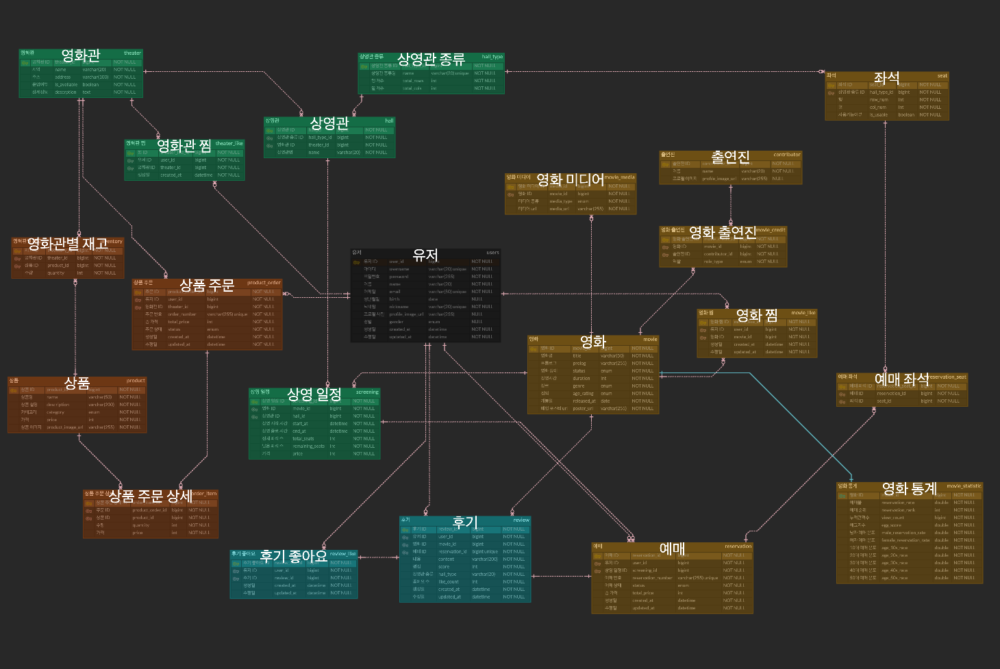

## 🎬 CGV 클론 코딩

### 📌 핵심 기능

- **영화관 조회**
- **영화관 찜**
- **영화 조회**
- **영화 예매, 취소**
- **영화 찜**
- **매점 구매 (환불X)**

### ERD 설계

https://www.erdcloud.com/d/A8T2DWPNN348xugsP
(미션의 제약 조건은 따르면서, 최대한 CGV와 비슷하게 구현하려 노력했습니다.)

| 도메인         | 엔티티                                                                    |
|-------------|------------------------------------------------------------------------|
| Movie       | Movie, MovieStatistic, MovieMedia, MovieCredit, Contributor, MovieLike |
| Theater     | Theater, Hall, HallType, Seat, TheaterLike                             |
| User        | User                                                                   |
| Screening   | Screening                                                              |
| Reservation | Reservation, ReservationSeat                                           |
| Product     | Product, ProductOrder, OrderItem, Inventory                            |
| Review      | Review, ReviewLike                                                     |

### 구현한 API

#### 영화 관련 API (`/api/v1/movies`)

| Method | URI                  | 설명                         |
|--------|----------------------|----------------------------|
| GET    | `/chart`             | 무비차트 조회 (상영중 + 상영예정, 예매율순) |
| GET    | `/running`           | 현재 상영중인 영화 조회              |
| GET    | `/upcoming`          | 상영 예정 영화 조회                |
| GET    | `/{movieId}`         | 영화 상세 조회 (기본정보 + 전체 통계)    |
| GET    | `/{movieId}/credits` | 영화 출연진 조회                  |
| GET    | `/{movieId}/medias`  | 영화 미디어 조회 (포스터, 트레일러)      |
| POST   | `/{movieId}/like`    | 영화 찜 토글                    |

#### 영화관 관련 API (`/api/v1/theaters`)

| Method | URI                 | 설명        |
|--------|---------------------|-----------|
| GET    | `/`                 | 영화관 목록 조회 |
| GET    | `/{theaterId}`      | 영화관 상세 조회 |
| POST   | `/{theaterId}/like` | 영화관 찜 토글  |

#### 상영 스케줄 API (`/api/v1/screenings`)

| Method | URI                                                 | 설명                |
|--------|-----------------------------------------------------|-------------------|
| GET    | `/by-movie?movieId={id}&theaterId={id}&date={date}` | 영화별 예매 - 상영관별 스케줄 |
| GET    | `/by-theater?theaterId={id}&date={date}`            | 극장별 예매 - 영화별 스케줄  |

#### 영화 예매 API (`/api/v1/reservations`)

| Method | URI                       | 설명    |
|--------|---------------------------|-------|
| POST   | `/`                       | 영화 예매 |
| PATCH  | `/{reservationId}/cancel` | 예매 취소 |

#### 매점 주문 API (`/api/v1/products`)

| Method | URI                       | 설명       |
|--------|---------------------------|----------|
| POST   | `/order`                  | 매점 주문    |
| PATCH  | `/order/{orderId}/cancel` | 매점 주문 취소 |

---

## ❓ 고민한 지점들

### 1. 패키지 구조: Product와 Order를 분리할 것인가?

Product와 Order를 별도 패키지로 나눌지 고민했습니다. OrderItem이 Product를 직접 참조하고 있고, 프로젝트 규모가 크지 않아 같은 `domain/product` 패키지에 두었습니다. 나중에
서비스가 복잡해지면 그때 분리해도 리팩토링 비용이 크지 않다고 판단했습니다.

### 2. Screening을 Theater에 포함할 것인가?

Screening은 Movie와 Theater를 연결하는 독립적인 도메인입니다. Theater에 넣으면 theater 패키지가 movie에 의존하게 되고, 예약(Reservation) 등 연관 엔티티가 계속 늘어날
수 있어 별도 `domain/screening` 패키지로 분리했습니다.

### 3. @OneToOne LAZY 로딩 문제

Movie ↔ MovieStatistic 관계에서 `@OneToOne(mappedBy = ...)`의 비소유 측은 Hibernate가 null 여부를 확인하기 위해 항상 즉시 로딩합니다. 양방향 관계를 만들지 않고
`@Query`로 `SELECT m, ms FROM Movie m LEFT JOIN MovieStatistic ms ON ms.movie = m`처럼 JPQL에서 직접 JOIN하여 해결했습니다.

### 4. 영화 상세 API의 응답 범위

처음에는 영화 상세 조회 시 기본정보 + 통계 + 출연진 + 미디어를 모두 반환했습니다. 하지만 CGV 실제 화면이 탭으로 나뉘어 있는 점을 고려하여, 기본정보 + 통계는 상세 조회에 포함하고 출연진(
`/credits`)과 미디어(`/medias`)는 별도 엔드포인트로 분리했습니다.

### 5. 상영 스케줄에 좌석 수를 저장할 것인가?

남은 좌석 수를 조회할 때 매번 `ReservationSeat`을 카운트하는 방식 vs Screening 테이블에 `total_seats`, `remaining_seats`를 저장하는 방식을 고민했습니다. 조회
성능과 코드 단순성을 위해 Screening에 직접 저장하고, 예매 시 차감 / 취소 시 복구하는 방식을 선택했습니다.

### 7. 상영 스케줄 조회 API 설계

CGV에는 영화별 예매(영화 + 날짜 + 극장)와 극장별 예매(극장 + 날짜) 두 가지 흐름이 있습니다. 하나의 API에 선택적 파라미터로 처리할 수도 있었지만, 각 흐름의 응답 구조가 다르고(상영관별 그룹핑 vs
영화별 그룹핑) 책임이 명확히 구분되므로 `/by-movie`와 `/by-theater`로 엔드포인트를 분리했습니다.

### 8. Seat 테이블에 모든 좌석을 저장하는 방식이 맞는가?

현재 `Seat` 테이블에 모든 좌석을 행(row_num) x 열(col_num) 단위로 저장하고 있습니다. 일반관 150석, IMAX 160석, 4DX 60석 등 상영관 타입별로 좌석을 전부 row로 저장하다 보니
데이터 양이 많아집니다. 예를 들어 상영관 타입이 10개이고 평균 100석이면 좌석만 1,000행이 됩니다. 좌석 배치가 단순한 격자 형태라면 `HallType`의 `total_rows`, `total_cols`
만으로 충분하고, 예매 시에는 좌석 번호만 저장하면 될 수도 있습니다. 하지만 `is_usable` 필드처럼 좌석별로 사용 가능 여부가 다를 수 있고(통로, 장애인석 등), CGV 실제 화면에서도 좌석마다 선택
가능/불가능 상태가 다르기 때문에 현재 방식을 유지했습니다.

