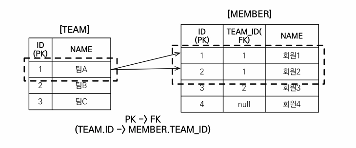
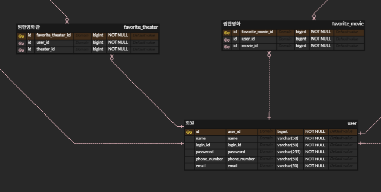
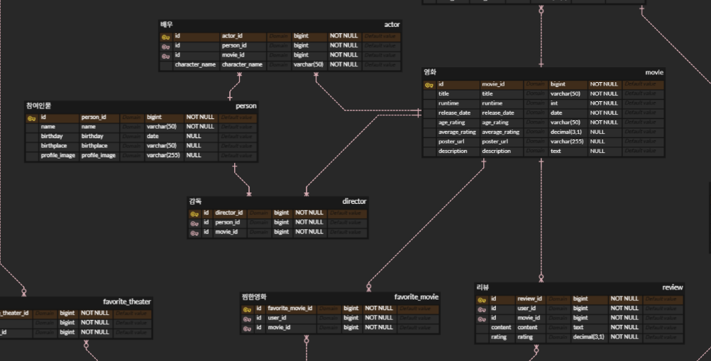
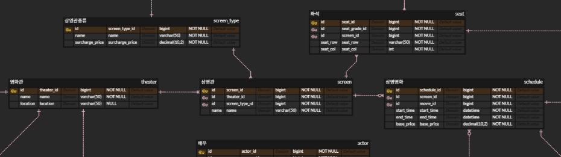
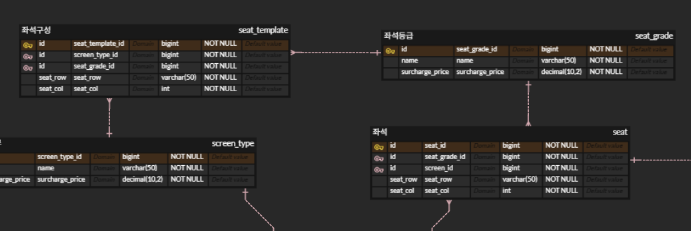
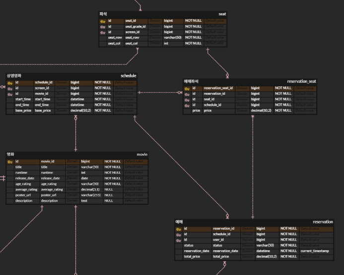
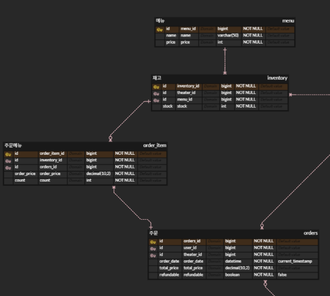

# spring-cgv-23rd
CEOS 23기 백엔드 스터디 - CGV 클론 코딩 프로젝트

## EntityManager와 DB Connection

- **EntityManager**
    - 스프링 컨테이너에 등록되는 것은 **Proxy EntityManager**
        - Proxy EM이 **싱글톤**으로 등록 되는 것
        - 빈들이 DI 받는 **EM은 Proxy EM**!!
            - 결국 하나의 Proxy EM이 모든 빈들에 공유
    - 진짜 **EntityManager**는 트랜잭션마다 **EntityManagerFactory**에 의해 생성됨
        - 클라이언트 요청이 오면 **Proxy EM**이 진짜 **EM**에게 요청 넘김
    - **결론**
        - 스프링이 싱글톤 EM 하나만을 사용하는 것 X
            - 그렇게 되면 여러 사용자의 동시 요청을 병렬적으로 수행 불가..
        - 내부적으로 **트랜잭션마다 진짜 EM이 계속 새로 생성되**며 독립적인 영속성 컨텍스트를 유지
            - **EM**마다 **영속성 컨텍스트** 관리하므로
                - 이로 인해 영속성 컨텍스트 내 데이터가 섞이지 않아, **여러 사용자의 동시 요청도 병렬 수행 가능!!**

- **EntityManager 생성 및 DB 연결** 과정
    1. **서버 시작**
        - 스프링 부트 실행
        - `application.yml`에 적어둔 DB 접속 정보를 바탕으로 `EntityManagerFactory`가 딱 하나 생성
        - **커넥션 풀에 미리 여러 커넥션들이 생성**
            - 스프링 부트에서 DB Connection 풀로 사용하는 **HikariCP** 라이브러리에 의해!!
    2. **사용자 요청 발생**
        - HTTP 요청을 처리하기 위한 **트랜잭션** 시작
    3. 빈들에게 주입된 `Proxy EntityManager`가 호출되고, 해당 요청에 할당된 진짜 `EntityManager`에게 요청 넘기기 위해 `EntityManagerFactory` 호출
    4. `EntityManager` 생성
        - `EntityManagerFactory`가 해당 요청을 처리할 `EntityManager` 생성
            - 즉 HTTP 요청마다 새로운 `EntityManager`가 생성됨!!
        - **아직 DB 커넥션을 가져오지 않음**
            - **지연된 커넥션 획득 전략** (JPA 최적화 전략)
                - 메모리(영속성 컨텍스트)에서 할 수 있는 일은 최대한 커넥션 없이 처리
    5. **비지니스 로직** 수행
        - `EntityManager`가 영속성 컨텍스트를 통해 로직 수행
            - **DB Connection** 사용 안하는 작업
                - `em.persist(member)` 호출
                    - 쓰기 지연 SQL 저장소에 쿼리 저장
    6. **DB 통신**
        - DB에 쿼리를 날려야 하는 시점에 **커넥션 풀**에서 DB Connection 획득
            - 트랜잭션 커밋 직전
            - `em.flush()`
            - JPQL 실행 전
    7. **쿼리 전송**
        - 영속성 컨텍스트에 쌓아둔 SQL을 DB로 모두 전송
    8. **요청 종료**
        - 트랜잭션이 **Commit**되고, 해당 `EntityManager`는 메모리에서 사라지고, **DB Connection**을 풀에 반납

### 컬렉션 페치 조인



- **컬렉션 페치조인에서 영속성 컨텍스트 동작 흐름**
    - **팀 테이블**에 1개 저장된 `팀 A` 조회 시, 연관된 `회원1`과 `회원2`를 **페치조인**하는 경우
        
        ```jsx
        public interface TeamRepository extends JPARepository<Team, Long> {
        		@EntityGraph(attributePaths = { "members" })
        		List<Team> findByName(String name);
        }
        ```
        
    1. **반환된 team 결과 리스트**
        - DB에서 1줄이 아니라, **2줄을 받음**
            - 일대다 관계이므로, **데이터 뻥튀기**
        - 결과 리스트(`List<Team>`)의 크기는 **2**
    2. **리스트에 객체 저장**
        - 첫 번째 줄을 읽어 `Team A` 객체 생성
        - 두 번째 줄을 읽을 때, 동일 Id 확인 (1차 캐시에 이미 저장)
            - 이미 생성된 객체의 주소 재활용
        - 결국 **리스트의** 첫 번째 요소와 두 번째 요소 모두 동일 객체 가리킴
    3. **리스트 출력**
        - 동일한 객체가 2번 출력
    
    ```jsx
    List<Team> teams = teamRepository.findByName("TEAM A");
    
    for(Team team : teams) { 
        System.out.println("teamname = " + team.getName()); 
        for (Member member : team.getMembers()) { 
          //페치 조인으로 팀과 회원을 함께 조회해서 지연 로딩 발생 안함 
          System.out.println("username =" + member.getUsername()); 
      } 
    }
    
    teamname = 팀A 
    username = 회원1 
    username = 회원2
    teamname = 팀A 
    username = 회원1 
    username = 회원2 
    ```
    
    - 중복 문제 해결 방법
        - **distinct**
            
            ```jsx
            public interface TeamRepository extends JPARepository<Team, Long> {
            		@EntityGraph(attributePaths = { "members" })
            		List<Team> findDistinctByName(String name);
            } 
            ```
            
            - **애플리케이션 레벨에서 중복 제거**
                - **Hibernate**가 같은 식별자인 Team 엔티티 제거하여, 리스트에 한 번만 저장됨
            - **DB 레벨**에서 중복 제거 안됨
                - SQL의 데이터는 같지 않으므로
        - **Hibernate6**부터 **distinct 명령어** 사용하지 않아도 자동으로 애플리케이션 레벨에서 중복 제거 해줌
            - 알아서 식별자를 보고 중복 제거
            - DB 레벨에서는 여전히 뻥튀기된 데이터가 전달
        - 그럼에도 **distinct** 명시적으로 작성하는 것을 추천!!
            - 자동 중복 제거는 JPA가 아닌 Hibernate의 기능이므로 다른 구현체로 바꾸면 중복 제거 안됨..
            - 중복 없이 가져온다는 것을 명시적으로 표현 가능

- **컬렉션 페치조인의 한계**
    - **둘 이상의 컬렉션 페치조인 불가**
        - 컬렉션마다 **카르테시안 곱** 발생
            - 팀 1개 * 멤버 10명 * 주문 10개 = 100개 행..
        - 둘 이상의 컬렉션 중복부터는 **Hibernate**가 중복 제거 불가능
            - `org.hibernate.loader.MultipleBagFetchException: cannot simultaneously fetch multiple bags`
            
    - **페이징 불가**
        - **데이터 유실 문제**
            - **일대다 페치조인**하면, 위의 경우처럼 **데이터 뻥튀기 발생**
                - 즉 DB 결과로 `팀A`가 두 줄로 반환
            - 뻥튀기된 데이터에 **페이징 걸면 데이터 유실 가능**
                - `limit 1`을 걸면 DB가 첫 줄만 보내게 됨
                - **DB 레벨**에서는 어디까지가 하나의 팀인지 모름
        - **Hibernate**의 작동 방식
            - 이러한 데이터 유실을 막기 위해 **뻥튀기된 데이터를 모두 갖고 와 메모리에서 페이징** 시도..
                - **OutOfMemory** 에러 발생 가능
                - **`firstResult/maxResults specified with collection fetch; applying in memory!`**

- **Batch Fetch**로 해결!!
    - 우선 **지연로딩으로** 가져오고, 연관된 엔티티를 필요할 때 **in 쿼리로** 여러개 가져오기
        - **페치조인** 사용 안하므로 위 문제들 발생 X
        - 페치조인 사용 안해도 **N+1** 문제 발생 X
    - **application.yml** 설정
        
        ```jsx
        jpa:
        	properties
        		hibernate:
        			default_batch_fetch_size: 100
        ```
        
    - 동작 방식
        
        ```jsx
        // Team만 조회 (페치 조인 X)
        List<Team> teams = teamRepository.findByName("TEAM A");
        
        // 지연 로딩 발생
        for (Team t : teams) {
            t.getMembers(); // in 쿼리 실행
        }
        ```
        
        - `IN` 절을 사용해서 데이터를 한 번에 미리 설정값만큼 가져옴
            - `SELECT * FROM MEMBER WHERE TEAM_ID IN (1, 2, 3, ..., 100)`
        - N+1 문제가 발생하지 않고, `1 + 1` 수준으로 최적화 가능
---
## CGV 서비스

- **ERD 모델링**
    - [CGV ERD](https://www.erdcloud.com/d/QvfvdQeEdWbPWid9b)

### 1. 즐겨찾기 (영화관 / 영화)

- **도메인**
    
    ```jsx
    user
    favorite_movie
    favorite_theater
    ```
    
    - `user`: CGV 회원
    - `favorite_movie`, `favorite_theater`: 즐겨찾기(찜) 기능
- **관계**
    
    ```jsx
    User 1:N FavoriteMovie
    User 1:N FavoriteTheater
    ```
    
    - 회원은 여러개의 영화와 영화관을 찜할 수 있음

### 2. 영화 등장인물 조회 및 리뷰 작성

- **도메인**
    
    ```jsx
    movie
    review
    actor
    director
    person
    ```
    
    - `movie`: 영화
    - `review`: 사용자 리뷰
    - `person`: 배우/감독 공통 엔티티
    - `actor`, `director`: 역할 분리
- **관계**
    
    ```jsx
    Person 1:N Actor/Director
    Actor/Director N:1 Movie
    Movie 1:N Review
    ```
    
    - `person`와 `movie`의 **다대다 관계**를 `actor`와 `director`를 통해 **일대다, 다대일 관계로 매핑**
        - 배우/감독 역할 구분
        - 배우이자 감독으로 영화에 참여하는 사람 고려
    - 영화에 여러개의 리뷰가 달릴 수 있음

### 3. 영화 조회 및 상영관에 따른 상영시간 확인

- **도메인**
    
    ```jsx
    theater
    screen
    screen_type
    schedule
    ```
    
    - `theater`: 영화관
    - `screen`: 상영관
    - `screen_type`: 특별관(IMAX, 4DX 등), 일반관
    - `schedule`: 상영 영화
- **관계**
    
    ```jsx
    Theater 1:N Screen
    Screen N:1 Screen_type
    Screen 1:N Schedule
    ```
    
    - 영화관에 여러 상영관 존재
    - 상영관은 특별관과 일반관으로 구성
    - 상영관에는 여러 영화가 상영

### 4. 좌석

- **도메인**
    
    ```jsx
    seat
    seat_grade
    seat_template
    ```
    
    - `seat`: 실제 좌석
    - `seat_grade`: 일반석 / 특별석
    - `seat_template`: 좌석 템플릿
- **관계**
    
    ```jsx
    SeatGrade 1:N Seat/Seat_template
    ```
    
    - 좌석에 여러 등급 존재
        - 좌석별 가격 차등 가능
    - 특별관, 일반관 종류가 같다면 좌석 동일하다는 조건
        - 좌석 템플릿을 통해 좌석 재사용하기 위함

### 5. 상영 영화 및 좌석 선택 후 예매 (혹은 취소)

- **도메인**
    
    ```jsx
    reservation
    reservation_seat
    ```
    
    - `reservation`: 예매
        - 상영영화 및 좌석 예매
    - `reservation_seat`: 예매 좌석
- **관계**
    
    ```jsx
    Reservation 1:N ReservationSeat
    Seat 1:N ReservationSeat
    Schedule 1:N Reservation
    ```
    
    - 한 번에 여러 좌석 예매 가능
        - `reservation`과 `seat`의 **다대다 관계**를 `reservation_seat`을 통해 **일대다, 다대일 관계로 매핑**

### 6. 매점 상품 주문

- **도메인**
    
    ```jsx
    menu
    inventory
    orders
    order_item
    ```
    
    - `menu`: 매점 상품
    - `inventory`: 지점별 재고
    - `orders`: 주문
    - `order_item`: 주문 상세
- **관계**
    
    ```jsx
    Orders 1:N OrderItem
    OrderItem N:1 Inventory
    Menu 1:N Inventory
    ```
    
    - 영화관별 재고 관리
    - 한 번에 여러 상품 주문 가능
        - `orders`와 `inventory`의 **다대다 관계**를 `order_item`을 통해 **일대다, 다대일 관계로 매핑**

---
## 웹 인증의 발전 과정

### HTTP의 치명적 단점

- 인터넷(HTTP)은 **Stateless**
    - 사용자가 한 번 요청을 보내고 서버가 응답을 주면, 서버는 사용자 기록 X
        - 로그인하고 메인 페이지로 넘어갔는데, 다시 로그인 해야함..

---

### 1. 쿠키 (Cookie)

- 페이지 이동 시마다, 다시 로그인해야하는 한계 극복하기 위해 탄생
- **클라이언트에 사용자 정보를 저장**
    - 요청마다 브라우저가 **자동으로 쿠키(사용자 정보) 포함**해 전송
- **작동 방식**
    1. 사용자 로그인(아이디/비번)
    2. 서버는 인증 후, **응답 헤더(`Set-Cookie`)에 사용자 데이터** 담아 전송
    3. 브라우저는 쿠키를 저장소에 보관
    4. 이후 브라우저가 다른 페이지에 요청할 때마다, 쿠키를 같이 서버로 전송 **(요청 헤더에 포함)**
- **장점**
    - 서버는 데이터를 기억하지 않아, 메모리 낭비 X
- **단점**
    - **보안 최악**
        - 개발자 도구창에서 쿠키 값 임의로 변경 가능
        - 브라우저 저장소에 사용자 정보 노출
            - `memberId=1`
            - 쿠키 값 예측 가능 → 다른 값으로 변경해 타 사용자의 접속 정보 이용 가능
        - **CSRF** 공격에 취약
            - 브라우저에 쿠키가 저장되면, 이후 **요청에 자동으로 쿠키 포함하는 성질 이용**
            - 공격자의 사이트에 악성 코드 클릭 시, 서버에 공격자가 원하는 요청이 쿠키가 포함되어 전송됨
                - 쿠키가 포함되어 있으므로, 인증도 성공해 요청 실행됨..

---

### 2. 세션 (Session)

- 쿠키의 보안 문제 때문에 탄생
    - **사용자 정보는 서버 메모리에 저장하고, 사용자한테는 유추할 수 없는 Session ID만 쿠키로 전송**
- **작동 방식**
    1. 사용자 로그인
    2. 서버가 **세션(서버 메모리)에 사용자 데이터 저장**
    3. 서버는 사용자에게 **Session ID(추정할 수 없는 번호)만 쿠키로 전송**
    4. 사용자가 쿠키에 **JSESSIONID**를 담아오면, 서버가 세션에서 해당 값과 일치하는 ID 찾아 인증
- **장점**
    - 브라우저에는 저장소에 의미 없는 랜덤 문자열만 저장
        - `JESSIONID=absd-12432`
        - 공격자가 조작 불가
    - JSESSIONID가 탈취되도, **서버 메모리에서 해당 데이터 없애면 해결**
- **단점**
    - 사용자가 많을 수록, 세션에 많은 데이터 저장해야 하므로 **서버 메모리에 부하 증가**
    - **확장성 문제**
        - 사용자가 많아져서 서버를 2대로 늘렸을 때, 1번 서버에서 로그인한 유저가 2번 서버로 요청을 보내면 2번 서버의 세션에 사용자 정보 없어 인증 실패됨
            - 이를 해결하기 위해 Redis 서버를 사용해야함… (구조 복잡해짐)
    - 여전히 **CSRF** 공격에 취약

---

### 3. JWT (JSON Web Token / Access Token)

- 서버가 여러 대로 쪼개지게 되며 세션의 한계가 명확해짐에 따라 탄생
- **JSON 형식의 데이터를 담아 전달하는 토큰**
    - 쿠키처럼 **Stateless** + 세션처럼 **보안에 강함**
- **작동 방식**
    1. 사용자 로그인
    2. 서버가 사용자 정보를 서버만 아는 **비밀키(Secret Key)로 서명**해 토큰 생성하고 전달
    3. 클라이언트는 이 토큰을 저장해 두고, API 요청 시 헤더에 담아 전송
    4. 서버는 **서명을 통해 위조 여부**와 **토큰 만료시간을 확인해** 인증
- **장점**
    - **Statelss**
        - **메모리 문제 X**
            - 서버는 토큰을 발급하고 기억 X
        - **확장성**
            - 서버가 늘어나도 똑같은 비밀키만 들고 있으면 모두 통과
    - **CSRF 공격에 강함**
        - 브라우저가 직접 요청 헤더에 JWT 포함해야함!!
            - 악성 코드 클릭해도, 서버에 JWT 없이 요청이 전송되어 어차피 인증 실패
- **단점**
    - 공격자가 토큰을 탈취하면, 유효기간 끝날 때까지 **토큰 제거할 방법 X**
        - 그렇다고 만료기간 짧게 잡으면 UX 안 좋아짐..

---

### 4. Refresh Token (주로 랜덤 문자열 UUID)

- **JWT의 보안과 UX 문제를 모두 해결**하기 위해 탄생
    - **유효기간이 짧은 Access Token과, 이를 재발급하는 Refresh Token 사용!!**
    
    ### Access Token
    
    - **수명**
        - **매우 짧게** 설정 (보통 15~ 30분)
        - 공격자에게 토큰 탈취되도, **피해 최소화!!**
    - **저장 위치**
        - **XSS** 공격에 대비해, **프론트엔드 메모리**에 저장
            - **Stateless**
                - 응답 속도 향상
            - 다른 저장소 X
                - 공격자가 JS를 통해 **localStorage**와 **SessionStorage**에 저장된 정보 탈취 가능
                - 쿠키에 저장 시 다시 **CSRF** 공격에 취약해짐
        - **새로고침하고나 창 껐다 키면 메모리 초기화 되므로, 사용자 데이터 사라짐**
            - **Silent Refresh**로 해결
                - **Access Token이 만료될 때마다 백그라운드에서 Refresh Token을 서버로** 보내 Access Token 재발급
    
    ### Refresh Token
    
    - Access Token이 만료되면, **새로운 Access Token을 발급받기 위한 용도**
    - **수명**
        - **매우 길게** 설정 (보통 1주 ~ 2주)
        - 공격자 탈취 위험 해결 방법
            - **Redis**
                - 발급한 Refresh Token를 서버의 Redis에 저장해 관리
                    - 공격자에게 탈취되도, Redis에 저장한 Refresh Token 삭제하면 끝
            - **RTR (Refresh Token Rotation)**
                - AccessToken 재발급할 때, **RefreshToken도 새로 발급**
                    - 기존 RefreshToken은 AccessToken 재발급 시 즉시 무효화
                - Redis에 RefreshToken을 기록하여, 재발급 요청 시 **토큰의 유효성을 검증**
                    - **같은 토큰으로 반복해서 AccessToken을 발급받는 것을 막을 수 있음**
    - **저장 위치**
        - **쿠키에 저장**
            - **Stateful**
        - 보안 옵션(`HttpOnly`, `Secure`, `SameSite`)
            - `HttpOnly`, `Secure`을 통해 **XSS** 공격 대비
                - JS로 쿠키에 접근 불가
            - `SameSite`을 통해 **CSRF** 공격 대비
                - 다른 도메인에서 온 요청엔 쿠키 안 보냄
                    - 즉, 브라우저는 공격자 사이트에서 서버로 요청시, 쿠키에 전송 X
- **AccessToken: 메모리**에 저장 + **RefreshToken: Cookie + Redis + RTR (국룰)**
    - **XSS, CSRF, 토큰 탈취**에 대해 강함!!
- **작동 방식**
    1. 로그인 성공하면 서버가 **Access Token, Refresh Token** 발급
    2. 프론트엔드는 **AT 만료 전까지 서버랑 AT를 통해** 통신
        - 서버는 검사만 하면 되므로 초고속 응답
    3. 프론트엔드가 AT를 보냈는데, **AT 만료되어 서버에서 401에러** 발생
    4. 프론트엔드는 **사용자 몰래** 백그라운드에서 쿠키에 **RT를 꺼내서 서버에 전송**
        - **Slient Refresh**
    5. 서버가 Redis에서 해당 RT 유효성 검증
    6. 검증 후, 서버는 **새 AT와 새 RT**를 프론트엔드에게 전송
        - 사용자는 해당 과정 알지 못함!!

---

### OAuth 2.0

- 탄생 배경
    - 과거에는 다른 서비스(구글, 카카오)의 정보를 가져오기 위해 유저의 아이디/비밀번호 요구
        - 보안상 최악
    - **유저의 비밀번호 노출하지 않**고, 다른 서비스(카카오, 구글)가 보증을 서
    **안전한 정보(이메일 등)만 빌려**주는 **글로벌 표준 규칙 OAuth 2.0** 탄생
- 주체
    - **Resource Owner**
        - 이메일의 진짜 주인
    - **Client**
        - 정보를 빌려 쓰고 싶은 자
    - **Authorization Server**
        - 아이디/비번을 확인하고 토큰을 발급해 주는 곳
    - **Resource Server**
        - 사용자의 이메일이 보관된 곳
- **작동 방식**
    1. **인가 코드(Authorization Code) 발급 (Front Channel)**
        1. 사용자가 우리 서비스(**Client**)에서 '카카오 로그인' 클릭
        2. 카카오 로그인 창으로 이동해 아이디/비번을 치고 **[정보 제공 동의]** 클릭
            - 사용자는 우리 서비스가 자신의 이메일을 가져가도록 허락(인가, Authorization)
        3. 카카오는 사용자를 다시 우리 서비스로 보내면서, **주소창에 Authorization Code 전송**
            - **프론트 채널**
                - 브라우저의 URL 창을 통해 데이터 이동
                - 보안 취약
            - **Authorization Code**
                - `/kakao?code=xYz123...`
                - 인가 코드는 수명이 매우 짧음
                - 단독으로 못써, 공격자에게 탈취되도 상관 X
    2. **Access Token 발급 (Back Channel)**
        1. 우리 서비스의 브라우저가 주소창의 `code`를 **우리 백엔드 서버**로 전송
        2. 우리 백엔드 서버는 카카오 서버와 **직접 Server-to-Server 통신 시작**
            - **백 채널**
                - **서버와 서버가 통신**
                - **브라우저를 거치지 않**아, 공격자는 정보 탈취 불가능
                - **백 채널에서 AccessToken 전달 위해**, 처음엔 탈취되도 상관 없는 **인가 코드 전달한 것**!!
        3. 우리 백엔드가 카카오에게 아래 정보 제공
            - **방금 받은 인가 코드**
            - **우리 앱 아이디 (Client ID)**
                - 카카오에게 발급받은 공개된 식별키(**REST  API 키)**
            - **우리 앱 전용 비밀번호(Client Secret)**
                - 우리 서버와 카카오 서버 둘 만 알고 있는 비밀번호
        4. 카카오는검증 후, 공격자가 볼 수 없는 백 채널을 통해
        **진짜 카카오 Access Token**을 우리 백엔드에 전달
    3. **사용자 정보 획득**
        1. 우리 백엔드는 카카오 Access Token를 담아 카카오 Resource Server에 요청
            - `Authorization: Bearer <카카오_Access_Token>`
        2. 카카오로부터 사용자의 이메일(`taeik@kakao.com`) 받아옴
            - 처음에 사용자가 **동의했던 정보들(이메일, 닉네임 등)을 JSON** 형태로 받음
        - 이후 카카오 Access Token 처리 방식
            - 사용자 정보 수집 목적으로만 사용 시
                - 저장하지 않음
            - 카카오 부가 기능 계속 쓰는 경우
                - 암호화해서 저장해둠
                - 예)
                    - 우리 앱에서 **카카오톡 친구에게 공유하기** 버튼
            - **절대 프론트엔드(유저)에게 주지 않음**
    4. **로그인 처리**
        1. 우리 DB를 조회해 해당 이메일이 가입되어 있는지 확인
        2. 로그인(또는 자동 회원가입) 처리
        3. 우리 백엔드의 **TokenProvider**를 통해 **우리 서비스 전용 새로운 Access Token과 Refresh Token** 생성
        4. 프론트엔드에게 AT, RT 전달
            - 프론트엔드 입장에서 **일반 로그인을 하든, 카카오 로그인을 하든** 똑같이 우리 서비스의 JWT 받아 쓰게 됨

