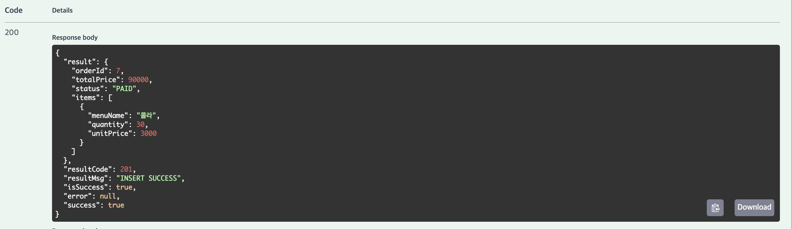
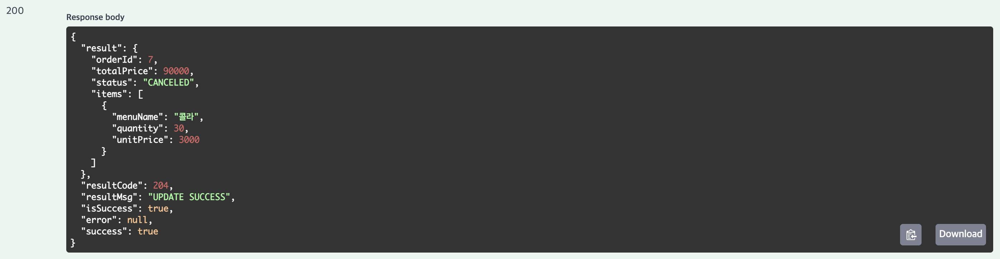
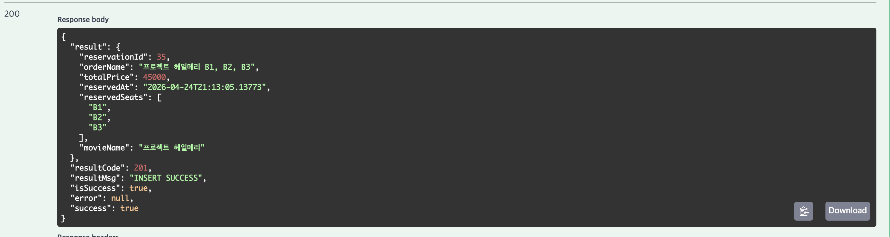
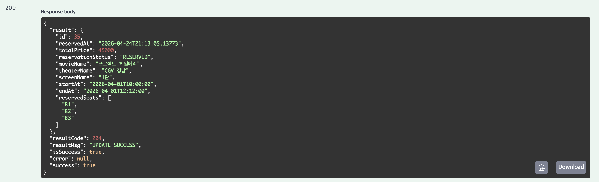
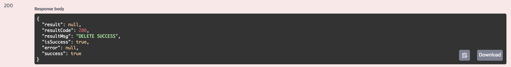

# CGV 클론 코딩

<details>
<summary> <h2>1. ERD</h2> </summary>


---

## 데이터베이스 구조

### 1. 영화관 (`Theater`)
영화관의 기본 정보를 저장합니다.
- **`id`** `PK` : 영화관 고유 ID (`theater_id`)
- **`name`** : 영화관 이름
- **`region`** : 지역
- **`address`** : 주소

** 연관 관계**
- `1 (Theater)` : `N (Screen)`
- `1 (Theater)` : `N (Store)`
- `1 (Theater)` : `N (TheaterFavorite)`

---

### 2. 상영관 (`Screen`)
각 영화관 내 존재하는 상영관 정보입니다.
- **`id`** `PK` : 상영관 고유 ID (`screen_id`)
- **`name`** : 상영관 이름
- **`theater_id`** `FK` : 소속 영화관 ID (`Theater`)
- **`screen_type_id`** `FK` : 상영관 좌석/타입 정보 ID (`ScreenType`)

** 연관 관계**
- `1 (Screen)` : `N (Schedule)`

---

### 4. 영화 (`Movie`)
상영 영화 정보를 저장합니다.
- **`id`** `PK` : 영화 고유 ID (`movie_id`)
- **`name`** : 영화 제목
- **`runningTime`** : 상영 시간
- **`ageRestriction`** : 관람 연령 등급

** 연관 관계**
- `1 (Movie)` : `1 (MovieStatistic)`
- `1 (Movie)` : `N (Schedule)`
- `1 (Movie)` : `N (MovieFavorite)`

---

### 5. 상영 스케줄 (`Schedule`)
특정 상영관에서 정해진 시간에 상영되는 시간표입니다.
- **`id`** `PK` : 스케줄 고유 ID (`schedule_id`)
- **`screen_id`** `FK` : 상영이 이루어지는 상영관 ID (`Screen`)
- **`movie_id`** `FK` : 상영되는 영화 ID (`Movie`)
- **`startAt`, `endAt`** : 상영 시작 및 종료 시간 (`LocalDateTime`)

** 연관 관계**
- `1 (Schedule)` : `N (Reservation)`

---

### 6. 회원 (`User`)
서비스를 이용하는 고객 정보입니다.
- **`id`** `PK` : 회원 고유 ID (`user_id`)
- **`nickname`** : 서비스 닉네임
- **`email`** : 이메일 주소
- **`birthdate`** : 생년월일 (`LocalDate`)

** 연관 관계**
- `1 (User)` : `1 (UserProfile)`
- `1 (User)` : `N (Reservation)`
- `1 (User)` : `N (Order)`

---

### 7. 예매 (`Reservation`)
유저의 개별 영화 예매 내역입니다.
- **`id`** `PK` : 예매 고유 ID (`reservation_id`)
- **`user_id`** `FK` : 예약자 회원 ID (`User`)
- **`schedule_id`** `FK` : 예매한 스케줄 ID (`Schedule`)
- **`reservedAt`** : 예약 시각 (`LocalDateTime`)
- **`totalPrice`** : 총 예매 결제 금액
- **`status`** : 예약 진행 상태 (`ReservationStatus`)
- **`seatNames`** : 예약된 좌석명 목록 문자열

** 연관 관계**
- `1 (Reservation)` : `N (ReservationSeat)`

---

### 9. 매장 (`Store`)
영화관에 위치한 매점 정보입니다.
- **`id`** `PK` : 매장 고유 ID (`store_id`)
- **`theater_id`** `FK` : 매장이 위치한 영화관 ID (`Theater`)

** 연관 관계**
- `1 (Store)` : `N (Inventory)`
- `1 (Store)` : `N (Order)`

---

### 10. 메뉴 (`Menu`)
매점에서 판매하는 상품 카테고리/종류입니다.
- **`id`** `PK` : 메뉴 고유 ID (`menu_id`)
- **`name`** : 상품명
- **`price`** : 가격
- **`menuType`** : 품목 카테고리 유형 (`MenuType`)

** 연관 관계**
- `1 (Menu)` : `N (Inventory)`

---

### 11. 재고 (`Inventory`)
매장별로 취급하는 메뉴의 판매 재고 정보입니다.
- **`id`** `PK` : 재고 고유 ID (`inventory_id`)
- **`store_id`** `FK` : 보유 중인 매장 ID (`Store`)
- **`menu_id`** `FK` : 해당 메뉴 ID (`Menu`)
- **`quantity`** : 보유 수량

** 연관 관계**
- `1 (Inventory)` : `N (OrderItem)`

---

### 12. 매점 주문 (`Order`)
매점에서 상품을 주문한 통합 내역입니다.
- **`id`** `PK` : 주문 고유 ID (`order_id`)
- **`user_id`** `FK` : 주문자 회원 ID (`User`)
- **`store_id`** `FK` : 주문이 접수된 매장 ID (`Store`)
- **`orderStatus`** : 주문 진행 상태 (`OrderStatus`)
- **`totalPrice`** : 총 지불 금액
- **`orderedAt`** : 주문 시각 (`LocalDateTime`)

** 연관 관계**
- `1 (Order)` : `N (OrderItem)`

</details>

<details>
<summary> <h2>2. 인증 방법</h2> </summary> 

## 1. JWT 기반 인증(Access Token)

### [핵심 개념]
> **JWT(JSON Web Token)**: JSON 객체를 사용해 사용자 정보를 안전하게 전달하는 웹 표준 토큰. 자체적인 Signature가 포함되어 있어 데이터 위변조 확인 가능

> **Access Token**: 서버의 리소스에 접근할 수 있는 권한을 증명하는 출입증 역할의 수명을 가진 토큰

### [인증 흐름]
1. 로그인 요청: 클라이언트가 서버로 사용자 정보 전송
2. 사용자 확인: 서버가 회원 DB를 조회하여 사용자 정보 일치 여부 검증
3. 토큰 발급: 검증 성공 시, 서버가 Access Token을 생성하여 클라이언트로 응답
4. 데이터 요청: 클라이언트는 이후 서버에 데이터를 요청할 때마다 헤더에 Access Token을 포함하여 전송
5. 토큰 검증 및 응답: 서버가 토큰의 유효성(서명, 만료일 등)을 검증한 후, 검증 성공 시 요청받은 데이터 응답

### [장점]
- Stateless 및 서버 확장성: 서버가 별도의 세션 상태를 저장할 필요가 없어 서버 트래픽 분산 및 확장에 매우 유리함
- 클라이언트 독립성: 쿠키를 사용하지 않아도 되므로 웹, 모바일 앱 등 다양한 클라이언트 환경에서 범용적으로 사용 가능

### [단점]
- 토큰 제어 불가: 한 번 발급된 토큰은 만료 전까지, 서버에서 강제로 만료시키거나 제어할 수 없음
- 데이터 크기: 토큰 내부에 담는 Payload가 많아질수록 토큰 길이가 길어져 네트워크 요청 시 오버헤드 발생 가능
---

### 2. Access Token + Refresh Token 인증


### [핵심 개념]
> **Refresh Token**: Access Token이 만료됐을 때 새로운 Access Token을 재발급받기 위한 토큰. 수명이 길고 서버 DB에 저장된다.

### [인증 흐름]
1. 로그인 요청: 클라이언트가 사용자 정보 전송
2. 토큰 발급: 서버가 수명이 짧은 Access Token + 수명이 긴 Refresh Token을 함께 발급
3. 데이터 요청: 클라이언트가 헤더에 Access Token을 담아 요청
4. Access Token 만료: 서버가 `401 Unauthorized` 응답
5. 토큰 재발급 요청: 클라이언트가 Refresh Token을 서버로 전송
6. Refresh Token 검증: 서버가 DB에 저장된 Refresh Token과 비교 후 유효하면 새 Access Token 발급
7. 재요청: 클라이언트가 새 Access Token으로 다시 요청

### [장점]
- 보안 강화: Access Token 수명을 짧게 유지할 수 있어 탈취 시 피해 범위 최소화
- 사용자 경험: Refresh Token이 유효하면 자동으로 Access Token을 재발급받아 로그인 유지 가능

### [단점]
- 구현 복잡도 증가: 토큰 재발급 로직, Refresh Token 저장 및 관리 등 추가 구현 필요
- 완전한 Stateless 불가: Refresh Token을 서버 DB에 저장해야 하므로 순수 JWT의 Stateless 특성이 부분적으로 깨짐

### 3. 세션과 쿠키 기반 인증


### [핵심 개념]
> **세션(Session)**: 서버가 인증된 사용자 정보를 서버 메모리에 저장하는 방식. 각 세션은 고유한 Session ID로 식별된다.

> **쿠키(Cookie)**: 서버가 클라이언트 브라우저에 저장하는 작은 데이터. 이후 요청마다 자동으로 서버에 전송된다.

### [인증 흐름]
1. 로그인 요청: 클라이언트가 사용자 정보 전송
2. 세션 생성: 서버가 인증 확인 후 Session ID를 생성하고 서버 메모리에 저장
3. 쿠키 발급: 서버가 응답 헤더에 Session ID를 담은 쿠키를 클라이언트로 전송
4. 데이터 요청: 클라이언트가 이후 요청마다 쿠키를 자동으로 포함하여 전송
5. 세션 조회 및 응답: 서버가 쿠키의 Session ID로 서버 메모리를 조회해 사용자 확인 후 응답

### [장점]
- 서버 제어 가능: 서버에서 세션을 직접 삭제하면 즉시 강제 로그아웃 가능
- 클라이언트 단순: 클라이언트는 쿠키만 저장하면 되고 인증 상태는 서버가 관리

### [단점]
- 서버 부하: 사용자가 많아질수록 서버 메모리에 저장해야 할 세션이 늘어남
- 확장성 문제: 서버가 여러 대인 경우 세션을 공유하는 별도 저장소(Redis 등)가 필요함
- CSRF 취약: 쿠키가 요청마다 자동 전송되므로 CSRF 공격에 노출될 수 있음

---

### 4. OAuth 2.0 인증


### [핵심 개념]
> **OAuth 2.0**: 사용자가 직접 비밀번호를 제공하지 않고, 신뢰할 수 있는 외부 서비스(Google, Kakao 등)를 통해 인증하고 권한을 위임받는 표준 프로토콜

- **Resource Owner**: 실제 사용자
- **Client**: 만든 서비스(서버)
- **Authorization Server**: 로그인을 처리하고 토큰을 발급하는 외부 서버
- **Resource Server**: 사용자 데이터를 갖고 있는 외부 서버

### [인증 흐름]
1. 사용자가 서비스에 로그인을 요청한다.
2. 서비스는 사용자에게 외부 로그인 URL을 돌려준다.
3. 사용자가 해당 URL에서 외부 서비스에 로그인하고 권한을 허용하면, Authorization Grant(권한 증서)가 서버로 전달된다.
4. 서버는 이 권한 증서를 Authorization Server에 보내 Access Token과 Refresh Token을 발급받는다.
5. 서버는 발급받은 Access Token으로 Resource Server에서 사용자 정보를 조회한다.
6. 조회한 정보로 DB에서 유저를 찾거나, 없으면 회원가입 처리한다.
7. 발급받은 Access Token은 서버가 DB에 안전하게 보관하거나, 필요한 정보만 조회한 뒤 폐기한다. 
8. 서버는 사용자의 로그인 상태를 유지하기 위해 새로운 Session ID나 자체 JWT를 생성하여 사용자에게 전달한다.
9. 이후 사용자가 서비스의 기능을 사용할 때, 클라이언트는 서비스가 발급한 토큰을 담아 서버에 요청을 보낸다.
10. Access Token이 만료되면 Refresh Token으로 재발급받고, Refresh Token까지 만료되면 처음부터 다시 로그인해야 한다.

### [장점]
- 비밀번호 미관리: 사용자 비밀번호를 서버에 저장하지 않아 보안 부담 감소
- 사용자 편의: 별도 회원가입 없이 기존 계정으로 빠른 로그인 가능

### [단점]
- 외부 의존성: 외부 Authorization Server가 다운되면 로그인 자체가 불가능
- 구현 복잡도: 표준 스펙이 있지만 각 서비스마다 세부 구현이 달라 연동 작업이 번거로움

</details>

<details>
<summary> <h2> 3. 액세스 토큰 발급 및 검증 로직 구현</h2></summary>

<h3> 1. 액세스 토큰 발급 </h3>

```java
public String createAccessToken(Long userId) {
        Date now = new Date();
        return Jwts.builder()
                .subject(String.valueOf(userId))
                .issuedAt(now)
                .expiration(new Date(now.getTime() + expirationMs))
                .signWith(key)
                .compact();
}
```

<h3> 2. 검증 로직 </h3>

```java
public boolean validateAccessToken(String token) {
    try {
        Jwts.parser()
                .verifyWith((SecretKey) key)
                .build()
                .parseSignedClaims(token);
        return true;
    } catch (JwtException | IllegalArgumentException e) {
        return false;
    }
}
```

- 해당 로직 `JwtAuthenticationFilter`에서 작동
- true 반환 시, `SecurityContext`에 저장


</details>

<details>
<summary> <h2> 4. 회원가입 및 로그인 API 구현</h2></summary>


</details>

<details>
<summary> <h2> 5. 토큰이 필요한 API</h2></summary>


</details>

<details>
<summary> <h2> 6. 리프레쉬 토큰 발급</h2></summary>

<h3> 1. 리프레쉬 토큰 도메인 및 리포 구현 </h3>

<h3> 2. 리프레쉬 토큰 생성 </h3>

```java
public String createRefreshToken(Long userId) {
    Date now = new Date();
    return Jwts.builder()
            .subject(String.valueOf(userId))
            .issuedAt(now)
            .expiration(new Date(now.getTime() + refreshExpirationMs))
            .signWith(key)
            .compact();
}

public LocalDateTime getRefreshTokenExpiresAt() {
    return LocalDateTime.now().plusSeconds(refreshExpirationMs / 1000);
}
```

<h3> 3. 리프레쉬 토큰 서비스 구현 </h3>

- login
```java
// refreshToken 발급
String refreshToken = tokenProvider.createRefreshToken(user.getId());

// 기존 토큰 있으면 rotate, 없으면 새로 저장
refreshTokenRepository.findByUserId(user.getId())
        .ifPresentOrElse(
                rt -> rt.rotate(refreshToken, tokenProvider.getRefreshTokenExpiresAt()),
                () -> refreshTokenRepository.save(RefreshToken.builder()
                        .userId(user.getId())
                        .token(refreshToken)
                        .expiresAt(tokenProvider.getRefreshTokenExpiresAt())
                        .build())
        );
```

- 로그인 시, 리프레쉬 토큰이 있을 경우에는 새로운 리프레쉬 토큰 발급
- 리프레쉬 토큰이 없을 경우에는 새로 발급하여 저장

- 회원가입의 경우에는 리프레쉬 토큰이 없으므로, 새로 발급하여 저장

- 로그아웃 시, 리프레쉬 토큰 삭제

<h3> 4. 리프레쉬 토큰 api 구현 </h3>

```java
@PostMapping("/reissue")
public ApiResponse<LoginResponse> reissue(@RequestBody ReissueRequest request) {
return ApiResponse.ok(SuccessCode.SELECT_SUCCESS, userService.reissue(request));
}
```

- RefreshToken을 재발급하는 것은 결국 accessToken이 만료되었을 때이므로, @AuthenticationPrincipal로 현재 로그인한 유저의 정보를 가져올 수 없다.
- 따라서, @RequestBody로 RefreshToken을 받아서, 해당 토큰이 유효한지 검증한 후, 새로운 AccessToken과 RefreshToken을 발급하는 로직.
</details>

# 동시성 이슈 해결

---
<details>
<summary> <h2> 1. Synchronized </h2> </summary>

#### **설명**

- 자바에서 동시성 제어를 위해 제공하는 가장 기본적인 키워드.
- 동기화가 필요한 메서드나 코드 블록에 사용하여 단 하나의 스레드만 접근할 수 있는 **임계 구역(Critical Section)**을 설정한다.
- 자바의 모든 인스턴스가 가진 고유의 **모니터 락**을 활용하여 동작한다.
    - `인스턴스 메서드`: 메서드를 호출한 객체(`this`)의 락을 사용
    - `특정 블록`: 개발자가 명시적으로 지정한 객체의 락을 사용
    - `static 메서드`: 해당 클래스 자체(`Class`)의 락을 사용

#### **동작 방식**

1. **락 획득 시도:** 스레드 T1이 동기화 블록에 진입하며 객체의 락을 확인한다. 아무도 락을 쥐고 있지 않다면 락을 획득하고 로직을 실행한다.
2. **대기 (BLOCKED):** 스레드 T2가 동일한 객체의 동기화 블록 진입을 시도하지만, 이미 T1이 락을 쥐고 있다. 따라서 T2는 `RUNNABLE` 상태에서 `BLOCKED` 상태로 전환되어 락 대기열에서 대기한다.
3. **락 반납 및 무한 경합:** T1이 실행을 마치고 블록을 벗어나면 락을 반납한다. 이때 대기열에 있던 T2, T3 등 **모든 대기 스레드들이 순서 없이 무작위로 락 획득 경합**을 벌인다.

#### **장점**

- **단순성과 안정성:** 자바 언어 차원에서 지원하므로 코드가 간결하며, 락을 명시적으로 해제할 필요가 없어 개발자의 휴먼 에러를 방지한다.
- **네트워크 비용:** 외부 시스템을 거치지 않고 오직 JVM 메모리 내부에서 동작하므로 단일 서버 환경에서 처리 속도가 매우 빠르다.
- **내부 최적화:** 최신 자바에서는 스레드 경합이 적은 상황일 경우 무거운 OS 락 대신 가벼운 락을 사용하여 성능 저하를 최소화한다.

#### **단점**

- **무한 대기:** `BLOCKED` 상태에 빠진 스레드는 타임아웃을 설정하거나 외부에서 인터럽트를 걸어 강제로 깨울 수 없다. 락을 쥐고 있는 스레드(T1)에 무한 루프나 외부 API 지연 같은 문제가 생기면, 나머지 스레드들은 락이 풀릴 때까지 영원히 대기해야 하여 시스템 장애로 이어질 수 있다.
- LockSupport
    - `LockSupport`는 스레드를 `WAITING` 상태로 관리하며, 개발자에게 스레드를 잠재우고 깨울 수 있는 직접적인 제어권을 부여한다.

  |  | `synchronized` | `LockSupport` |
      | --- | --- | --- |
  | 제어 상태 | 운영체제/JVM이 강제 관리 | 스레드 스스로 대기 모드 진입 |
  | 타임아웃 | 불가능 (무조건 기다림) | 가능 (parkNanos, parkUntil) |
  | 인터럽트 | 반응 안 함 (무시) | 즉각 반응 (대기 해제 후 깨어남) |
  | 타겟팅 | 불가능 (아무나 깨움) | 가능 (unpark(Thread)로 지목 가능) |
- **불공정성:** 락이 반납되었을 때 먼저 와서 기다린 스레드에게 락을 우선적으로 준다는 순서 보장이 전혀 없다. 운이 나쁜 스레드는 계속 락을 얻지 못하는 기아 현상이 발생할 수 있다.
- **ReentrantLock의 공정 모드**
    - `ReentrantLock`은 대기열과 `LockSupport.unpark(특정 스레드)` 기능을 조합하여 **순서를 보장하는 자물쇠**를 만들 수 있다.
    - 생성자에 `true`를 넘겨 `new ReentrantLock(true)`로 락을 생성하면, 락이 풀렸을 때 큐의 맨 앞에 있는 스레드에게 락을 넘겨주어 기아 현상을 차단한다.
    - **공정 락 vs 비공정 락**

      `ReentrantLock`은 동시성을 제어할 때 **'Lock Barging를 허용할 것인가?'**를 기준으로 두 가지 모드를 제공한다. 기본값은 **비공정 락**이다.

      **1. 비공정 락 (Non-Fair Lock) `new ReentrantLock()` 또는 `new ReentrantLock(false)`**

        - **동작 방식:** 락이 풀리는 찰나의 순간에 마침 접근하는 스레드가 있다면, 큐에서 대기 중인 스레드들을 무시하고 **즉시 락을 낚아채는 행위를 허용**한다.
        - **장점:** 대기 중인 스레드를 `unpark()`로 깨우는 데는 시간이 걸린다. 비공정 락은 이 깨어나는 유휴 시간을 노려 이미 깨어있는 스레드가 락을 바로 가져가게 하므로, 시스템 전체의 **처리량이 향상**된다.

      **2. 공정 락 (Fair Lock) `new ReentrantLock(true)`**

        - **동작 방식:** F**IFO** 원칙을 따른다. 새치기를 절대 허용하지 않으며, 새로 진입한 스레드는 무조건 대기열 큐의 맨 뒤로 이동한다.
        - **단점:** 순서를 지키기 위해 다음 스레드가 완전히 깨어날 때까지 락을 비워두고 기다려야 하므로, 비공정 락에 비해 성능이 떨어진다.
- **분산 환경에서의 한계:** 오직 **단일 JVM(하나의 프로세스)** 내에서만 동작한다. 서버가 여러 대로 늘어나는 순간, 각 서버의 스레드 간 동시성 보장이 불가능해진다.

#### 코드

```java
@Override
@Transactional
    public synchronized OrderResponse createOrder(Long userId ...) {
        User user = userRepository.findById(userId)
                .orElseThrow(() -> new CustomException(ErrorCode.USER_NOT_FOUND));
        ...

        List<Inventory> inventories = validateAndDecreaseStock(store, items);
        int totalPrice = calculateTotalPrice(inventories, items);

        ...

        addOrderItems(order, inventories, items);
        orderRepository.save(order);

        return OrderResponse.from(order);
    }
```

- 왜 `validateAndDecreaseStock`에 `synchronized`에 붙는게 아닌, `createOrder` 전체에 `synchronized`가 붙나?
    - `validateAndDecreaseStock`

      → Thread A: **락획득 → 재고 감소(메모리) → 락해제** → order 저장 → 메서드 종료 → 커밋

        - 락을 해제한 시점에서는 커밋이 아직 되기 전이라 재고는 옛날 값을 가지고 있다. 즉, 만약 다른 스레드가 커밋이 되기 전에 락을 획득하여 실행한다면 옛날 값으로 진행해버린다…
    - `createOrder`

      → Thread A: 락획득 → 재고 감소 → order 저장 → 메서드 종료 → **(이때 틈이 존재)** 락해제 → 커밋

        - 이때, `@Transactional`를 사용해서 스프링은 Proxy 객체를 만들어 이걸 실행한다. 내부 프록시에서는 트랜잭션 시작 하고 진짜 객체를 호출한 다음에 트랜잭션 커밋을 진행하는데, 이때 객체 호출 후 와 트랜잭션 커밋 사이에 틈이 생겨, 이때 동시성 문제가 생길 수 있다.

        ```java
        // 스프링이 만든 가짜 객체
        public class OrderServiceProxy {
            
            private final OrderService target; // 진짜 객체
            
            public OrderResponse createOrder(...) {
                try {
                    // 1. 트랜잭션 시작
                    transactionManager.begin(); 
                    
                    // 2. 진짜 객체의 메서드 호출
                    target.createOrder(...); 
        
                    // 3. 락은 이미 풀렸는데, 아직 DB 커밋은 안 된 상태 (틈)
                    
                    // 4. 트랜잭션 커밋
                    transactionManager.commit(); 
                    
                } catch (Exception e) {
                    transactionManager.rollback();
                }
            }
        }
        ```

        - 이를 해결하기 위해선 결국엔 `@Transactional`하고 `Synchronized`를 분리하여 락의 범위를 넓혀야한다.

        ```java
          @Service("orderServiceSynchronized")                                                                  
          @RequiredArgsConstructor                                                                              
          public class OrderServiceSynchronized implements OrderService {                                       
                                                                                                                
              private final OrderServiceSynchronizedInner inner;
                                                                                               
              @Override                                                                                         
              public synchronized OrderResponse createOrder(Long userId, Long storeId, OrderRequest request) {  
                  return inner.createOrder(userId, storeId, request);                                           
              }                                                                                                 
              
              ...                                                                                             
          }                                                                                               
                    
        ```

        ```java
         @Service                                                                                              
         @RequiredArgsConstructor                                                                              
          public class OrderServiceSynchronizedInner {                                                          
                                                                                                                
              private final UserRepository userRepository;                                                      
              ...
                                                                                                                
              @Transactional
              public OrderResponse createOrder(Long userId, Long storeId, OrderRequest request) {               
                  ...
              }
              
              ...
          }  
        ```

        - 하지만 결국에는, 서버 2대 이상이면 사용 못함
        - 락 단위가 store나 inventory가 아니라 전체 서비스이다

</details>

<details>
<summary> <h2> 2. DB Lock </h2> </summary>

### 1. Pessimistic Lock

#### 설명

- "데이터 충돌이 무조건 발생할 것이다"라고 비관적으로 가정하고, 데이터베이스가 제공하는 실제 물리적 자물쇠를 걸어버리는 방식이다.
- SQL 쿼리에 `SELECT ... FOR UPDATE` 구문을 사용하여, 한 트랜잭션이 데이터를 읽는 순간부터 수정하고 커밋할 때까지 다른 모든 트랜잭션의 접근을 차단하고 대기열에 세운다.

- `@Lock(LockModeType.PESSIMISTIC_WRITE)` 어노테이션으로 구현할 수 있다.

#### 장점

- **정합성 보장:** DB 레벨에서 락을 잡기 때문에 데이터 무결성을 보호할 수 있다.
- **충돌이 잦은 환경에 유리:** 수시로 데이터 충돌이 일어나는 환경이라면, 애플리케이션에서 매번 재시도하는 것보다 처음부터 줄을 세워서 처리하는 비관적 락이 오히려 시스템 자원 낭비가 적다.

#### 단점

- **성능 저하:** 락을 쥔 트랜잭션이 끝날 때까지 다른 트랜잭션들이 DB 단에서 무한 대기해야 하므로, 동시 처리량과 응답 속도가 현저히 떨어진다.
- **데드락 위험:** 서로 다른 테이블이나 row의 락을 잡고 상대방의 락이 풀리기를 기다리는 데드락에 빠질 확률이 높다.

#### 코드

```java
public interface InventoryRepository extends JpaRepository<Inventory, Long> {
    List<Inventory> findAllByStore_Id(Long storeId);

    @Lock(LockModeType.PESSIMISTIC_WRITE)
    @Query("SELECT i FROM Inventory i WHERE i.id = :id")
    Optional<Inventory> findByIdWithPessimisticLock(@Param("id") Long id);
}
```

- 비관적 락을 사용하기 위해서 위와 같이 `@Lock(LockModeType.PESSIMISTIC_WRITE)`  (쓰기 락) 을 걸어준다.
- 이때 `Query`도 명시해야하는데, `@Lock`을 해석하기 위해서는 **쿼리 메서드**여야 해서 명시적으로 JPQL을 써주는게 안전하다.

```java
private List<Inventory> validateAndDecreaseStock(...) {
        List<Inventory> inventories = new ArrayList<>();

        for (OrderRequest.OrderItemRequest item : items) {
            Inventory inventory = inventoryRepository.findByIdWithPessimisticLock(item.getInventoryId()) // findByIdWithPessimisticLock 사용
                    .orElseThrow(() -> new CustomException(ErrorCode.ITEM_NOT_FOUND));

            ...
        
}
```

- `Synchronized`와 다르게, `validateAndDecreaseStock`에서 `findById`를 `findByIdWithPessimisticLock` 바꿔주기만 하면 된다.

  → 즉, 메서드 전체가 락이 걸리는게 아닌, DB 테이블에서 해당 Row만 락을 거는거다. 다른 스레드가 만약 해당 Row를 읽거나 쓸려고 하면 DB단에서 대기시킨다.

- 그런데..! 만약 요청 A가 [1, 2] 요청 B는 [2, 1]로 들어오게 된다면 데드락 상태가 생길 수 있다. 방지하기 위해 `정렬`을 진행시킨다.

```java
private List<Inventory> validateAndDecreaseStock(...) {
        List<Inventory> inventories = new ArrayList<>();

        // 순서에 따른 데드락 방지
        items.sort(Comparator.comparing(OrderRequest.OrderItemRequest::getInventoryId));
				
				...
    }
```


### 2. Optimistic Lock

#### 설명

- "데이터 충돌이 거의 발생하지 않을 것이다"라고 낙관적으로 가정하고, DB의 물리적 락을 사용하지 않는 애플리케이션 레벨의 논리적 제어 방식이다.
- 테이블에 `version` (또는 `timestamp`) 컬럼을 추가하여 동시성을 제어한다.
- 데이터를 수정할 때 자신이 처음 읽었던 버전과 현재 DB의 버전을 비교(`WHERE version = ?`)하여, 버전이 일치할 때만 수정을 진행하고 버전을 +1 올린다. 만약 버전이 다르면 누군가 먼저 수정한 것이므로 업데이트가 실패한다.

- 엔티티 필드에 `@Version` 어노테이션을 붙여 구현하며, 충돌 시 `OptimisticLockException`을 발생시킨다.

#### 장점

- **성능:** DB에 물리적인 락을 전혀 걸지 않으므로 데이터 조회 및 수정 작업이 논블로킹으로 매우 빠르게 처리된다.
- **데드락 방지:** 락을 점유한 채로 기다리는 과정이 없기 때문에 데드락이 발생하지 않는다.

#### 단점

- **직접 처리:** 충돌이 발생하여 예외가 터졌을 때, 이를 어떻게 복구할지 애플리케이션 코드에 직접 작성해야 한다.
- **충돌이 잦은 환경에서 성능 최악:** 트래픽이 몰려 충돌이 빈번하게 발생하면, 수많은 스레드가 롤백과 재시도를 반복하며 CPU와 네트워크 자원을 낭비하게 되어 오히려 비관적 락보다 성능이 더 나빠질 수 있다.

#### 코드

```java
public interface InventoryRepository extends JpaRepository<Inventory, Long> {
    
    ...

    @Lock(LockModeType.OPTIMISTIC)
    @Query("SELECT i FROM Inventory i WHERE i.id = :id")
    Optional<Inventory> findByIdWithOptimisticLock(@Param("id") Long id);
}
```

- 낙관적 락을 사용하기 위해서 위와 같이 `@Lock(LockModeType.OPTIMISTIC)`  을 걸어준다.
- 쿼리를 꼭 명시해야하는가?

  → 꼭 명시는 X. 대신, 읽기만 하지만 그 값이 커밋 시점까지 유효하길 원하는 경우에는 명시가 필요하다.


```java
@Service("orderServiceOptimistic")
@RequiredArgsConstructor
public class OrderServiceOptimistic implements OrderService {

    private static final int MAX_RETRY = 5;
    private static final long RETRY_DELAY_MS = 50;

    private final OrderServiceOptimisticInner inner;

    @Override
    public OrderResponse createOrder(Long userId, Long storeId, OrderRequest request) {
        int attempt = 0;
        while (true) {
            try {
                return inner.createOrder(userId, storeId, request);
            } catch (ObjectOptimisticLockingFailureException e) {
                attempt++;
                if (attempt >= MAX_RETRY) {
                    throw new CustomException(ErrorCode.CONCURRENT_UPDATE_FAILED);
                }
                try {
                    Thread.sleep(RETRY_DELAY_MS);
                } catch (InterruptedException ie) {
                    Thread.currentThread().interrupt();
                    throw new CustomException(ErrorCode.CONCURRENT_UPDATE_FAILED);
                }
            }
        }
    }
```

- 낙관적 락의 경우에도 synchronized와 비슷하게 Facade 방식으로 외부와 내부를 만들어야한다.

  → 만약 동시성 문제가 터져 재시도를 해야할 때, 트랜잭션 내부에서 진행할 경우 **롤백이 마크**된 트랜잭션 안에서 다시 시도하기 때문에, 또 롤백이 일어난다. 따라서 `@Transactional`과 분리해야한다.


```java
@Service
@RequiredArgsConstructor
public class OrderServiceOptimisticInner implements OrderService {

    ...

    private List<Inventory> validateAndDecreaseStock(Store store, List<OrderRequest.OrderItemRequest> items) {
        List<Inventory> inventories = new ArrayList<>();

        for (OrderRequest.OrderItemRequest item : items) {
            Inventory inventory = inventoryRepository.findByIdWithOptimisticLock(item.getInventoryId())
                    .orElseThrow(() -> new CustomException(ErrorCode.ITEM_NOT_FOUND));

				...
    }
    
    ...
}
```

### 3. Named Lock

#### 설명

- 데이터베이스가 제공하는 사용자 수준의 잠금 기능이다.
- 비관적 락(`FOR UPDATE`)이 테이블의 특정 Row에 자물쇠를 거는 것이라면, 네임드 락은 **`GET_LOCK('문자열', 타임아웃)` 함수를 이용해 특정한 '문자열 이름' 그 자체에 자물쇠를 건다.**
- 예를 들어, `GET_LOCK('ticket_A1', 3)`을 호출하면 3초 동안 'ticket_A1'이라는 이름의 자물쇠를 얻으려고 대기하고, 자물쇠를 얻은 세션만이 비즈니스 로직을 실행할 수 있다. 작업이 끝나면 `RELEASE_LOCK('ticket_A1')`으로 명시적으로 자물쇠를 푼다.

#### 장점

- **인프라 비용 절감:** 분산 락을 구현할 때, 네임드 락을 쓰면 **기존에 쓰던 MySQL만으로도 훌륭한 분산 락을 구현**할 수 있다.
- **데이터와 무관한 잠금:** DB 테이블에 아직 데이터가 insert 되기 전이거나, 데이터 자체가 필요 없는 비즈니스 로직에서도 임의의 문자열로 동시성을 제어할 수 있다.
- **타임아웃 지원:** `LockSupport`처럼 락을 얻기 위한 대기 시간(타임아웃)을 설정할 수 있어 무한 대기를 방지한다.

#### 단점

- **Connection Pool 고갈 위험:** 실무에서 네임드 락을 쓸 때 락을 획득하는 커넥션과 실제 비즈니스 로직을 처리하는 커넥션을 분리하지 않으면, 수많은 스레드가 락을 기다리며 DB 커넥션을 물고 늘어져 결국 애플리케이션 전체의 커넥션 풀이 꽉 차버리는 장애가 발생할 수 있다.
- **트랜잭션 관리의 복잡성:** 락을 해제하는 타이밍(`RELEASE_LOCK`)과 비즈니스 로직의 트랜잭션 커밋 타이밍을 아주 정교하게 맞춰야 한다. (트랜잭션 종료 시점에 락이 자동으로 풀리지 않고 세션이 유지되는 한 락도 유지되기 때문)
- **아쉬운 성능:** 결국 디스크 기반의 RDBMS를 거쳐야 하므로, 메모리 기반인 Redis 분산 락(`Redisson`, `Lettuce`)보다는 락 획득/반납 속도가 느리다.

#### 코드

```yaml
  datasource:
    main:
      driver-class-name: com.mysql.cj.jdbc.Driver
      hikari:
        maximum-pool-size: 10
        pool-name: MainHikariPool
    lock:
      driver-class-name: com.mysql.cj.jdbc.Driver
      hikari:
        maximum-pool-size: 5
        pool-name: LockHikariPool
```

- 네임드 락을 쓰기 앞서, 데드락을 방지하기 위해 데이터소스를 1개가 아닌 2개로 운영해야한다

  → 만약 1개만 쓴다면?

    1. 10명의 스레드가 동시에 `GET_LOCK`을 얻고자 달려가서 1개의 데이터소스의 커넥션 풀에 있는 10개의 커넥션을 다 잡는다.
    2. 스레드 1번이 먼저 락을 획득하고 나머지는 락 커넥션을 쥔 채로 대기하고 있다.
    3. 스레드 1번이 락을 잡고 이제 비즈니스 로직용 커넥션을 잡을려고 하는데, 이미 2번에서 모든 커넥션 풀을 잡고 있기에 **데드락**이 발생해버린다.

  → 이를 방지하기 위해

    1. 데이터소스를 2개로 나눠 락 전용 풀과 비즈니스 로직 전용 풀을 분리한다.
    2. 모두 `LockHikariPool`에 가서 커넥션을 달라고 하고, 그 중에 스레드 1번이 락을 획득한다.
    3. 스레드 1번은 이제 `MainHikariPool`에서 비즈니스 로직을 돌리기 위한 커넥션을 요청하고, 무리없이 줄 수 있다.

```java
@Configuration
public class DataSourceConfig {

    @Value("${spring.datasource.url}")
    private String url;

    @Value("${spring.datasource.username}")
    private String username;

    @Value("${spring.datasource.password}")
    private String password;

    @Bean
    @Primary
    @ConfigurationProperties(prefix = "spring.datasource.main.hikari")
    public HikariConfig mainHikariConfig() {
        return new HikariConfig();
    }

    @Bean
    @ConfigurationProperties(prefix = "spring.datasource.lock.hikari")
    public HikariConfig lockHikariConfig() {
        return new HikariConfig();
    }

    @Bean
    @Primary
    public DataSource mainDataSource() {
        HikariConfig config = mainHikariConfig();
        config.setJdbcUrl(url);
        config.setUsername(username);
        config.setPassword(password);
        config.setDriverClassName("com.mysql.cj.jdbc.Driver");
        return new HikariDataSource(config);
    }

    @Bean
    public DataSource lockDataSource() {
        HikariConfig config = lockHikariConfig();
        config.setJdbcUrl(url);
        config.setUsername(username);
        config.setPassword(password);
        config.setDriverClassName("com.mysql.cj.jdbc.Driver");
        return new HikariDataSource(config);
    }
}
```

- 네임드 락을 만들기 위해서는 `SQL`에 `GET_LOCK`이든 `RELEASE_LOCK`을 쏴줘야 하는데, 이를 위해 `Jdbc`를 사용하여 `Repository`를 만든다.

  → `JdbcTemplate` 의 경우에는 락을 획득, 해제가 각각 다른 풀에서 진행되어서 `순수 Jdbc` 사용해야함.

    - 1 → 획득
    - 0 → 타임아웃
    - NULL → 에러
- `releaseLock`의 경우에도 `result` 반환이 가능하나, 굳이?

```java
@Service("orderServiceNamed")
@RequiredArgsConstructor
public class OrderServiceNamed implements OrderService {

    private static final int LOCK_TIMEOUT_SECONDS = 3;

    private final LockRepository lockRepository;
    private final OrderServiceNamedInner inner;

    @Override
    public OrderResponse createOrder(Long userId, Long storeId, OrderRequest request) {
        String key = "store:" + storeId;

        boolean locked = lockRepository.getLock(key, LOCK_TIMEOUT_SECONDS);
        if (!locked) {
            throw new CustomException(ErrorCode.CONCURRENT_UPDATE_FAILED);
        }

        try {
            return inner.createOrder(userId, storeId, request);
        } finally {
            lockRepository.releaseLock(key);
        }
    }
    
    ...
}
```

- 앞선 `Synchronized`나 낙관적 락와 같이, 락을 쥐고 있는 시간이 무조건 트랜잭션(커밋) 시간보다 길어야 하기때문에, facade 구조를 사용해야한다.
- 근데 굳이 클래스를 2개로 나눠야 하는가? 그냥 같은 클래스 안에 2개의 함수를 작성하고 inner 함수를 부르면 되지 않는가??

  → Self-invocation (자기 내부 호출) 문제

    - 스프링의 `@Transactional`의 경우에는 `Proxy`객체를 사용하는데, 이때 이 프록시는 **외부**에서 누군가 호출할 때만 개입한다.
    - 즉, 하나의 클래스 안에 inner를 만들고 호출하더라도 프록시를 거치지 않고 그냥 메서드를 실행해버린다. 즉, `@Transactional`을 완전히 무시해버린다.

```java
@Service
@RequiredArgsConstructor
public class OrderServiceNamedInner implements OrderService {

    ...

    @Override
    @Transactional(propagation = Propagation.REQUIRES_NEW)
    public OrderResponse createOrder(...) {
        ...
    }

    ...
}
```

- 여기서 `@Transactional(propagation = Propagation.REQUIRES_NEW)` 왜 사용하는가?
    - `OrderServiceNamed`에서 `lockRepository.getLock()`을 호출할 때 `LockHikariPool`에서 커넥션을 꺼내어 락을 쥔다.
    - 그리고 `inner.createOrder()`을 호출
    - 바깥쪽 (`OrderServiceNamed`)에서 커넥션을 물고 있으니, 해당 커넥션은 잠깐 멈춰두고, 완전히 새로운 트랜잭션 커넥션(`MainHikariPool`)을 가져와서 데드락 상황을 피한다.

</details>

<details>
<summary> <h2> 3. Redis </h2> </summary>

### 1. (Spring) Lettuce

#### 설명

- Java로 개발된 확장 가능한 redis 클라이언트이다.
- Netty 기반의 비동및 리액티브 프로그래밍을 지원하며, 현재 스프링 데이터 redis의 기본 라이브로 채택되었다.
    - Netty →비동기 이벤트 기반 네트워크 애플리케이션 프레임워크

#### 장점

- **고성능 및 저비용**: 논블로킹 방식으로 작동하여 적은 수의 스레드로도 매우 높은 처리량을 유지할 수 있어 자원 효율성이 뛰어나다.
- **다양한 API**: 동기 방식뿐만 아니라 비동기, 리액티브 API를 모두 제공하여 프로젝트의 성격에 맞춰 선택이 가능하다.

#### 단점

- **기능의 부재**: 분산 락과 같은 복잡한 기능을 기본적으로 제공하지 않는다. 이를 구현하려면 사용자가 직접 스핀 락 구조를 작성해야 하며, 이 과정에서 레디스 서버에 부하가 갈 수 있는 구조적 한계가 있다.

### 2. (Spring) Redisson

#### 설명

- Redis를 사용하여 분산 데이터 구조와 서비스를 제공하는 클라이언트이다.
- 레디스 명령어를 직접 실행하기보다는, 자바에서 제공하는 맵, 락 등의 인터페이스를 레디스를 통해 분산 환경에서 구현하는 데 초점을 맞춘다.

#### 장점

- **강력한 분산 락 지원**: 별도의 복잡한 로직 없이도 분산 환경에서 자원 동시성을 제어할 수 있는 락 기능을 제공한다. 발행-구독 방식을 사용하므로 레터스의 방식보다 레디스 부하가 훨씬 적다.
- **추상화 객체**: 분산 맵, 셋, 큐, 세마포어 등 복잡한 데이터 구조를 일반적인 자바 객체처럼 다룰 수 있어 개발 생산성이 매우 높다.

#### 단점

- **무거운 라이브러리**: 레터스에 비해 라이브러리 자체가 크고 복잡하며 메모리 점유율이 상대적으로 높다.

</details>

<details>
<summary> <h2> HTTP Client </h2> </summary>
## Http Client

- Java 11부터 내장된 표준 HttpClient나 아파치(Apache) 재단에서 제공하는 저수준 네트워크 모듈이다.
- 스프링 프레임워크가 제공하는 추상화 계층을 거치지 않기 때문에, 커넥션 풀링, 타임아웃, SSL 인증 등 HTTP 프로토콜의 가장 밑단까지 개발자가 원하는 대로 튜닝을 할 수 있다.
- 그러나 JSON 데이터를 객체로 변환하거나 공통적인 에러를 처리하는 로직까지 처음부터 끝까지 수동으로 구성해야 하므로, 개발 피로도가 높아질 수 있다.

## Feign Client

- Feign Client는 복잡한 네트워크 통신 코드를 걷어내고, 인터페이스 기반으로 API 명세서만 작성하면 되는 선언적(Declarative) 웹 서비스 클라이언트이다.
- 내부 로직에 있는 함수를 호출하듯 외부 API를 사용할 수 있어 비즈니스 로직에만 온전히 집중할 수 있게 해준다.
- 하지만 통신 규격이 애너테이션으로 강하게 묶여 있기 때문에, 실행 중에 요청 주소나 파라미터가 동적으로 크게 변해야 하는 상황에서는 유연성이 떨어진다.

<h2> API 테스트 </h2>

## 1. 매점 주문



## 2. 매점 주문 취소



## 3. 좌석 선점 (Pending)



## 4. 선점 좌석 결제



## 5. 좌석 결제 취소



</details>