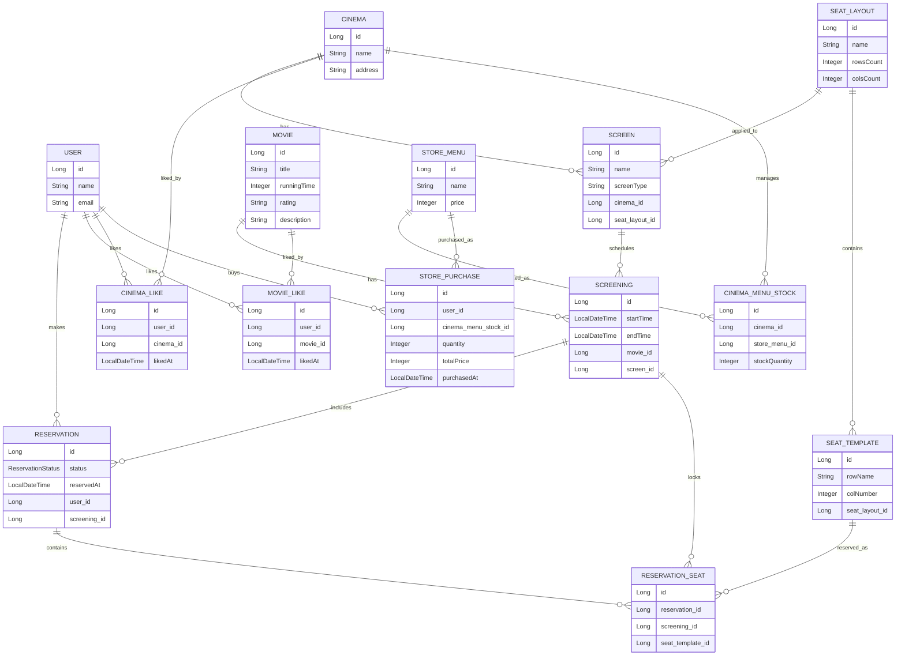

# spring-cgv-23rd
CEOS 23기 백엔드 스터디 - CGV 클론 코딩 프로젝트

<details>
<summary><h2> 0️⃣ 2주차 스터디 복습 </summary>

### 1. ORM과 JPA

**(1) EntityManager는 누가 생성하고 DB와의 연결은 어떻게 이루어질까요?**

- **`EntityManagerFactory`가 생성**
- 실제 사용
    - Spring이 `EntityManagerFactory`를 관리
    - 필요할 때 `EntityManager`를 만들어서 연결해줌

> EntityManager는 EntityManagerFactory가 생성
> Spring 환경에서는 이 과정을 스프링 컨테이너가 대신 관리

```java
EntityManagerFactory emf = Persistence.createEntityManagerFactory("myPersistenceUnit");
EntityManager em = emf.createEntityManager();
```

---

**(2) DB 모델링과 Domain 작성하기**

- *⚠️ 프로젝트 시 주의할 것!!! : `ddl - auto`*
- `ddl-auto`
    - 테이블을 어떻게 다룰지 결정
    - DB 테이블을 자동으로 생성/수정/삭제할지 정하는 옵션
        - 실행할 때 테이블 새로 만들까?
        - 기존 테이블 구조 바꿀까?
        - 아예 지우고 다시 만들까?
        - 그냥 건드리지 말까?
    - OPTION
        - `create` : 실행할 때마다 기존 테이블을 삭제하고 다시 생성
            - **테스트 데이터 매번 초기화하고 싶을 때**
        - `create-drop` : 실행 시 테이블 새로 생성, 종료 시점에 테이블 삭제
        - `update` : 엔티티 기준으로 테이블 구조를 자동 반영, 기존 데이터는 보통 안 지움
            - **공부/연습용**
        - `validate` : 엔티티와 테이블 구조가 맞는지만 검사, DB를 수정하지 않음, 틀리면 실행 에러 발생
            - **실제 프로젝트 / 운영 가까운 환경**
        - `none` : DB 구조를 건드리지 않음
            - **실제 프로젝트 / 운영 가까운 환경**
```
create       : 실행할 때마다 새로 만듦 → 데이터 날아갈 수 있음
create-drop  : 실행 시 생성 + 종료 시 삭제 → 데이터 날아감
update       : 테이블 구조를 자동 수정 → 편하지만 운영에선 위험
validate     : 구조만 검사 → 안전
none         : 아무것도 안 함 → 가장 안전
```

```java
spring:
  datasource:
    driver-class-name: com.mysql.cj.jdbc.Driver
    url: {JDBC URL}
    username: {DATABASE USERNAME}
    password: {DATABASE PASSWORD}
  jpa:
    database: mysql
    database-platform: org.hibernate.dialect.MySQL8Dialect
    hibernate:
      ddl-auto: {OPTION}
    properties:
      hibernate:
        dialect: org.hibernate.dialect.MySQL8Dialect
        database-platform: org.hibernate.dialect.MySQL8Dialect
				show_sql: true
        format_sql: true
```

### 2. 로딩 전략과 N+1 문제

**(1) 지연 로딩의 핵심 : 프록시 객체**
- 프록시 객체란?
    - 실제 객체에 바로 접근하지 않고 **중간에서 대신 동작하는 가짜 객체**
    - **JPA에서는 지연 로딩을 위해 프록시 객체를 사용**

- 왜 프록시를 사용할까?
    - 문제 상황
        - `team = null`
            - 값이 없는 건지, 조회를 안 한 건지 구분 불가
        - `team을 바로 조회`
            - 항상 JOIN 발생 → 성능 낭비

- 프록시 초기화
    - 실제 값 없음
    - ID 값만 보유
    - **값이 필요한 순간 DB 조회 발생 → Lazy Loading**
```java
team.getId();   // DB 조회 X
team.getName(); // DB 조회 발생 (초기화)
```

- 프록시 동작 원리
```text
프록시 객체 생성
        ↓
(아직 초기화 안됨)
        ↓
메서드 호출 (ex. getName)
        ↓
DB 조회
        ↓
실제 엔티티 로딩
        ↓
프록시 내부 값 채움
```

- 동작 흐름
```java
Member 조회

DB
 ↓
Member 반환

Member
 ├ id
 ├ username
 └ team → TeamProxy (프록시)
            │
            │ (초기 상태: DB 조회 X)
            │
            │ team.getName() 호출
            ↓
         DB 조회
            ↓
         실제 Team 엔티티 로딩
```

- 핵심 특징
    - 프록시는 실제 엔티티를 상속한 객체 : `TeamProxy extends Team`
    - 처음에는 DB 조회 없이 껍데기만 존재
    - 실제 데이터 접근 시 DB 조회 발생 (Lazy Loading)

> **지연 로딩에서는 실제 엔티티 대신 프록시 객체를 먼저 넣어두고 실제로 사용하는 시점에 DB 조회를 수행한다**

- 프록시 VS. 실제 엔티티

| 구분    | 프록시       | 실제 엔티티 |
| ----- | --------- | ------ |
| 초기 상태 | 값 없음      | 값 있음   |
| DB 조회 | 필요 시      | 이미 조회됨 |
| 클래스   | Proxy 클래스 | 실제 클래스 |
| 목적    | 지연 로딩     | 데이터 사용 |


- 지연 로딩 동작 예시
```java
Member member = em.find(Member.class, 1L);
Team team = member.getTeam(); // 아직 DB 조회 안됨 (프록시 반환)
team.getName();               // 이 시점에 DB 조회 발생
```

- 출력 결과 : 실제 Team 객체가 아니라 **프록시 객체**가 들어있음
```java
class com.example.demo.entity.Team$HibernateProxy$xxxx
```

---

**(2) fetch join을 사용하면서 페이징을 적용할 때 발생하는 문제에 대해 알아보아요!**

- Fetch Join이란?
    - 연관 엔티티를 JOIN으로 한 번에 조회하는 방법
    - N+1 문제를 해결하기 위해 사용

```java
@Query("select m from Member m join fetch m.team")
List<Member> findAll();
```
- Member + Team을 한 번에 조회

- 페이징과 함께 사용할 때 문제 발생
```java
@Query("select m from Member m join fetch m.orders")
Page<Member> findAll(Pageable pageable);
```

- 문제의 원인
    - 컬렉션 fetch join 시
    ```text
    Member 1 → Order A, Order B
    Member 2 → Order C
    ```

    - SQL 결과 : **Member1이 중복으로 조회됨**
    ```text
    Member1, OrderA
    Member1, OrderB
    Member2, OrderC
    ```

- 페이징의 동작
```sql
limit 2
```

DB는 그냥 row 기준으로 자름
```
Member1, OrderA
Member1, OrderB
```

결과 :
```
Member1만 조회됨
Member2는 아예 안 나옴
```

- 문제 정리
    - 컬렉션 fetch join → row 중복 발생
    - DB 페이징은 row 기준으로 동작
    - JPA는 엔티티 기준으로 결과를 만들어야 함
    **=> 정확한 페이징이 불가능해짐**

- Hibernate 의 문제 해결 방법
    - 메모리에서 페이징 수행
        - DB에서 모든 데이터 조회
        - 애플리케이션 메모리에서 페이징 처리
    
    - 문제점
        - 전체 데이터를 다 가져옴 → 성능 최악
        - 데이터 많으면 OOM 위험

- 🟡 해결 방법 
    - ToOne 관계만 fetch join 사용 : ManyToOne / OneToOne은 안전
    ```java
    @Query("select m from Member m join fetch m.team")
    Page<Member> findAll(Pageable pageable);
    ```
    - 컬렉션은 지연 로딩 + 배치 처리 : IN 쿼리로 최적화
    ```yaml 
    spring:
    jpa:
        properties:
        hibernate:
            default_batch_fetch_size: 100
    ```
    - DTO 조회 사용
    ```java
    @Query("select new com.example.dto.MemberDto(m.id, t.name) from Member m join m.team t")
    Page<MemberDto> findAll(Pageable pageable); 
    ```

- 정리해보기
> **컬렉션 fetch join을 사용하면 row 중복이 발생하고 DB 페이징이 깨지기 때문에 페이징과 함께 사용할 수 없다.**

---

**(3) 🟡 추가로 생각해볼 것들**
1. data jpa를 찾다보면 SimpleJpaRepository에서  entity manager를 생성자 주입을 통해서 주입 받는다. 근데 싱글톤 객체는 한번만 할당을  받는데, 한번 연결 때 마다 생성이 되는 entity manager를 생성자 주입을 통해서 받는 것은 수상하지 않는가? 어떻게 되는 것일까? 한번 알아보자 
2. fetch join 할 때 distinct를 안하면 생길 수 있는 문제
3. fetch join 을 할 때 생기는 에러가 생기는 3가지 에러 메시지의 원인과 해결 방안
    1. `HHH000104: firstResult/maxResults specified with collection fetch; applying in memory!`
    2. `query specified join fetching, but the owner of the fetched association was not present in the select list`
    3. `org.hibernate.loader.MultipleBagFetchException: cannot simultaneously fetch multiple bags`

### 3. REST

**(1) HTTP 프로토콜 버전: HTTP 1.1과 HTTP 2.0의 차이**

| 구분 | HTTP/1.1 | HTTP/2.0 |
|------|----------|----------|
| 전송 방식 | 텍스트 기반 (Plain Text) | 바이너리 기반 (Binary) |
| 연결 방식 | 요청-응답 순차 처리 | 멀티플렉싱 (동시에 여러 요청 처리) |
| 성능 | 느림 (요청마다 대기 발생) | 빠름 (병렬 처리 가능) |
| Head-of-Line Blocking | 발생 (앞 요청이 끝나야 다음 요청 처리) | 해결 (스트림 단위 처리) |
| 헤더 처리 | 매 요청마다 전체 헤더 전송 | 헤더 압축 (HPACK) |
| 서버 푸시 | 지원 x | 지원 o |
| 요청 방식 | 파이프라이닝 (비효율적, 거의 안 씀) | 스트림 기반 요청 |
| TCP 연결 | 여러 개 필요 | 하나의 연결로 처리 |
| 우선순위 설정 | 없음 | 요청 우선순위 가능 |
| 보안 | 선택적 (HTTP/HTTPS) | 대부분 HTTPS 기반 사용 |
| 네트워크 효율 | 낮음 | 높음 |

- 가장 큰 차이  
    - **"멀티플렉싱 + 바이너리 프로토콜"**

- 정리해보기
    - **HTTP/1.1** : 요청을 하나씩 처리 → 병목 발생
    - **HTTP/2.0** : 여러 요청을 동시에 처리 → 성능 개선

---

**(2) HTTP 응답 상태 코드**

- 전체 분류

| 상태 코드 범위 | 의미 |
|----------------|------|
| 1xx | 요청 처리 중 (정보 응답) |
| 2xx | 요청 성공 |
| 3xx | 리다이렉션 (추가 작업 필요) |
| 4xx | 클라이언트 오류 |
| 5xx | 서버 오류 |

- `1xx (Informational)`

| 코드 | 이름 | 설명 |
|------|------|------|
| 100 | Continue | 요청 일부 수신, 계속 진행 가능 |
| 101 | Switching Protocols | 프로토콜 변경 요청 수락 |

- `2xx (Success)`

| 코드 | 이름 | 설명 |
|------|------|------|
| 200 | OK | 요청 성공 |
| 201 | Created | 요청 성공 + 리소스 생성 |
| 202 | Accepted | 요청 접수 (처리 미완료) |
| 204 | No Content | 성공했지만 반환 데이터 없음 |

- `3xx (Redirection)`

| 코드 | 이름 | 설명 |
|------|------|------|
| 301 | Moved Permanently | 영구적으로 URL 변경 |
| 302 | Found | 일시적 URL 변경 |
| 303 | See Other | 다른 URL로 GET 요청 |
| 304 | Not Modified | 캐시 사용 (변경 없음) |

- `4xx (Client Error)`

| 코드 | 이름 | 설명 |
|------|------|------|
| 400 | Bad Request | 잘못된 요청 |
| 401 | Unauthorized | 인증 필요 |
| 403 | Forbidden | 접근 권한 없음 |
| 404 | Not Found | 리소스 없음 |
| 405 | Method Not Allowed | 허용되지 않은 메서드 |
| 409 | Conflict | 요청 충돌 |
| 415 | Unsupported Media Type | 지원하지 않는 형식 |

- `5xx (Server Error)`

| 코드 | 이름 | 설명 |
|------|------|------|
| 500 | Internal Server Error | 서버 내부 오류 |
| 502 | Bad Gateway | 게이트웨이 오류 |
| 503 | Service Unavailable | 서버 과부하 / 점검 |
| 504 | Gateway Timeout | 응답 지연 |

### 4. Spring MVC

```text
1. 클라이언트 요청
2. DispatcherServlet이 HandlerMapping 호출
3. 어떤 컨트롤러를 사용할지 찾음
4. HandlerAdapter가 컨트롤러 실행
5. Controller → Service → Repository → DB
6. Controller가 결과 반환
7. HandlerAdapter / MessageConverter / ViewResolver 처리
8. DispatcherServlet이 최종 응답 반환
```

**(1) Spring MVC란?**
> **클라이언트의 HTTP 요청을 받아서 적절한 컨트롤러에 전달하고**
> **그 결과를 다시 HTTP 응답으로 반환하는 웹 프레임워크이다.**

- 이 과정에서 여러 내부 컴포넌트가 협력해서 동작
- 가장 중심에 있는 것 : **DispatcherServlet**

---

**(2) DispatcherServlet이란?**
> **Spring MVC의 프론트 컨트롤러(Front Controller) : 중앙 관리자**

- 모든 HTTP 요청을 가장 먼저 받는 진입점
- 어떤 컨트롤러가 요청을 처리할지 결정
- 컨트롤러 실행 결과를 다시 HTTP 응답으로 만들어 클라이언트에게 반환

---

**(3). 왜 DispatcherServlet이 중요한가?**

```text
클라이언트 요청 → DispatcherServlet → 적절한 컨트롤러 → 응답
```
- 이 구조의 장점 : 아래와 같은 작업을 Spring이 일관되게 관리 가능
    - 공통 요청 처리
    - URL 매핑
    - 예외 처리
    - View 처리
    - JSON 변환

---

**(4) DispatcherServlet이 하는 일**
- 요청 접수
- 핸들러 조회 요청
- 핸들러 실행 위임
- 결과 해석
- ViewResolver 또는 MessageConverter 호출
- 최종 응답 반환
> **Spring MVC에서 요청 처리의 시작과 끝을 담당**


### 5. Service Architecture
**(1) Controller Layer : 어노테이션 중심으로 더 공부하기**
```java
@RestController
@RequiredArgsConstructor
@RequestMapping(value = "/activities")
public class ActivityController {

    private final ActivityService activityService;

    @PostMapping
    public ResponseEntity<Void> createActivity(@RequestBody @Valid ActivityRequest activityRequest) {
        activityService.createActivity(activityRequest);
        return ResponseEntity.status(HttpStatus.CREATED).build();
    }

    @GetMapping("/{activityId}")
    public ResponseEntity<ActivityResponse> getActivity(@PathVariable Long activityId) {
        return ResponseEntity.ok(activityService.getActivity(activityId));
    }
}
```

- 클래스 레벨 어노테이션
    - `@RestController`
        - @Controller + @ResponseBody 합친 것
        - 반환값을 View가 아니라 **HTTP Response Body(JSON)**로 반환
    - `@RequiredArgsConstructor`
        - Lombok 어노테이션
        - final 필드에 대해 생성자 자동 생성
        - 생성자 주입을 간편하게 해줌
    - `@RequestMapping`
        - 클래스 공통 URL 설정
        - 모든 메서드에 prefix 적용

- 메서드 레벨 어노테이션
    - `@PostMapping`
        - HTTP POST 요청 처리
        - URL: `/activities`
        - 의미 : 데이터 생성 요청
    - `@GetMapping`
        - HTTP GET 요청 처리
        - URL: `/activities/{activityId}`
        - 의미 : 특정 리소스 조회

- 파라미터 어노테이션
    - `@RequestBody`
        - HTTP 요청 body(JSON)를 Java 객체로 변환
    - `@Valid`
        - 요청 데이터 검증 수행
        - DTO에 선언된 validation 적용
    - `@PathVariable`
        - URL 경로 값을 변수로 바인딩

- 응답 관련
    - `ResponseEntity`
        - HTTP 응답 전체를 제어 : 상태 코드, 헤더, 바디
</details>

<details>
<summary><h2> 1️⃣ DB를 모델링해봐요! </summary>

# CGV 서비스 모델링

## 1. 서비스 설명
**영화관 조회**, **영화관 찜**, **영화 조회**, **영화 예매 및 취소**, **영화 찜**, **매점 구매** 기능을 중심으로 모델링

서비스의 핵심 흐름 : 

1. 사용자는 영화관 정보를 조회할 수 있다.
2. 사용자는 영화 정보를 조회할 수 있다.
3. 사용자는 특정 영화관의 특정 상영관에서 진행되는 상영 정보를 확인할 수 있다.
4. 사용자는 원하는 좌석을 선택하여 예매할 수 있다.
5. 사용자는 자신의 예매를 취소할 수 있다.
6. 사용자는 영화관과 영화를 찜할 수 있다.
7. 사용자는 영화관 매점에서 상품을 구매할 수 있다.

설계 목표 : 

1. 단순히 화면에 필요한 데이터만 나열하는 것 X
2. 실제 서비스 흐름인 조회 → 상영 확인 → 좌석 선택 → 예매 → 취소, 그리고 찜/매점 구매까지 자연스럽게 이어지도록 도메인을 설계
3. 이번 주차 구현 범위 외 기능도 이후 확장 가능하도록 구조적으로 설계

---

## 2. 요구사항 해석

- 모든 영화관에 특별관과 일반관이 존재한다.
- 동일한 종류의 상영관은 동일한 좌석 구조를 가진다고 가정하였다.
    - *같은 종류의 관이면 좌석이 동일하다*
    - 좌석 구조를 상영관마다 직접 생성하지 않고 좌석 배치 템플릿으로 분리
- 좌석은 직사각형 형태로 존재한다.
- 영화관마다 매점이 있으며 재고를 따로 관리한다.
- 모든 영화관의 매점 메뉴는 같다.
- 매점 구매는 가능하지만 환불은 고려하지 않는다.

이번 주차 구현 범위 부분 :  
`영화관 조회, 영화 조회, 영화 예매 및 취소`

(영화관 찜, 영화 찜, 매점 관련 기능은 전체 서비스 모델링에는 포함하지만 이번 구현 범위에서는 우선 제외)

---

## 3. 모델링 방향

- 실제 영화관 내부에는 여러 상영관이 존재
- 각 상영관은 하나의 좌석 배치 템플릿을 참조
- 동일한 구조의 상영관은 같은 좌석 템플릿을 공유하도록 설계
    - 좌석 구조의 중복 생성을 줄임
    - 요구사항을 더 자연스럽게 반영
- 영화와 상영을 분리하여 시간 단위의 상영 정보 관리 가능
- 예매는 단순히 영화 선택이 아니라 **사용자 + 상영 + 좌석**을 함께 다루는 구조로 설계
- 한 번의 예매에서 여러 좌석을 선택할 수 있도록 예매 단위와 좌석 단위를 분리
- 찜 기능과 매점 기능은 다대다 관계 및 재고 관리가 드러나도록 별도 엔티티로 분리

---

## 4. 모델링

**엔티티 :** 

- `User` : 예매, 찜, 매점 구매를 수행하는 사용자
    - 이름과 이메일 정보

- `Cinema` : 영화관 지점
    - CGV 대전둔산점, CGV 대전관저점과 같은 실제 지점 단위
    - 하나의 영화관은 여러 개의 `Screen`을 가짐

- `Screen` : 영화관 내부 상영관
    - 영화관 내부의 개별 관
    - 일반관 또는 특별관과 같은 타입을 가짐
    - 하나의 좌석 배치 템플릿을 참조함

- `SeatLayout` : 좌석 배치 템플릿
    - 같은 종류의 상영관이 동일한 좌석 구조를 가진다는 조건을 위해 별도의 엔티티로 분리
    - 하나의 좌석 구조를 여러 상영관이 공유할 수 있음

- `SeatTemplate` : 좌석 배치 템플릿 내부의 개별 좌석
    - A열 1번, A열 2번, B열 1번과 같은 좌석 정보
    - 직사각형 형태를 표현하기 위해 행(row)과 열(column)로 관리

- `Movie` : 영화 정보
    - 영화 제목, 상영 시간, 관람 등급, 설명 등의 정보 포함

- `Screening` : 특정 영화의 상영 정보
    - 어떤 영화가 어느 상영관에서 언제 상영되는지
    - 영화와 상영관을 연결
    - 실제 예매는 이 상영 정보를 기준으로 이루어짐

- `Reservation` : 사용자의 예매 정보
    - 사용자가 특정 상영에 대해 생성한 예매 단위
    - 하나의 예매는 여러 좌석을 포함할 수 있음
    - 예매 상태와 예매 시각 등을 관리함

- `ReservationSeat` : 예매에 포함된 개별 좌석 정보
    - 하나의 예매에 포함된 각 좌석을 저장
    - 예매와 좌석을 연결하는 역할
    - 같은 상영 내 동일 좌석의 중복 예매를 방지하기 위한 기준이 됨

- `MovieLike` : 영화 찜 정보
    - 사용자와 영화 사이의 찜 관계를 관리

- `CinemaLike` : 영화관 찜 정보
    - 사용자와 영화관 사이의 찜 관계를 관리

- `StoreMenu` : 매점 메뉴
    - 팝콘, 음료, 나초 등 모든 영화관이 공통으로 가지는 메뉴 정보

- `CinemaMenuStock` : 영화관별 매점 재고
    - 동일한 메뉴라도 영화관마다 재고 수량은 다르므로 별도 관리

- `StorePurchase` : 매점 구매 내역
    - 사용자가 특정 영화관에서 어떤 메뉴를 몇 개 구매했는지 기록

---

**전체 흐름 :** 

- 하나의 영화관(`Cinema`)은 여러 상영관(`Screen`)을 가진다.
- 하나의 상영관(`Screen`)은 하나의 좌석 배치 템플릿(`SeatLayout`)을 참조한다.
- 하나의 좌석 배치 템플릿(`SeatLayout`)은 여러 개의 좌석 템플릿(`SeatTemplate`)을 가진다.
- 하나의 영화(`Movie`)는 여러 번 상영될 수 있으므로 여러 상영 정보(`Screening`)를 가진다.
- 하나의 상영관(`Screen`)은 여러 상영 정보(`Screening`)를 가진다.
- 하나의 예매(`Reservation`)는 한 사용자(`User`)와 한 상영(`Screening`)에 대해 생성된다.
- 하나의 예매(`Reservation`)는 여러 개의 예매 좌석(`ReservationSeat`)을 가질 수 있다.
- 따라서 한 사용자가 한 번의 예매에서 여러 좌석을 선택하는 상황을 표현할 수 있다.
- 하나의 예매 좌석(`ReservationSeat`)은 하나의 좌석 템플릿(`SeatTemplate`)을 참조한다.
- 상영관별 실제 좌석을 별도 엔티티로 생성하지 않고, 상영관이 참조하는 좌석 템플릿의 좌석을 해당 상영관의 좌석으로 간주하였다.
- 즉, 같은 좌석 구조를 공유하는 상영관에서는 `SeatTemplate`이 논리적인 좌석 식별자 역할을 한다.
- 영화 찜과 영화관 찜은 사용자와 대상 간 다대다 관계를 풀기 위해 별도 엔티티로 분리하였다.
- 매점은 공통 메뉴와 영화관별 재고를 분리하여 영화관마다 다른 재고 상황을 표현하도록 설계하였다.

---

## 5. ERD



*※ 모든 엔티티의 id는 PK이며 *_id 컬럼은 연관 엔티티를 참조하는 FK로 설계하였음*
*※ 상영관 종류는 복잡성을 줄이기 위해 별도 엔티티로 분리하지 않고 Screen.screenType 속성으로 관리하였음*

**Enum 정의**

- `ReservationStatus`
    - `RESERVED` : 예매 완료 상태
    - `CANCELED` : 예매 취소 상태
    - `EXPIRED` : 결제 미완료 등으로 자동 취소된 상태

**제약 조건**
- `SeatTemplate` : `(seat_layout_id, row_name, col_number)` UNIQUE

- `ReservationSeat` : `(screening_id, seat_template_id)` UNIQUE

- `MovieLike` : `(user_id, movie_id)` UNIQUE

- `CinemaLike` : `(user_id, cinema_id)` UNIQUE

- `CinemaMenuStock` : `(cinema_id, store_menu_id)` UNIQUE

**엔티티 관계 설명**
- Cinema 1 : N Screen
    - 하나의 영화관은 여러 상영관을 가진다.

- SeatLayout 1 : N Screen
    - 하나의 좌석 구조는 여러 상영관에서 공유될 수 있다.
    - 각 상영관은 하나의 좌석 구조를 참조한다.

- SeatLayout 1 : N SeatTemplate
    - 하나의 좌석 구조는 여러 개의 좌석으로 구성된다.

- Movie 1 : N Screening
    - 하나의 영화는 여러 번 상영될 수 있다.

- Screen 1 : N Screening
    - 하나의 상영관에서 여러 상영이 이루어진다.

- User 1 : N Reservation
    - 한 사용자는 여러 번 예매할 수 있다.

- Screening 1 : N Reservation
    - 하나의 상영에 대해 여러 예매가 생성될 수 있다.

- Reservation 1 : N ReservationSeat
    - 하나의 예매는 여러 좌석을 포함할 수 있다.

- SeatTemplate 1 : N ReservationSeat
    - 하나의 좌석은 여러 상영에서 반복 사용될 수 있다.

- Screening 1 : N ReservationSeat
    - 하나의 상영에서는 여러 예매 좌석 정보가 존재할 수 있다.
    - 같은 상영에서는 동일 좌석 중복 예매가 불가능하다.

- User N : M Movie
    - 영화 찜 기능은 `MovieLike` 엔티티로 분리하여 관리한다.

- User N : M Cinema
    - 영화관 찜 기능은 `CinemaLike` 엔티티로 분리하여 관리한다.

- Cinema N : M StoreMenu
    - 모든 영화관은 동일한 매점 메뉴를 공유하지만 재고는 다르므로 `CinemaMenuStock` 엔티티로 관리한다.

- User 1 : N StorePurchase
    - 한 사용자는 여러 번 매점 상품을 구매할 수 있다.

---

## 6. 설계 특징 및 고려 사항
- **좌석 구조의 재사용성과 예매 흐름의 자연스러움**
    - *같은 종류의 관이면 좌석이 동일하다*
        - 좌석 배치를 SeatLayout과 SeatTemplate으로 분리
        - 여러 상영관이 동일한 좌석 구조를 공유
    - *예매는 특정 상영에서 특정 좌석을 선택하는 행위이다*
        - `Reservation`과 `ReservationSeat`를 분리하여 하나의 예매가 여러 좌석을 포함할 수 있도록 설계
        - `Reservation`은 예매 단위의 상태와 상영 정보를 관리
        - `ReservationSeat`는 실제 선택된 좌석 정보를 관리
        - 같은 좌석이라도 상영이 다르면 별도의 예매가 가능
        - 따라서 한 사용자가 한 번에 여러 좌석을 예매하는 상황도 표현 가능
    - *Screening을 중심으로 Movie와 Screen을 연결*
        - 상영 시간 단위의 관리가 가능하도록 설계
    - *`ReservationSeat`에 `(screening_id, seat_template_id)` 유니크 제약을 설정하여 동일 상영 내 동일 좌석의 중복 예매를 방지*
        - 동일 좌석 중복 예매 방지
    - *예매 상태를 Enum(ReservationStatus)로 관리*
        - 예약/취소 상태 구분
        - 예매 취소 시 데이터를 삭제하기보다 상태 변경 방식으로 관리 가능

- **찜 기능의 명확한 관계 분리**
    - 영화 찜과 영화관 찜은 모두 사용자와 대상 간 다대다 관계이므로 별도 엔티티(`MovieLike`, `CinemaLike`)로 분리
    - 중복 찜 방지와 찜 시각 기록 가능

- **매점 메뉴와 재고의 분리**
    - 모든 영화관의 메뉴는 같지만 재고는 영화관마다 다르므로    `StoreMenu`와 `CinemaMenuStock`을 분리
    - 공통 메뉴 정의와 영화관별 재고 관리를 동시에 만족 가능

- **실제 서비스와의 차이 및 단순화**
    - 실제 서비스에서는 결제 정보, 임시 좌석 선점, 취소 가능 시간, 할인 정책 등이 추가로 필요할 듯
    > **이번 과제에서는 예매/찜/매점 중심으로 단순화**


---

## 7. 정리하기
- CGV 서비스 모델링:
    - 영화관, 상영관, 좌석 구조, 영화, 상영, 예매
    - 찜 기능과 매점 기능까지 포함하여 전체 서비스 관점에서 설계

- 실제 서비스에서 사용자가 경험하는 흐름인 *조회 → 상영 확인 → 좌석 선택 → 예매/취소, 찜, 매점 구매* 까지 이어질 수 있도록 엔티티 간 관계 구성


</details>

<details>
<summary><h2> 3️⃣ CGV의 4가지 HTTP Method API 만들어요 </h2></summary>

> **Reservation API 중심으로 구현**
- 과제의 `api/items/` 예시는 서비스에 맞게 `api/reservations/`로 수정
- 이번 주차 우선 구현 범위인 **영화관 조회 / 영화 조회 / 영화 예매 및 취소** 기능을 반영
- 4가지 HTTP Method 예시는 **예매(Reservation)** 모델을 기준으로 구현
- 추가로 구현 범위 충족을 위해 `Cinema`, `Movie` 조회 API도 함께 작성

---

## 1. 계획
단순 CRUD 예시를 그대로 따르기보다
실제 서비스 흐름에 더 가까운 모델인 **Reservation(예매)** 을 기준으로 4가지 API를 구성

- `POST /api/reservations`
- `GET /api/reservations`
- `GET /api/reservations/{reservationId}`
- `DELETE /api/reservations/{reservationId}`

추가로 구현 범위에 포함된 조회 기능을 위해 아래 API도 함께 작성

- `GET /api/cinemas`
- `GET /api/cinemas/{cinemaId}`
- `GET /api/movies`
- `GET /api/movies/{movieId}`

- 패키지 기준 : `com.ceos23.spring_boot.cgv`
- 새로 만든 주요 파일
    - `controller/cinema/CinemaController.java`
    - `controller/movie/MovieController.java`
    - `controller/reservation/ReservationController.java`
    - `dto/cinema/CinemaResponse.java`
    - `dto/movie/MovieResponse.java`
    - `dto/reservation/ReservationCreateRequest.java`
    - `dto/reservation/ReservationResponse.java`

---

## 2. API와 어떻게 대응되는지

### (1) 새로운 데이터 create
예매 생성 기능을 `POST` 요청으로 구현

- URL : `POST /api/reservations`

- Body
```json
{
  "userId": 1,
  "screeningId": 1,
  "seatTemplateIds": [1, 2]
}
```

### (2) 모든 데이터 가져오기
전체 예매 목록을 조회하는 기능을 `GET` 요청으로 구현

- URL : `GET /api/reservations`
    - 예매가 존재하지 않으면 빈 배열 [] 이 반환

-조회 기능 구현 범위를 반영하여 전체 조회 API도 함께 작성
    - `GET /api/cinemas`
    - `GET /api/movies`

### (3) 특정 데이터 가져오기

특정 예매 1건을 조회하는 기능을 `GET` 요청으로 구현

- URL : `GET /api/reservations/{reservationId}`

예시:
```
GET /api/reservations/1
```

추가로 특정 영화관 / 특정 영화 조회도 아래와 같이 구현

```
GET /api/cinemas/{cinemaId}
GET /api/movies/{movieId}
```

### (4) 특정 데이터 삭제

예매 취소 기능을 `DELETE` 요청으로 구현

- URL : `DELETE /api/reservations/{reservationId}`

예시:
```
DELETE /api/reservations/1
```
- 데이터를 물리적으로 삭제하는 방식이 아니라 예매 상태를 `CANCELED`로 변경하는 방식으로 처리
- API 형태는 `DELETE` 이지만 내부적으로는 **상태 변경 기반 취소 로직** 적용

---

## 3. 구현하면서 고려한 점
- 과제 예시의 `items` -> `reservations`로 URI 구체화
- 4가지 HTTP Method 예시는 **예매 모델** 기준으로 함
- 예매 생성 시 단순 저장이 아니라 아래 조건을 함께 검증하도록 함
    - 사용자 존재 여부
    - 상영 정보 존재 여뷰
    - 좌석 존재 여부
    - 요청 좌석 중복 여부
    - 해당 상영관 좌석 구조와의 일치 여부
    - 동일 상영 내 좌석 중복 예매 여부

--

## 4. 정리하기
> **CGV 서비스에 더 가까운 `Reservation API` 중심으로 구현
- 영화관 조회 : `CinemaController`
- 영화 조회 : `MovieController`
- 영화 예매/취소 : `ReservationController`

---

- 영화관


-영화


- 예약 post


- 예약 get


- 예약 취소


- 예약 취소 체크


</details>

<details>
<summary><h2> 4️⃣ 정적 팩토리 메서드를 사용해서 DTO 사용해봐요 </h2></summary>

> **DTO를 사용하여 Controller ↔ Service ↔ Domain 역할을 분리**
- Entity를 그대로 반환하지 않고 DTO로 변환하여 응답하도록 구현
- Java의 `record`를 활용하여 간결한 DTO 정의
- 정적 팩토리 메서드(`of`, `from`)를 사용하여 변환 로직을 DTO 내부에 위치

---

## 1. 왜 DTO를 사용하는가
- Entity 구조가 외부 API에 그대로 노출되는 문제 방지
- 필요한 데이터만 선택적으로 응답 가능
- 추후 필드 변경 시 API 영향 최소화
- 계층 간 역할 분리 (Controller ↔ Service ↔ Domain)

---

## 2. DTO 구성

이번 구현에서는 아래와 같이 요청/응답 DTO를 분리하였다.

### (1) Request DTO
클라이언트 → 서버로 들어오는 데이터를 담당

- `ReservationCreateRequest`
```java
public record ReservationCreateRequest(
    Long userId,
    Long screeningId,
    List<Long> seatTemplateIds
) {}
```

### (2) Response DTO
서버 -> 클라이언트로 나가는 데이터 담당
`CinemaResponse`
`MovieResponse`
`ReservationResponse`
```java
public record CinemaResponse(
    Long cinemaId,
    String name,
    String address
) {}
```

---

## 3. 정적 팩토리 메서드 사용
DTO 변환 로직을 `Controller` 나 `Service`에 두지 않음
DTO 내부에 `static` 메서드로 정의

### (1) 단일 Entity -> DTO 변환
```java
public static CinemaResponse from(Cinema cinema) {
    return new CinemaResponse(
        cinema.getId(),
        cinema.getName(),
        cinema.getAddress()
    );
}
```

### (2) 복합 데이터 변환 (Reservation)
- 예매는 좌석 정보까지 포함
- 단순 Entity 하나가 아니라 추가 데이터를 함께 받아서 DTO 생성
```java
public static ReservationResponse of(
    Reservation reservation,
    List<ReservationSeat> reservationSeats
) {
    return new ReservationResponse(
        reservation.getId(),
        reservation.getUser().getId(),
        reservation.getScreening().getId(),
        reservation.getStatus().name(),
        reservation.getReservedAt(),
        reservationSeats.stream()
            .map(seat -> seat.getSeatTemplate().getId())
            .toList()
    );
}
```

---

## 4. Controller 에서의 사용 방식
Controller 에서는 Entity를 직접 반환 X
DTO로 변환하여 반환
```java
@GetMapping
public List<CinemaResponse> getCinemas() {
    return cinemaService.getCinemas().stream()
        .map(CinemaResponse::from)
        .toList();
}
```

예매 API
```java
return ReservationResponse.of(
    reservation,
    reservationService.getReservationSeats(reservation)
);
```

---

## 5. record를 사용한 이유
- 불변 객체 생성 (immutable)
- getter, constructor 자동 생성
- 코드 간결성 증가
- DTO 목적에 적합한 구조

---

## 6. 정리하기
> **DTO를 도입 -> Entity와 API 응답을 분리**
- 정적 팩토리 메서드를 활용하여 변환 책임을 DTO 내부로 이동시킴
    - Controller와 Service의 역할을 더욱 명확하게 구분
- Swagger, 테스트 코드, 예외 처리 단계에서도 확장성과 유지보수성을 높이는 기반

</details>

<details>
<summary><h2> 5️⃣ Global Exception를 만들어봐요 </summary>
[참고 링크](https://adjh54.tistory.com/79)

> **전역 예외 처리를 통해 일관된 에러 응답 구조를 구성**
- Service 계층에서 발생하는 예외를 Controller에서 개별 처리하지 않고  
  `@RestControllerAdvice`를 통해 공통 처리
- 에러 유형을 `ErrorCode`로 관리하여 일관된 응답 제공
- 커스텀 예외를 정의하여 비즈니스 로직과 예외 처리를 분리

---

## 1. 왜 Global Exception이 필요한가

- 초기 구현 : `IllegalArgumentException`, `IllegalStateException` 등을 사용하여 예외처리
    - 문제점
        - Controller마다 예외 처리를 따로 해야 하는 비효율
        - 에러 응답 형식이 일정하지 않음
        - 어떤 에러인지 구분하기 어려움

- 해결 방안
    - 전역에서 예외를 처리
    - 일관된 JSON 형태로 응답하기 위해 Global Exception 구조 도입

---

## 2. 전체 구조

```text
global/exception
├── ErrorCode.java
├── ErrorResponse.java
├── GlobalExceptionHandler.java
├── NotFoundException.java
├── BadRequestException.java
└── ConflictException.java
```

---

## 3. ErrorCode
**코드 + HTTP 상태 + 메시지**로 관리하도록 설계
```java
USER_NOT_FOUND (404)
SEAT_TEMPLATE_NOT_FOUND (404)
EMPTY_SEAT_REQUEST (400)
ALREADY_RESERVED_SEAT (409)
```
---

## 4. ErrorResponse
클라이언트에 내려줄 공통 에러 응답 형식을 정의

```java
public record ErrorResponse(
    LocalDateTime timestamp,
    int status,
    String code,
    String message
)
```

예시 응답:
```json
{
  "timestamp": "2026-03-20T17:10:00",
  "status": 404,
  "code": "USER_404",
  "message": "해당 사용자가 존재하지 않습니다. id=999"
}
```

---

## 5. Custom Exception
비즈니스 상황에 맞게 예외를 구분하기 위해 커스텀 예외 정의

- `NotFoundException`
- `BadRequestException`
- `ConflictException`

각 예외는 `ErrorCode`를 포함하여 어떤 에러인지 명확하게 표현

---

## 6. GlobalExceptionHandler
모든 예외를 한 곳에서 처리하기 위해 `@RestControllerAdvice`를 사용

```java
@RestControllerAdvice
public class GlobalExceptionHandler {

    @ExceptionHandler(NotFoundException.class)
    protected ResponseEntity<ErrorResponse> handleNotFoundException(NotFoundException e) { ... }

    @ExceptionHandler(BadRequestException.class)
    protected ResponseEntity<ErrorResponse> handleBadRequestException(BadRequestException e) { ... }

    @ExceptionHandler(ConflictException.class)
    protected ResponseEntity<ErrorResponse> handleConflictException(ConflictException e) { ... }

    @ExceptionHandler(Exception.class)
    protected ResponseEntity<ErrorResponse> handleException(Exception e) { ... }
}
```
- Controller에서는 별도의 try-catch 없이도 자동으로 에러 응답 처리되도록 구성

---

## 7. Service 계층 적용
- 기존의 `IllegalArgumentException` 대신 `커스텀 예외`를 사용

예시:
```java
userRepository.findById(userId)
    .orElseThrow(() -> new NotFoundException(
        ErrorCode.USER_NOT_FOUND,
        "해당 사용자가 존재하지 않습니다. id=" + userId
    ));
```

- 예매 로직에서는 다음과 같은 예외를 구분하여 처리하였다.
    - 좌석이 없는 경우 → `BadRequestException`
    - 좌석 중복 요청 → `BadRequestException`
    - 이미 예매된 좌석 → `ConflictException`
    - 이미 취소된 예매 → `ConflictException`

---

## 8. 정리하기
**Global Exception 도입으로 얻는 개선 효과**
- Controller 코드 단순화 (try-catch 제거)
- 에러 응답 형식 통일
- 비즈니스 예외를 명확하게 표현 가능
- 유지보수성과 확장성 향상
- 예매 로직처럼 *다양한 예외 상황* 발생하는 경우 에러를 *의미 단위로 분리 처리* 가능해짐

[global exception]


</details>

<details>
<summary><h2> 6️⃣ Swagger 연동 및 Controller 통합 테스트 </h2></summary>

> **Swagger를 활용한 API 테스트 환경 구축 및 Controller 통합 테스트 진행**

---

## 1. 목표
- Swagger(OpenAPI)를 연동하여 API를 문서화
- 브라우저에서 직접 API 요청 및 응답 테스트
- 작성한 Controller가 정상적으로 동작하는지 통합적으로 확인

---

## 2. 적용 방법

### (1) 의존성 추가
`build.gradle`에 아래 의존성을 추가

```gradle
implementation 'org.springdoc:springdoc-openapi-starter-webmvc-ui:3.0.1'
```

### (2) 설정 파일 수정
`application.properties`에 Swagger UI 경로 추가
```
springdoc.swagger-ui.path=/swagger-ui.html
```

### (3) 실행 후 접속
```
http://localhost:8080/swagger-ui.html
```

---

## 3. Swagger 에서 확인된 API
**Reservation API**
- `GET /api/reservations` : 전체 예매 조회
- `POST /api/reservations` : 예매 생성
- `GET /api/reservations/{reservationId}` : 특정 예매 조회
- `DELETE /api/reservations/{reservationId}` : 예매 취소

**Movie API**
- `GET /api/movies` : 전체 영화 조회
- `GET /api/movies/{movieId}` : 특정 영화 조회

**Cinema API**
- `GET /api/cinemas` : 전체 영화관 조회
- `GET /api/cinemas/{cinemaId}` : 특정 영화관 조회

---

## 4. Controller 통합 테스트

Swagger UI의 Try it out 기능을 사용하여 각 API를 직접 호출해봄

### (1) 예매 생성 테스트
`POST /api/reservations`

요청 예시:
```json
{
  "userId": 1,
  "screeningId": 1,
  "seatTemplateIds": [1, 2]
}
```

테스트 결과:
- 정상 요청 시 예매가 생성되었음
- 하나의 예매에서 여러 좌석을 선택할 수 있음을 확인함

### (2) 전체 예매 조회 테스트
`GET /api/reservations`

테스트 결과:
- 생성된 예매 목록이 정상적으로 조회되었음
- 예매가 없을 경우 빈 배열 [] 이 반환됨

### (3) 특정 예매 조회 테스트
`GET /api/reservations/{reservationId}`

테스트 결과:
- 특정 ID에 해당하는 예매 정보가 정상적으로 조회되었음

### (4) 예매 취소 테스트
`DELETE /api/reservations/{reservationId}`

테스트 결과:
- 특정 예매 ID를 기준으로 예매 취소가 가능했음
- 잘못된 URL(`/api/reservations`)로 DELETE 요청을 보낼 경우 `405 Method Not Allowed`가 발생함을 확인함
- 올바른 URL(`/api/reservations/{reservationId}`)로 요청해야 정상 동작함

---

## 5. 정리하기
- Swagger UI를 통해 각 API의 요청 방식과 응답 구조를 한눈에 확인
- Controller → Service → Repository 흐름이 실제로 어떻게 동작하는지 테스트를 통해 확인
- DTO가 Swagger 스키마에 반영되어 Request / Response 구조를 명확히 확인 
- Global Exception이 적용된 이후 잘못된 요청에 대해서도 일관된 JSON 에러 응답을 반환함을 확인

---
- swagger


- swagger reservation


</details>

<details>
<summary><h2> 7️⃣ Service 계층의 단위 테스트를 진행해요 </h2></summary>

> **Service 계층의 비즈니스 로직이 올바르게 동작하는지 단위 테스트로 검증**

---

## 1. 목표
- Controller나 DB까지 포함하지 않고 **Service 계층의 비즈니스 로직만 독립적으로 검증**
- Repository는 실제 DB 대신 Mock 객체로 대체
- 예매 생성/취소 과정에서 발생할 수 있는 주요 예외 상황까지 함께 테스트

---

## 2. 테스트 대상
이번 주차에서 핵심 비즈니스 로직이 가장 많이 들어간 `ReservationService`를 중심으로 단위 테스트를 작성

테스트 파일 위치:
```text
src/test/java/com/ceos23/spring_boot/cgv/service/reservation/ReservationServiceTest.java
```

---

## 3. 사용한 방식
- `JUnit5`
- `Mockito`
- `@ExtendWith(MockitoExtension.class)`
- `@Mock`
- `@InjectMocks`

Repository는 모두 Mock으로 두고
`ReservationService`에 주입하여 DB 없이 서비스 로직만 검증하도록 구성하였다.

---

## 4. 테스트한 항목

### (1) 예매 생성 성공
- 사용자 존재
- 상영 정보 존재
- 좌석 존재
- 중복 좌석 요청 아님
- 이미 예매된 좌석 아님

위 조건을 모두 만족할 때 예매가 정상 생성!

### (2) 예매 생성 실패 - 좌석 요청이 비어 있는 경우

예매 요청 좌석 목록이 비어 있으면
`BadRequestException` 이 발생하는지 검증

### (3) 예매 생성 실패 - 사용자 없음

존재하지 않는 사용자 ID로 요청했을 때
`NotFoundException` 이 발생하는지 검증

### (4) 예매 생성 실패 - 상영 정보 없음

존재하지 않는 상영 정보 ID로 요청했을 때
`NotFoundException` 이 발생하는지 검증

### (5) 예매 생성 실패 - 요청 좌석 중복

하나의 요청에서 같은 좌석 ID를 중복으로 보내는 경우
`BadRequestException` 이 발생하는지 검증

### (6) 예매 생성 실패 - 이미 예매된 좌석

동일 상영 내에서 이미 예매된 좌석을 다시 선택한 경우
`ConflictException` 이 발생하는지 검증

### (7) 예매 취소 성공

정상적인 예매를 취소했을 때
예매 상태가 `CANCELED` 로 변경되는지 검증

### (8) 예매 취소 실패 - 이미 취소된 예매

이미 취소된 예매를 다시 취소하려고 하면
`ConflictException` 이 발생하는지 검증

### (9) 예매 취소 실패 - 존재하지 않는 예매

존재하지 않는 예매 ID로 취소 요청 시
`NotFoundException` 이 발생하는지 검증

---

## 5. 테스트 코드 작성하면서 고려한 점
- 테스트에서는 JPA가 실제로 동작하지 않음
    - 엔티티의 `id` 값이 자동 생성되지 않음

- 따라서 `ReflectionTestUtils.setField()`를 사용
    - 테스트용 엔티티에 id 값을 직접 주입

- 실제 서비스 코드에서 사용하는 좌석 구조 비교 로직, 예매 중복 검증 로직 등을 단위 테스트 환경에서도 동일하게 검증

---

## 6. 실행 결과

- `ReservationServiceTest` 기준 총 9개의 테스트를 작성

```
BUILD SUCCESSFUL
9 테스트 통과
```

---

## 7. 정리

- `ReservationService`의 핵심 비즈니스 로직이 정상적으로 동작하는지 검증
- 단순 성공 케이스만이 아니라 예외 상황까지 함께 테스트함
     -예매 생성 / 취소 로직의 안정성을 더 높임
- Controller나 DB에 의존하지 않고 Service 계층만 독립적으로 테스트
    - 단위 테스트의 목적과 장점 이해

[service]


</details>