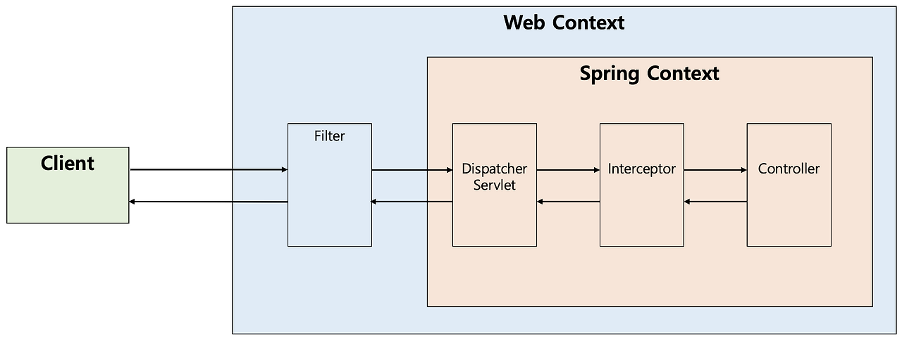

# JWT 란?

**JWT(Json Web Token)** 은 Json 포맷을 이용하여 사용자에 대한 속성을 지정하는 Claim 기반의 Web Token이다.  
JWT는 토큰 자체에 정보를 저장해, 토큰 자체가 정보가 되어 전달되어 사용된다.


JWT는 `Header`, `Payload`, `Signature`의 3부분으로 이뤄진다.  
각 부분은 Base64Url로 인코딩되어 표현된다.  
또한, 각 부분을 구분하고 이어주기 위해 `.`구분자를 사용한다.

### Header

Header는 **alg**과 **typ** 두 가지 정보로 구성된다.

- **typ** : 토큰의 타입을 지정 ex) JWT
- **alg** : 알고리즘 방식을 지정, 서명(Signature) 및 토큰 검증에 사용 ex) HS256, RSA

```
{ 
   "alg": "HS256",
   "typ": JWT
 }
```

### Payload

Payload에는 토큰에서 사용할 정보의 조각들인 **클레임(Claim)** 이 담겨 있다.  
클레임의 종류로는 **Register**, **Public**, **Private**이 있다.

#### Register

Register는 토큰에 담을 정보를 포함한다.

```
{
  "sub": "user:1234",     // 식별 가능한 사용자 ID
  "iat": 1695030000,
  "exp": 1695031800,
  "jti": "9f8b7a6c"
  ...
}
```

- **sub** : 토큰의 주제(보통 사용자 ID)
- **iat** : 토큰 발급 시간
- **exp** : 토큰 만료 시간
- **jti** : 토큰 식별, 중복 방지를 위해 사용

#### Public

Public은 공개용 정보를 위해 사용한다.  
충돌 방지를 위해 URI 포맷을 이용한다.

```
{
    "https://example.com":true
}
```

#### Private

Private은 서버와 클라이언트 사이에 임의로 지정한 정보를 저장한다.

```
{
    "token_type": access
}
```

### Signature

Signature은 토큰을 인코딩하거나 유효성을 검증할 때 사용하는 고유한 암호화 코드이다.  
이는 Header와 Payload의 값을 각각 Base64Url로 인코딩하고, 인코딩한 값을 Secret Key를 이용해 Header에서 정의한 알고리즘으로 해싱을 하고, 이 값을 다시 Base64Url로 인코딩하여
생성한다.

## JWT 장점 👍

- **무상태성(Stateless)**  
  서버가 클라이언트의 상태를 저장하지 않기 때문에, 서버를 여러 대로 확장하는 환경이나 MSA에 적합.
- **CORS 및 모바일**  
  쿠키를 사용하지 않아도 되므로 다양한 도메인 환경이나 쿠키 관리가 어려운 모바일 환경에서도 쉽게 사용 가능.
- **성능 향상**  
  DB를 조회하지 않고, 토큰 자체의 서명(Signature)만 검증하여 인증을 처리할 수 있어 서버의 부담이 줄어듬.

## JWT 단점 👎

- **Payload 정보 노출**  
  Payload 부분은 암호화된 것이 아니라 단순히 Base64Url로 인코딩된 것이기 때문에 누구나 정보를 볼 수 있음. (민감한 정보를 담으면 안된다!!!)
- **토큰 통제 및 만료의 어려움**  
  한번 발급된 JWT는 유효기간이 지나기 전까지는 서버에서 임의로 삭제하거나 만료시키기 어려움. (토큰 탈취시 매우 취약!)
- **네트워크 오버헤드**  
  Payload에 담는 정보(Claim)가 많이질수록 토큰의 길이가 길어져 API 요청 헤더가 커짐.

<details>
<summary>참고</summary>

- **난수 기반 인증(Opaque Token)** : JWT의 크기 문제와 정보 노출 문제를 해결하기 위해, 의미없는 긴 난수 토큰(Opaque Token)을 클라이언트에게 발급하고 실제 데이터는 Redis에
  저장하는
  방식도 많이 사용한다.
  [참고](https://auth-wiki.logto.io/ko/opaque-token)
- **JWE(Json Web Encryption)** : 위에서 설명한 일반적인 JWT는 서명을 통해 데이터의 변조는 막는 JWS 방식이다.  
  JWE는 대칭키-비대칭키를 활용해 데이터를 암호화함.
  이는 리소스를 많이 먹는 작업이여서 잘 사용하지 않음. (금융권에서는 종종 사용함.)

</details>

## AccessToken과 RefreshToken

### AccessToken

- **목적** : 실제 리소스에 접근하고 권한을 인증받기 위해 사용하는 토큰
- **특징** : 토큰이 탈취당하더라도 피해를 최소화하기 위해 유효기간을 짧게(15분~1시간) 설정.

### RefreshToken

- **목적** : 수명이 짧은 AccessToken이 만료되었을때, 사용자가 다시 로그인할 필요 없이 AccessToken을 재발급 받기 위해 사용
- **특징** : 유효기간을 길게(1주~1달) 설정.

# 다른 인증 방식들

## Cookie 🍪

- **개념** : 클라이언트측에 저장되는 Key-Value 형태의 작은 데이터 파일.
- **특징** : 서버가 응답 헤더(Set-Cookie)를 통해 클라이언트에 쿠키를 넘겨주면, 이후 클라이언트는 요청할 때마다 자동으로 쿠키를 서버로 보냄.
- **한계** : 쿠키 자체에 인증 정보를 담으면 브라우저에 데이터가 노출되어 보안에 매우 취약하며, CSRF 공격의 대상이 되기 쉬움.

## Session 🗄️

- **개념** : 사용자의 민감한 정보나 상태를 클라이언트가 아닌 서버의 메모리나 데이터베이스에 저장하는 방식.
- **작동 방식** : 서버는 유저 정보를 서버에 저장하고, 해당 정보를 식별할 수 있는 고유한 임의의 문자열인 세션 ID(Session ID) 만을 클라이언트의 쿠키에 담아 보냄.
- **특징** : 실제 정보는 서버에 있으므로 보안성이 높고, 서버에서 사용자 세션을 강제로 만료시킬 수 있음.
- **한계** : 동시 접속자가 많아지면 서버 메모리에 부하가 심해지며, 서버를 여러 대 두는 환경에서는 세션 정보를 서버 간에 동기화해야 하는 복잡한 문제가 발생.

## OAuth 2.0 🔒

- **개념** : 사용자가 자신의 비밀번호를 서비스에 제공하지 않고도, 신뢰할 수 있는 외부 서비스(Google, Kakao등)의 계정 정보를 이용하여 인증과 권한 부여를 처리할 수 있게 해주는 방식.
- **특징** : 사용자는 간편한 소셜 로그인으로 서비스 이용 가능. 민감한 사용자 비밀번호를 직접 관리하지 않아도 됨.
- **작동 방식** : 클라이언트가 외부 인가 서버(Authorization Server)로부터 Authorization Code를 받아오고, 이를 통해 외부 리소스 서버의 Access Token을 발급받아 유저
  정보를 안전하게 가져오는 흐름으로 동작. 이후 우리 서비스만의 자체 JWT를 발급하여 통신하는 형태로 많이 결합되어 사용됨.

-----

# ❓ 고민한 지점들

## 401 & 403 에러



**401(인증 실패)** 와 **403(권한 부족)** 에러는 Security Filter 단계에서 발생하므로, `DispatcherServlet`의 이전 단계에서 발생한다.   
따라서, `@RestControllerAdvice`가 이를 잡을 수 없다.

```
요청 → [Security Filter Chain] → [DispatcherServlet] → [Controller] → [@ControllerAdvice]
              ↑                                                              ↑
       401/403 발생 지점                                            일반 예외 처리 지점
       (ExceptionAdvice 도달 불가)                                  (ExceptionAdvice 처리 가능)

```

별도의 핸들러 없이 Spring Security의 기본 응답을 사용하면, 다른 API 응답과의 형식이 달라지는 문제가 발생한다..

`JwtAuthenticationEntryPoint` : 인증 실패(토큰 없음, 만료, 유효 X)  
`JwtAccessDeniedHandler` : 인가 실패(권한 부족)

이 2개의 핸들러가 각각 401 에러와 403 에러에 대해 공통 응답 형식(`ApiResponse`)으로 변환해준다.

### 401 응답 흐름

```
JwtTokenFilter에서 토큰 검증 실패
→ request attribute에 에러 타입 저장 (TOKEN_EXPIRED / INVALID_TOKEN)
→ SecurityContext에 인증 정보 미설정
→ Spring Security가 JwtAuthenticationEntryPoint 호출
→ 에러 타입에 따라 적절한 에러 코드로 ApiResponse 반환
```

### 403 응답 흐름

```
인증은 성공했으나 요청한 리소스에 대한 권한 부족
→ Spring Security가 JwtAccessDeniedHandler 호출
→ FORBIDDEN 에러 코드로 ApiResponse 반환
```

위의 핸들러를 `SecurityConfig` 등록해주면 된다!!

```
http
        .exceptionHandling(exception -> exception
            .authenticationEntryPoint(jwtAuthenticationEntryPoint)
            .accessDeniedHandler(jwtAccessDeniedHandler)
        )
```

## @LoginUser 어노테이션

인증된 사용자의 userId를 컨트롤러에서 사용하려면, `AuthUserDetails`에서 userId를 꺼내야 하는 코드가 들어간다..

```
@PostMapping
public ApiResponse<...> 귀찮은_코드(@AuthenticationPrincipal AuthUserDetails userDetails) {
    Long userId = userDetails.getId();
    reservationService.createReservation(userId, reservationId);
    return ...;
}
```

사실 대부분의 컨트롤러에서 `Long userId = userDetails.getId();` 와 같은 코드를 이를 없앨 수 있다.

`@LoginUser` : 커스텀 어노테이션  
`LoginUserArgumentResolver` : @LoginUser가 붙은 파리미터를 resolve하여 userId를 주입  
`WebConfig` : LoginUserArgumentResolver를 Spring MVC에 등록

```
@PostMapping
public ApiResponse<...> 안귀찮은_코드(@LoginUser Long userId) {
    reservationService.createReservation(userId, reservationId);
    return ...;
}
```

### 동작 흐름

```
요청 → JwtTokenFilter (토큰 검증 → SecurityContext에 인증 저장)
     → DispatcherServlet
     → LoginUserArgumentResolver (@LoginUser 파라미터 감지 → SecurityContext에서 userId 추출)
     → Controller (userId를 바로 사용)
```

<details>
<summary>의문점</summary>

**❓토큰에 있는 userId를 AuthUserDetails에 담고 다시 @LoginUser를 통해서 userId를 꺼내고 있는거 아닐까?**

결론부터 말하면, 맞다.

`AuthUserDetails`에 담는 건 **JwtTokenFilter** 단에서 하고, 꺼내는 것은 **Controller** 단에서 하고 있다.  
이 두 계층은 직접 데이터를 주고 받을 수 없고, `SecurityContextHolder`를 통해서 주고 받아야 한다.

`SecurityContextHolder`는 `Authentication` 객체를 저장하기 때문에, `UserDetails`에 담아서 저장해야 한다.
</details>


