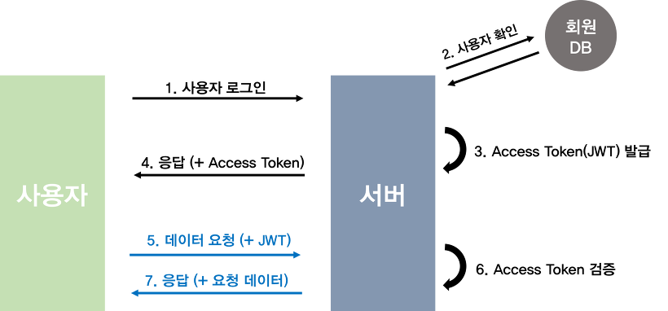
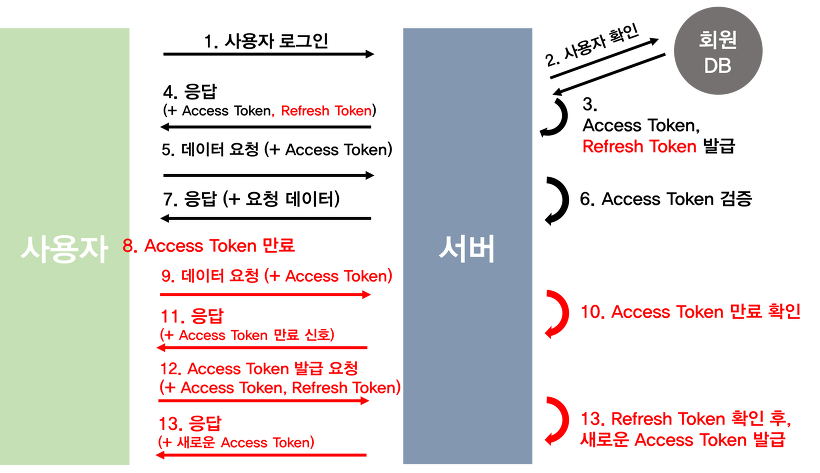
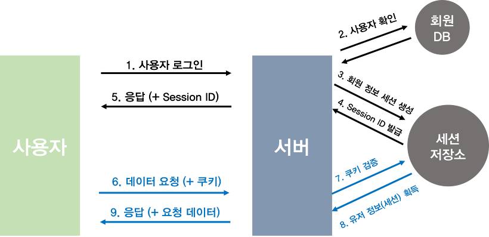
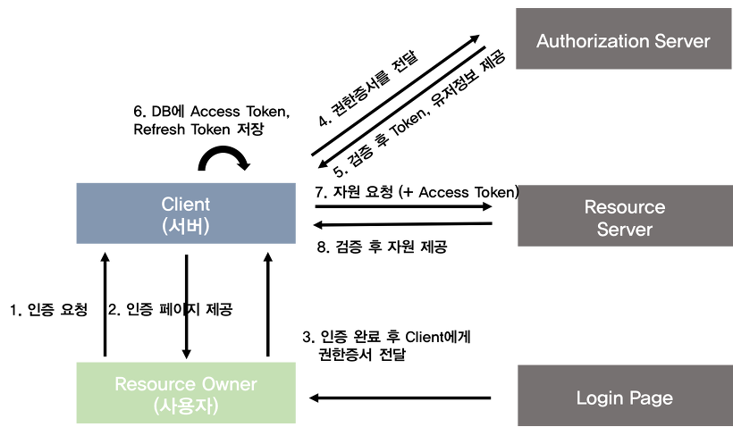
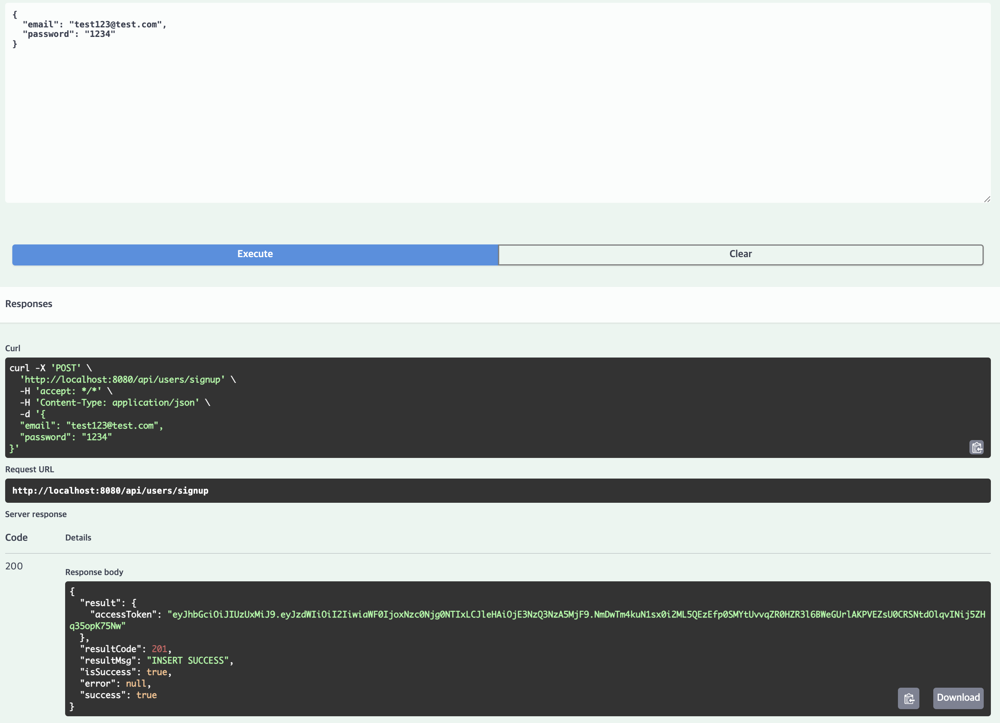
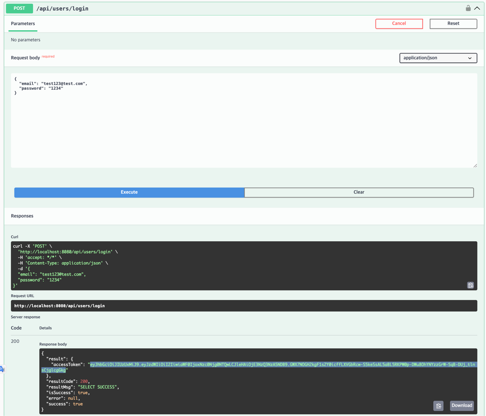
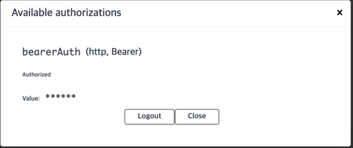
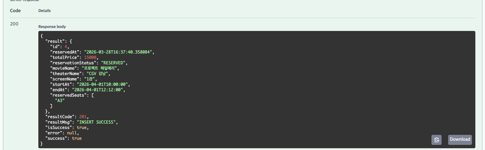

# CGV 클론 코딩

<details>
<summary> <h2>1. ERD</h2> </summary>


---

## 데이터베이스 구조

### 1. 영화관 (`Theater`)
영화관의 기본 정보를 저장합니다.
- **`id`** `PK` : 영화관 고유 ID (`theater_id`)
- **`name`** : 영화관 이름
- **`region`** : 지역
- **`address`** : 주소

** 연관 관계**
- `1 (Theater)` : `N (Screen)`
- `1 (Theater)` : `N (Store)`
- `1 (Theater)` : `N (TheaterFavorite)`

---

### 2. 상영관 (`Screen`)
각 영화관 내 존재하는 상영관 정보입니다.
- **`id`** `PK` : 상영관 고유 ID (`screen_id`)
- **`name`** : 상영관 이름
- **`theater_id`** `FK` : 소속 영화관 ID (`Theater`)
- **`screen_type_id`** `FK` : 상영관 좌석/타입 정보 ID (`ScreenType`)

** 연관 관계**
- `1 (Screen)` : `N (Schedule)`

---

### 4. 영화 (`Movie`)
상영 영화 정보를 저장합니다.
- **`id`** `PK` : 영화 고유 ID (`movie_id`)
- **`name`** : 영화 제목
- **`runningTime`** : 상영 시간
- **`ageRestriction`** : 관람 연령 등급

** 연관 관계**
- `1 (Movie)` : `1 (MovieStatistic)`
- `1 (Movie)` : `N (Schedule)`
- `1 (Movie)` : `N (MovieFavorite)`

---

### 5. 상영 스케줄 (`Schedule`)
특정 상영관에서 정해진 시간에 상영되는 시간표입니다.
- **`id`** `PK` : 스케줄 고유 ID (`schedule_id`)
- **`screen_id`** `FK` : 상영이 이루어지는 상영관 ID (`Screen`)
- **`movie_id`** `FK` : 상영되는 영화 ID (`Movie`)
- **`startAt`, `endAt`** : 상영 시작 및 종료 시간 (`LocalDateTime`)

** 연관 관계**
- `1 (Schedule)` : `N (Reservation)`

---

### 6. 회원 (`User`)
서비스를 이용하는 고객 정보입니다.
- **`id`** `PK` : 회원 고유 ID (`user_id`)
- **`nickname`** : 서비스 닉네임
- **`email`** : 이메일 주소
- **`birthdate`** : 생년월일 (`LocalDate`)

** 연관 관계**
- `1 (User)` : `1 (UserProfile)`
- `1 (User)` : `N (Reservation)`
- `1 (User)` : `N (Order)`

---

### 7. 예매 (`Reservation`)
유저의 개별 영화 예매 내역입니다.
- **`id`** `PK` : 예매 고유 ID (`reservation_id`)
- **`user_id`** `FK` : 예약자 회원 ID (`User`)
- **`schedule_id`** `FK` : 예매한 스케줄 ID (`Schedule`)
- **`reservedAt`** : 예약 시각 (`LocalDateTime`)
- **`totalPrice`** : 총 예매 결제 금액
- **`status`** : 예약 진행 상태 (`ReservationStatus`)
- **`seatNames`** : 예약된 좌석명 목록 문자열

** 연관 관계**
- `1 (Reservation)` : `N (ReservationSeat)`

---

### 9. 매장 (`Store`)
영화관에 위치한 매점 정보입니다.
- **`id`** `PK` : 매장 고유 ID (`store_id`)
- **`theater_id`** `FK` : 매장이 위치한 영화관 ID (`Theater`)

** 연관 관계**
- `1 (Store)` : `N (Inventory)`
- `1 (Store)` : `N (Order)`

---

### 10. 메뉴 (`Menu`)
매점에서 판매하는 상품 카테고리/종류입니다.
- **`id`** `PK` : 메뉴 고유 ID (`menu_id`)
- **`name`** : 상품명
- **`price`** : 가격
- **`menuType`** : 품목 카테고리 유형 (`MenuType`)

** 연관 관계**
- `1 (Menu)` : `N (Inventory)`

---

### 11. 재고 (`Inventory`)
매장별로 취급하는 메뉴의 판매 재고 정보입니다.
- **`id`** `PK` : 재고 고유 ID (`inventory_id`)
- **`store_id`** `FK` : 보유 중인 매장 ID (`Store`)
- **`menu_id`** `FK` : 해당 메뉴 ID (`Menu`)
- **`quantity`** : 보유 수량

** 연관 관계**
- `1 (Inventory)` : `N (OrderItem)`

---

### 12. 매점 주문 (`Order`)
매점에서 상품을 주문한 통합 내역입니다.
- **`id`** `PK` : 주문 고유 ID (`order_id`)
- **`user_id`** `FK` : 주문자 회원 ID (`User`)
- **`store_id`** `FK` : 주문이 접수된 매장 ID (`Store`)
- **`orderStatus`** : 주문 진행 상태 (`OrderStatus`)
- **`totalPrice`** : 총 지불 금액
- **`orderedAt`** : 주문 시각 (`LocalDateTime`)

** 연관 관계**
- `1 (Order)` : `N (OrderItem)`

</details>

<details>
<summary> <h2>2. 인증 방법</h2> </summary> 

## 1. JWT 기반 인증(Access Token)

### [핵심 개념]
> **JWT(JSON Web Token)**: JSON 객체를 사용해 사용자 정보를 안전하게 전달하는 웹 표준 토큰. 자체적인 Signature가 포함되어 있어 데이터 위변조 확인 가능

> **Access Token**: 서버의 리소스에 접근할 수 있는 권한을 증명하는 출입증 역할의 수명을 가진 토큰

### [인증 흐름]
1. 로그인 요청: 클라이언트가 서버로 사용자 정보 전송
2. 사용자 확인: 서버가 회원 DB를 조회하여 사용자 정보 일치 여부 검증
3. 토큰 발급: 검증 성공 시, 서버가 Access Token을 생성하여 클라이언트로 응답
4. 데이터 요청: 클라이언트는 이후 서버에 데이터를 요청할 때마다 헤더에 Access Token을 포함하여 전송
5. 토큰 검증 및 응답: 서버가 토큰의 유효성(서명, 만료일 등)을 검증한 후, 검증 성공 시 요청받은 데이터 응답

### [장점]
- Stateless 및 서버 확장성: 서버가 별도의 세션 상태를 저장할 필요가 없어 서버 트래픽 분산 및 확장에 매우 유리함
- 클라이언트 독립성: 쿠키를 사용하지 않아도 되므로 웹, 모바일 앱 등 다양한 클라이언트 환경에서 범용적으로 사용 가능

### [단점]
- 토큰 제어 불가: 한 번 발급된 토큰은 만료 전까지, 서버에서 강제로 만료시키거나 제어할 수 없음
- 데이터 크기: 토큰 내부에 담는 Payload가 많아질수록 토큰 길이가 길어져 네트워크 요청 시 오버헤드 발생 가능
---

### 2. Access Token + Refresh Token 인증


### [핵심 개념]
> **Refresh Token**: Access Token이 만료됐을 때 새로운 Access Token을 재발급받기 위한 토큰. 수명이 길고 서버 DB에 저장된다.

### [인증 흐름]
1. 로그인 요청: 클라이언트가 사용자 정보 전송
2. 토큰 발급: 서버가 수명이 짧은 Access Token + 수명이 긴 Refresh Token을 함께 발급
3. 데이터 요청: 클라이언트가 헤더에 Access Token을 담아 요청
4. Access Token 만료: 서버가 `401 Unauthorized` 응답
5. 토큰 재발급 요청: 클라이언트가 Refresh Token을 서버로 전송
6. Refresh Token 검증: 서버가 DB에 저장된 Refresh Token과 비교 후 유효하면 새 Access Token 발급
7. 재요청: 클라이언트가 새 Access Token으로 다시 요청

### [장점]
- 보안 강화: Access Token 수명을 짧게 유지할 수 있어 탈취 시 피해 범위 최소화
- 사용자 경험: Refresh Token이 유효하면 자동으로 Access Token을 재발급받아 로그인 유지 가능

### [단점]
- 구현 복잡도 증가: 토큰 재발급 로직, Refresh Token 저장 및 관리 등 추가 구현 필요
- 완전한 Stateless 불가: Refresh Token을 서버 DB에 저장해야 하므로 순수 JWT의 Stateless 특성이 부분적으로 깨짐

### 3. 세션과 쿠키 기반 인증


### [핵심 개념]
> **세션(Session)**: 서버가 인증된 사용자 정보를 서버 메모리에 저장하는 방식. 각 세션은 고유한 Session ID로 식별된다.

> **쿠키(Cookie)**: 서버가 클라이언트 브라우저에 저장하는 작은 데이터. 이후 요청마다 자동으로 서버에 전송된다.

### [인증 흐름]
1. 로그인 요청: 클라이언트가 사용자 정보 전송
2. 세션 생성: 서버가 인증 확인 후 Session ID를 생성하고 서버 메모리에 저장
3. 쿠키 발급: 서버가 응답 헤더에 Session ID를 담은 쿠키를 클라이언트로 전송
4. 데이터 요청: 클라이언트가 이후 요청마다 쿠키를 자동으로 포함하여 전송
5. 세션 조회 및 응답: 서버가 쿠키의 Session ID로 서버 메모리를 조회해 사용자 확인 후 응답

### [장점]
- 서버 제어 가능: 서버에서 세션을 직접 삭제하면 즉시 강제 로그아웃 가능
- 클라이언트 단순: 클라이언트는 쿠키만 저장하면 되고 인증 상태는 서버가 관리

### [단점]
- 서버 부하: 사용자가 많아질수록 서버 메모리에 저장해야 할 세션이 늘어남
- 확장성 문제: 서버가 여러 대인 경우 세션을 공유하는 별도 저장소(Redis 등)가 필요함
- CSRF 취약: 쿠키가 요청마다 자동 전송되므로 CSRF 공격에 노출될 수 있음

---

### 4. OAuth 2.0 인증


### [핵심 개념]
> **OAuth 2.0**: 사용자가 직접 비밀번호를 제공하지 않고, 신뢰할 수 있는 외부 서비스(Google, Kakao 등)를 통해 인증하고 권한을 위임받는 표준 프로토콜

- **Resource Owner**: 실제 사용자
- **Client**: 만든 서비스(서버)
- **Authorization Server**: 로그인을 처리하고 토큰을 발급하는 외부 서버
- **Resource Server**: 사용자 데이터를 갖고 있는 외부 서버

### [인증 흐름]
1. 사용자가 서비스에 로그인을 요청한다.
2. 서비스는 사용자에게 외부 로그인 URL을 돌려준다.
3. 사용자가 해당 URL에서 외부 서비스에 로그인하고 권한을 허용하면, Authorization Grant(권한 증서)가 서버로 전달된다.
4. 서버는 이 권한 증서를 Authorization Server에 보내 Access Token과 Refresh Token을 발급받는다.
5. 서버는 발급받은 Access Token으로 Resource Server에서 사용자 정보를 조회한다.
6. 조회한 정보로 DB에서 유저를 찾거나, 없으면 회원가입 처리한다.
7. 발급받은 Access Token은 서버가 DB에 안전하게 보관하거나, 필요한 정보만 조회한 뒤 폐기한다. 
8. 서버는 사용자의 로그인 상태를 유지하기 위해 새로운 Session ID나 자체 JWT를 생성하여 사용자에게 전달한다.
9. 이후 사용자가 서비스의 기능을 사용할 때, 클라이언트는 서비스가 발급한 토큰을 담아 서버에 요청을 보낸다.
10. Access Token이 만료되면 Refresh Token으로 재발급받고, Refresh Token까지 만료되면 처음부터 다시 로그인해야 한다.

### [장점]
- 비밀번호 미관리: 사용자 비밀번호를 서버에 저장하지 않아 보안 부담 감소
- 사용자 편의: 별도 회원가입 없이 기존 계정으로 빠른 로그인 가능

### [단점]
- 외부 의존성: 외부 Authorization Server가 다운되면 로그인 자체가 불가능
- 구현 복잡도: 표준 스펙이 있지만 각 서비스마다 세부 구현이 달라 연동 작업이 번거로움

</details>

<details>
<summary> <h2> 3. 액세스 토큰 발급 및 검증 로직 구현</h2></summary>

<h3> 1. 액세스 토큰 발급 </h3>

```java
public String createAccessToken(Long userId) {
        Date now = new Date();
        return Jwts.builder()
                .subject(String.valueOf(userId))
                .issuedAt(now)
                .expiration(new Date(now.getTime() + expirationMs))
                .signWith(key)
                .compact();
}
```

<h3> 2. 검증 로직 </h3>

```java
public boolean validateAccessToken(String token) {
    try {
        Jwts.parser()
                .verifyWith((SecretKey) key)
                .build()
                .parseSignedClaims(token);
        return true;
    } catch (JwtException | IllegalArgumentException e) {
        return false;
    }
}
```

- 해당 로직 `JwtAuthenticationFilter`에서 작동
- true 반환 시, `SecurityContext`에 저장


</details>

<details>
<summary> <h2> 4. 회원가입 및 로그인 API 구현</h2></summary>




</details>

<details>
<summary> <h2> 5. 토큰이 필요한 API</h2></summary>




</details>

<details>
<summary> <h2> 6. 리프레쉬 토큰 발급</h2></summary>

<h3> 1. 리프레쉬 토큰 도메인 및 리포 구현 </h3>

<h3> 2. 리프레쉬 토큰 생성 </h3>

```java
public String createRefreshToken(Long userId) {
    Date now = new Date();
    return Jwts.builder()
            .subject(String.valueOf(userId))
            .issuedAt(now)
            .expiration(new Date(now.getTime() + refreshExpirationMs))
            .signWith(key)
            .compact();
}

public LocalDateTime getRefreshTokenExpiresAt() {
    return LocalDateTime.now().plusSeconds(refreshExpirationMs / 1000);
}
```

<h3> 3. 리프레쉬 토큰 서비스 구현 </h3>

- login
```java
// refreshToken 발급
String refreshToken = tokenProvider.createRefreshToken(user.getId());

// 기존 토큰 있으면 rotate, 없으면 새로 저장
refreshTokenRepository.findByUserId(user.getId())
        .ifPresentOrElse(
                rt -> rt.rotate(refreshToken, tokenProvider.getRefreshTokenExpiresAt()),
                () -> refreshTokenRepository.save(RefreshToken.builder()
                        .userId(user.getId())
                        .token(refreshToken)
                        .expiresAt(tokenProvider.getRefreshTokenExpiresAt())
                        .build())
        );
```

- 로그인 시, 리프레쉬 토큰이 있을 경우에는 새로운 리프레쉬 토큰 발급
- 리프레쉬 토큰이 없을 경우에는 새로 발급하여 저장

- 회원가입의 경우에는 리프레쉬 토큰이 없으므로, 새로 발급하여 저장

- 로그아웃 시, 리프레쉬 토큰 삭제

<h3> 4. 리프레쉬 토큰 api 구현 </h3>

```java
@PostMapping("/reissue")
public ApiResponse<LoginResponse> reissue(@RequestBody ReissueRequest request) {
return ApiResponse.ok(SuccessCode.SELECT_SUCCESS, userService.reissue(request));
}
```

- RefreshToken을 재발급하는 것은 결국 accessToken이 만료되었을 때이므로, @AuthenticationPrincipal로 현재 로그인한 유저의 정보를 가져올 수 없다.
- 따라서, @RequestBody로 RefreshToken을 받아서, 해당 토큰이 유효한지 검증한 후, 새로운 AccessToken과 RefreshToken을 발급하는 로직.
</details>