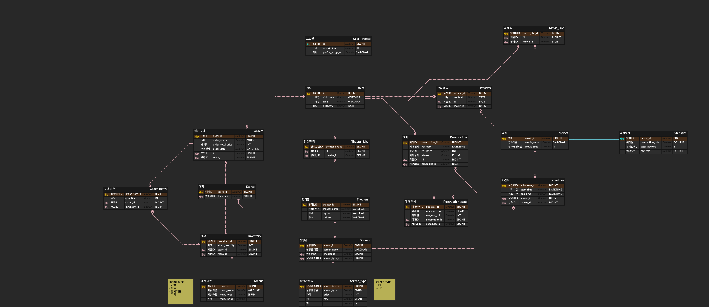

# 🎬 CGV 클론 코딩

---

## 📊 ERD

---

## 📦 데이터베이스 구조 

### 1. 영화관 (`Theater`)
영화관의 기본 정보를 저장합니다.
- **`id`** `PK` : 영화관 고유 ID (`theater_id`)
- **`name`** : 영화관 이름
- **`region`** : 지역
- **`address`** : 주소

**🔗 연관 관계**
- `1 (Theater)` : `N (Screen)`
- `1 (Theater)` : `N (Store)`
- `1 (Theater)` : `N (TheaterFavorite)`

---

### 2. 상영관 (`Screen`)
각 영화관 내 존재하는 상영관 정보입니다.
- **`id`** `PK` : 상영관 고유 ID (`screen_id`)
- **`name`** : 상영관 이름
- **`theater_id`** `FK` : 소속 영화관 ID (`Theater`)
- **`screen_type_id`** `FK` : 상영관 좌석/타입 정보 ID (`ScreenType`)

**🔗 연관 관계**
- `1 (Screen)` : `N (Schedule)`

---

### 4. 영화 (`Movie`)
상영 영화 정보를 저장합니다.
- **`id`** `PK` : 영화 고유 ID (`movie_id`)
- **`name`** : 영화 제목
- **`runningTime`** : 상영 시간
- **`ageRestriction`** : 관람 연령 등급

**🔗 연관 관계**
- `1 (Movie)` : `1 (MovieStatistic)`
- `1 (Movie)` : `N (Schedule)`
- `1 (Movie)` : `N (MovieFavorite)`

---

### 5. 상영 스케줄 (`Schedule`)
특정 상영관에서 정해진 시간에 상영되는 시간표입니다.
- **`id`** `PK` : 스케줄 고유 ID (`schedule_id`)
- **`screen_id`** `FK` : 상영이 이루어지는 상영관 ID (`Screen`)
- **`movie_id`** `FK` : 상영되는 영화 ID (`Movie`)
- **`startAt`, `endAt`** : 상영 시작 및 종료 시간 (`LocalDateTime`)

**🔗 연관 관계**
- `1 (Schedule)` : `N (Reservation)`

---

### 6. 회원 (`User`)
서비스를 이용하는 고객 정보입니다.
- **`id`** `PK` : 회원 고유 ID (`user_id`)
- **`nickname`** : 서비스 닉네임
- **`email`** : 이메일 주소
- **`birthdate`** : 생년월일 (`LocalDate`)

**🔗 연관 관계**
- `1 (User)` : `1 (UserProfile)`
- `1 (User)` : `N (Reservation)`
- `1 (User)` : `N (Order)`

---

### 7. 예매 (`Reservation`)
유저의 개별 영화 예매 내역입니다.
- **`id`** `PK` : 예매 고유 ID (`reservation_id`)
- **`user_id`** `FK` : 예약자 회원 ID (`User`)
- **`schedule_id`** `FK` : 예매한 스케줄 ID (`Schedule`)
- **`reservedAt`** : 예약 시각 (`LocalDateTime`)
- **`totalPrice`** : 총 예매 결제 금액
- **`status`** : 예약 진행 상태 (`ReservationStatus`)
- **`seatNames`** : 예약된 좌석명 목록 문자열

**🔗 연관 관계**
- `1 (Reservation)` : `N (ReservationSeat)`

---

### 9. 매장 (`Store`)
영화관에 위치한 매점 정보입니다.
- **`id`** `PK` : 매장 고유 ID (`store_id`)
- **`theater_id`** `FK` : 매장이 위치한 영화관 ID (`Theater`)

**🔗 연관 관계**
- `1 (Store)` : `N (Inventory)`
- `1 (Store)` : `N (Order)`

---

### 10. 메뉴 (`Menu`)
매점에서 판매하는 상품 카테고리/종류입니다.
- **`id`** `PK` : 메뉴 고유 ID (`menu_id`)
- **`name`** : 상품명
- **`price`** : 가격
- **`menuType`** : 품목 카테고리 유형 (`MenuType`)

**🔗 연관 관계**
- `1 (Menu)` : `N (Inventory)`

---

### 11. 재고 (`Inventory`)
매장별로 취급하는 메뉴의 판매 재고 정보입니다.
- **`id`** `PK` : 재고 고유 ID (`inventory_id`)
- **`store_id`** `FK` : 보유 중인 매장 ID (`Store`)
- **`menu_id`** `FK` : 해당 메뉴 ID (`Menu`)
- **`quantity`** : 보유 수량

**🔗 연관 관계**
- `1 (Inventory)` : `N (OrderItem)`

---

### 12. 매점 주문 (`Order`)
매점에서 상품을 주문한 통합 내역입니다.
- **`id`** `PK` : 주문 고유 ID (`order_id`)
- **`user_id`** `FK` : 주문자 회원 ID (`User`)
- **`store_id`** `FK` : 주문이 접수된 매장 ID (`Store`)
- **`orderStatus`** : 주문 진행 상태 (`OrderStatus`)
- **`totalPrice`** : 총 지불 금액
- **`orderedAt`** : 주문 시각 (`LocalDateTime`)

**🔗 연관 관계**
- `1 (Order)` : `N (OrderItem)`
