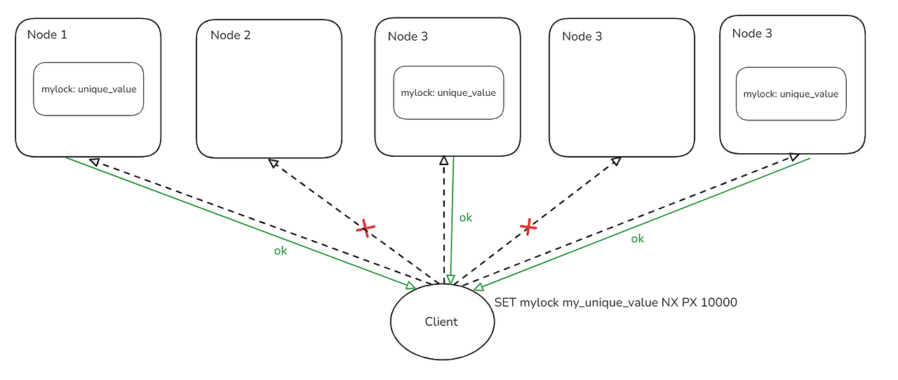
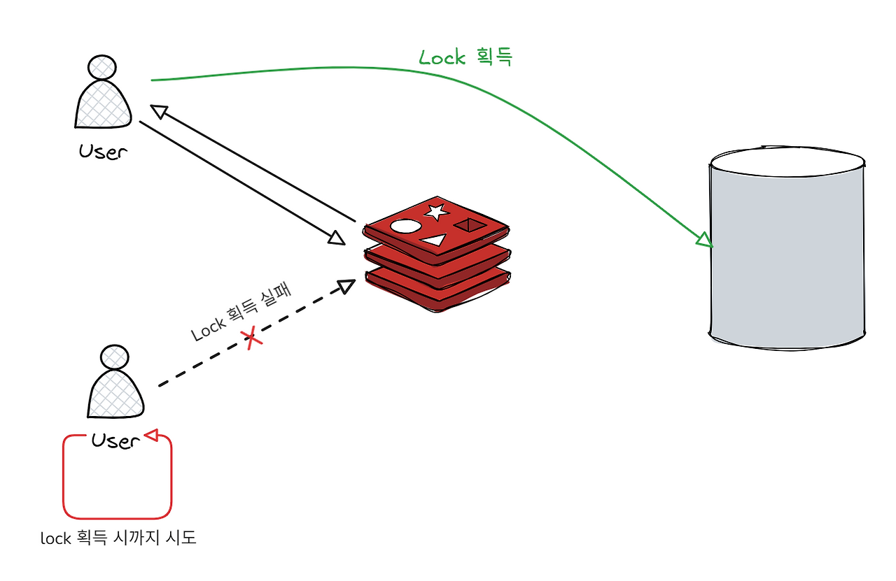

# 동시성 문제란?

다수의 스레드(Thread)나 프로세스가 공유 자원에 동시에 접근하여 변경을 시도할 때 발생하는 데이터 불일치 현상을 의미한다.

이를 해결하기 위해 애플리케이션, 데이터베이스, 인메모리 저장소 등 다양한 계층에서 락(Lock)을 활용하여 동시성 제어를 할 수 있다.

# 동시성 제어 방법

## 애플리케이션 레벨

### ✅ synchronized

`synchronized`는 Java에서 지원하는 동시성 제어를 위한 키워드로, 여러 스레드가 동시에 하나의 메서드나 코드 블록에 접근하지 못하게 막아준다.

`synchronized`가 처리되는 과정을 low-level에서 살펴보면 모니터(Monitor)라는 개념을 통해 동기화 과정이 이루어지게 된다.  
Monitor(모니터)는 공유 자원에 대한 접근을 제어하는 객체로, 한 번에 하나의 스레드만 리소스에 접근할 수 있도록 공유 리소스에 대한 접근을 동기화하는데 사용되는 기술이다.


Monitor의 처리 과정은 위와 같이 스레드 단위로 메서드를 실행하는 시점에서 모니터 락을 획득(acquire) 및 반환(release) 한다.

다만, 위에서도 볼 수 있듯이 Thread A의 트랜잭션 내에서 likePost() 메서드가 수행된 후 트랜잭션이 커밋 되기 전 Thread B의 likePost() 메서드가 실행이 되기 때문에 예상했던 바와 달리
synchronized 키워드를 통해 동시성 문제를 완전히 해결할 수 없다.  
이는 `@Transactional`이 Spring AOP를 활용해 프록시 방식으로 동작하기 때문이다.  
즉, Lock은 메소드가 끝나는 시점에 반환되지만, DB에 커밋은 그 이후인 프록시 종료 시점에 발생한다.

이외에도 `synchronized`는 아래와 같은 단점들이 있다.

- JVM 내부에서 동작하기 때문에 다중 서버 환경에서는 동작하지 않는다.
- 특정 게시물에만 락을 걸지 않고 전체 게시물에 대해 락을 걸기 때문에 과도한 병목 현상이 발생한다.

(`synchronized`의 사용을 최대한 지양하는 것이 좋다... 대신에 아래의 다른 동시성 제어 방법을 사용하자!)

## 데이터베이스 레벨

### ✅ Pessimistic Lock (비관적 락)

트랜잭션의 충돌이 발생한다고 가정하고, 데이터에 접근할 때 우선적으로 DB 락(Shared Lock, Exclusive Lock)을 거는 방식.

<details>
<summary>참고</summary>

- **Shared lock (읽기 잠금, S-Lock)** :읽기만 허용하는 방법 (`PESSIMISTIC_READ`) 으로 여러 트랜잭션이 동시에 데이터를 조회할 수는 있지만, 락을 획득한 트랜잭션에서만 대상
  레코드를 수정, 삭제 할 수 있음
- **Exclusive Lock (쓰기 잠금, X-Lock)** : 락을 획득하지 못한 트랜잭션에서 대상 레코드를 수정, 삭제 뿐 아니라 읽기도 허용하지 않는 방법(`PESSIMISTIC_WRITE`)으로 읽기를
  허용하지 않기 때문에 한 번에 하나의 트랜잭션만 작업을 수행함을 보장.

|     현재 걸려있는 락      | 요청하는 락: S-Lock | 요청하는 락: X-Lock |
|:------------------:|:--------------:|:--------------:|
|   Shared Lock(S)   |      허용 ✅      |      대기 ❌      |
| Exclusive Lock (X) |      대기 ❌      |      대기 ❌      |

</details>

보통 수정하는 동안 다른 트랜잭션의 조회를 막기 위해 Excusive Lock(`PESSIMISTIC_WRITE`)를 사용한다.

```java
public interface StockRepository extends JpaRepository<Stock, Long> {

    @Lock(LockModeType.PESSIMISTIC_WRITE)
    @Query("select s from Stock s where s.id = :id")
    Stock findByIdWithPessimisticLock(Long id);
}
```

이는 SQL 쿼리에 `SELECT ... FOR UPDATE`를 사용하여, 다른 트랜잭션의 접근을 차단한다.

#### 🧠 작동 원리

- **데이터 조회** : 사용자가 데이터를 조회할 때, 데이터를 수정할 의도가 있다면 해당 데이터에 대해 락을 걸고 다른 트랜잭션이 접근하지 못하도록 한다.
- **락 유지** : 락이 걸린 동안 다른 트랜잭션은 해당 데이터에 접근할 수 없으며, 락을 획득한 트랜잭션이 완료될 때까지 대기하거나 실패하게 된다.
- **데이터 수정** :  락을 획득한 사용자가 데이터를 수정한다. 이때 수정된 데이터는 다른 트랜잭션이 접근할 수 없으므로 충돌을 방지할 수 있다.
- **락 해제** :  트랜잭션이 완료되면 락이 해제되어 다른 트랜잭션이 데이터를 조회하거나 수정할 수 있다.

#### Pessimistic Lock 장점 👍

- **충돌 예방** : 미리 락을 걸기 때문에 동시에 데이터를 수정하는 과정에서 발생할 수 있는 충돌을 방지할 수 있다.
- **데이터 무결성 보장** :  동시 접근으로 인해 발생할 수 있는 데이터 정합성 문제를 미리 차단한다.

#### Pessimistic Lock 단점 👎

- **성능 저하** : 락을 걸면 다른 트랜잭션들이 해당 데이터에 접근하지 못하고 대기해야 하기 때문에 시스템의 성능이 저하될 수 있다. 특히, 트랜잭션이 오래 지속되거나, 락이 걸린 상태에서 대기 시간이 길어지면
  병목 현상이 발생할 수 있다.
- **교착 상태(Deadlock) 발생 가능성** : 두 트랜잭션이 서로 다른 리소스를 락을 걸고 상호 대기하는 상태가 되면 교착 상태가 발생할 수 있다.

### ✅ Optimistic Lock (낙관적 락)

트랜잭션 충돌이 발생하지 않을 것이라고 가정하고, 락을 걸지 않고 데이터를 수정할 때 충돌 여부를 확인하는 방식.  
이는 `version`이나 `timestamp`를 활용.

#### 🧠 작동 원리

- **데이터 조회** : 사용자가 데이터를 조회할 때 해당 레코드의 현재 버전 정보를 함께 가져온다. 이 버전은 레코드가 수정될 때마다 증가하거나 변경된다.
- **데이터 수정** : 사용자가 데이터를 수정하려고 할 때, 수정하려는 레코드의 현재 버전과 사용자가 처음 조회할 때 가져온 버전 정보를 비교한다.
- **검증** : 만약 사용자가 조회한 이후에 다른 사용자가 해당 데이터를 수정해서 버전 정보가 변경되었다면, 충돌이 발생했다고 판단하고 예외를 발생시킨다. 이때 수정이 실패하고 트랜잭션이 롤백된다.
- **수정 성공** : 만약 버전 정보가 동일하다면, 수정이 성공적으로 이루어지며, 데이터베이스는 해당 레코드의 버전 번호를 증가시킨다.

```java

@Entity
public class Stock {
    @Id
    private Long id;

    private String name;

    @Version
    private Long version;
}
```

JPA에서는 `@Version`을 붙여주면, 버전 변경 및 검증 과정 등은 JPA가 알아서 해준다!

```java
public interface StockRepository extends JpaRepository<Stock, Long> {

    @Lock(LockModeType.OPTIMISTIC)
    @Query("select s from Stock s where s.id = :id")
    Stock findByIdWithOptimisticLock(Long id);
}
```

#### Optimistic Lock 장점 👍

- **높은 성능 (자원 점유 최소화)**: 데이터베이스 수준의 물리적인 락을 걸지 않기 때문에 트랜잭션이 대기하지 않는다. 읽기 작업이 많고 충돌이 적은 환경에서 매우 빠른 성능을 보여준다.
- **교착 상태(Deadlock) 방지**: 물리적 락이 없기 때문에 여러 트랜잭션이 서로 락을 잡고 기다리는 상황이 발생하지 않는다.
- **확장성**: DB 자원을 직접 묶어두지 않으므로, 동시 접속자가 많은 서비스에서 비관적 락보다 더 많은 요청을 처리할 수 있다.

#### Optimistic Lock 단점 👎

- **충돌 발생 시 재시도 로직 필요**: 충돌이 발생하면 예외(`OptimisticLockException`)가 발생하며 트랜잭션이 롤백된다. 직접 retry를 하거나 사용자에게 알리는 로직을 별도로 구현해야
  한다.
- **충돌이 빈번할 경우 성능 저하**: 만약 동시에 수정을 시도하는 사용자가 많다면, 계속해서 예외가 터지고 재시도를 반복해야 하므로 오히려 시스템 전체의 부하가 커질 수 있다.
- **애플리케이션 계층의 책임**: DB가 알아서 줄을 세워주는 것이 아니라, 애플리케이션 코드 단에서 버전 체크와 예외 처리를 담당해야 하므로 구현 복잡도가 올라간다.

### ✅ Named Lock (네임드 락)

데이터베이스의 실제 row가 아닌, 사용자가 지정한 **임의의 문자열(이름)** 을 기반으로 락을 획득하는 방식.   
주로 MySQL의 기능을 활용하며, 여러 서버가 하나의 DB를 공유하는 분산 환경에서 분산 락을 구현하기 위해 사용된다.

<details>
<summary>참고) 특징</summary>

**메타데이터 락**: 데이터 자체를 잠그는 것이 아니라 DB 서버 내의 별도 메모리 공간에 '이름'을 등록하여 잠금을 관리합니다.

**트랜잭션 독립성**: 일반적인 DB 락과 달리 트랜잭션이 종료(Commit/Rollback)되어도 자동으로 해제되지 않는다. 반드시 명시적으로 해제 명령을 보내거나 세션이 종료되어야 한다.

</details>

주로 MySQL의 `GET_LOCK(name, timeout)`과 `RELEASE_LOCK(name)` 를 사용한다.

```java
public class UserLevelLock {

    private static final String GET_LOCK = "SELECT GET_LOCK(?, ?)";
    private static final String RELEASE_LOCK = "SELECT RELEASE_LOCK(?)";
    private static final String EXCEPTION_MESSAGE = "LOCK 을 수행하는 중에 오류가 발생하였습니다.";

    private final DataSource dataSource;

    public UserLevelLock(DataSource dataSource) {
        this.dataSource = dataSource;
    }

    public <T> T executeWithLock(String userLockName,
                                 int timeoutSeconds,
                                 Supplier<T> supplier) {

        try (Connection connection = dataSource.getConnection()) {
            try {
                log.info("start getLock=[], timeoutSeconds ], connection=[]", userLockName, timeoutSeconds, connection);
                getLock(connection, userLockName, timeoutSeconds);
                log.info("success getLock=[], timeoutSeconds ], connection=[]", userLockName, timeoutSeconds, connection);
                return supplier.get();

            } finally {
                log.info("start releaseLock=[], connection=[]", userLockName, connection);
                releaseLock(connection, userLockName);
                log.info("success releaseLock=[], connection=[]", userLockName, connection);
            }
        } catch (SQLException | RuntimeException e) {
            throw new RuntimeException(e.getMessage(), e);
        }
    }

    private void getLock(Connection connection,
                         String userLockName,
                         int timeoutseconds) throws SQLException {

        try (PreparedStatement preparedStatement = connection.prepareStatement(GET_LOCK)) {
            preparedStatement.setString(1, userLockName);
            preparedStatement.setInt(2, timeoutseconds);

            checkResultSet(userLockName, preparedStatement, "GetLock_");
        }
    }

    private void releaseLock(Connection connection,
                             String userLockName) throws SQLException {
        try (PreparedStatement preparedStatement = connection.prepareStatement(RELEASE_LOCK)) {
            preparedStatement.setString(1, userLockName);

            checkResultSet(userLockName, preparedStatement, "ReleaseLock_");
        }
    }

    private void checkResultSet(String userLockName,
                                PreparedStatement preparedStatement,
                                String type) throws SQLException {
        try (ResultSet resultSet = preparedStatement.executeQuery()) {
            if (!resultSet.next()) {
                log.error("USER LEVEL LOCK 쿼리 결과 값이 없습니다. type = [], userLockName ], connection=[]", type, userLockName, preparedStatement.getConnection());
                throw new RuntimeException(EXCEPTION_MESSAGE);
            }
            int result = resultSet.getInt(1);
            if (result != 1) {
                log.error("USER LEVEL LOCK 쿼리 결과 값이 1이 아닙니다. type = [], result ] userLockName ], connection=[]", type, result, userLockName, preparedStatement.getConnection());
                throw new RuntimeException(EXCEPTION_MESSAGE);
            }
        }
    }
}
```

#### 🧠 작동 원리

- **락 획득 요청** : 사용자가 특정 이름(예: "stock_1")으로 락을 요청한다. 이때 대기 시간(Timeout)을 설정할 수 있다.
- **점유 확인** : DB는 해당 이름으로 이미 걸려있는 락이 있는지 확인한다. 없다면 락을 부여하고, 있다면 락이 풀릴 때까지 대기한다.
- **비즈니스 로직 수행** : 락을 획득한 트랜잭션이 실제 데이터를 수정한다. 이때 데이터 자체에는 락이 걸려있지 않지만, 다른 서버들이 동일한 '이름'으로 락을 얻으려 하기 때문에 순서가 보장된다.
- **명시적 락 해제** : 로직이 끝나면 반드시 `RELEASE_LOCK()`을 호출하여 락을 해제해야 한다. 그래야 대기 중인 다른 트랜잭션이 락을 얻을 수 있다.

#### Named Lock 장점 👍

- **row 락 부하 감소** : 실제 데이터 row를 잠그지 않으므로, 동일한 테이블의 다른 데이터들에 대한 접근에 영향을 주지 않는다.
- **분산 환경 지원** : Redis 같은 별도의 인프라 없이도 여러 애플리케이션 서버 간의 동기화를 DB만으로 구현할 수 있다.
- **타임아웃 제어 용이** : 락을 획득하기 위해 대기하는 시간을 세밀하게 제어할 수 있다.

#### Named Lock 단점 👎

- **수동 해제 필수** : 트랜잭션이 끝나도 락이 자동으로 안 풀리기 때문에, 로직 중간에 예외가 발생하더라도 반드시 `finally 블록` 등에서 락을 해제해줘야 한다.
- **커넥션 점유 문제** : 락을 유지하는 동안 DB 커넥션을 계속 붙잡고 있어야 하므로, 락을 사용하는 요청이 많아지면 커넥션 풀이 부족해질 수 있다. (보통 별도의 DataSource를 사용해 문제 해결)
- **구현 복잡도** : JPA 영속성 컨텍스트와 별개로 네이티브 쿼리를 직접 관리해야 하며, 락 획득/해제 로직을 비즈니스 로직 앞뒤로 감싸야 합니다.

## Redis 레벨

Redis는 모든 서버가 공유하는 외부 저장소로서, 분산 환경에서 하나의 자원을 보호화기 위한 '중앙 게시판' 역할을 수행한다.

#### ✔️ RedLock

**RedLock**은 분산 락을 안전하게 구현하기 위한 알고리즘이다.

N대의 Redis 서버가 있다고 가정할 때, 과반 수 이상의 노드에서 Lock을 획득했다면 Lock을 획득한 것으로 간주한다.  
그리고 이런식의 consensus를 거치려면 기본적으로 2n+1개의 노드를 가지고 있어야한다.


클라이언트는 각 Redis 서버에 `SET mylock my_unique_value NX PX 10000` 와 같은 형식으로 락 요청을 보낸다.

락 요청을 시작한 시점과 모든 응답을 받은 시점 사이의 총 소요 시간(T_elapsed)을 측정하고, 이 값이 락의 유효시간(TTL)보다 작아야 한다.
작업이 끝나면 클라이언트는 락을 받은 Redis에 락 해제 요청을 보낸다.

다만, 이는 강한 일관성을 보장하지 못한다는 단점이 있다.

- **Clock Drift** : 각 Redis 노드의 로컬 시계가 흐르는 속도가 미세하게 다를 수 있다. 이로 인해 한 노드에서는 락이 만료되었다고 판단했는데, 다른 노드에서는 아직 유효하다고 판단하는 시차가
  발생할 수 있다.
- **fencing token 부재 (애플리케이션 지연)** : 네트워크 지연이나 Stop-the-world (GC) 현상으로 애플리케이션이 잠시 멈춘 사이 Redis에서 락이 만료될 수 있다. 멈췄던 로직이 다시
  돌면서 "내가 아직 락을 쥐고 있다"고 착각하고 DB에 덮어쓰기를 하면 데이터가 꼬이게 된다. (이를 해결하기 위해 순차적으로 증가하는 'fencing token'을 사용하기도 한다.)

RedLock과 같은 분산 락 원리를 Java 환경에서 구현하기 위해 사용되는 대표적인 라이브러리로 `Lettuce`와 `Redisson`이 있다.

### ✅ Lettuce (Spin Lock 방식)

Spring Data Redis에 기본으로 제공되는 라이브러리이다.  
별도의 기능 구현 없이 Redis의 `SETNX`(Set if Not Exists) 명령어를 이용하여 직접 락을 제어한다.

#### 🧠 작동 원리

- **획득 시도** : `SETNX` 명령어를 통해 특정 키가 없는 경우에만 값을 저장하여 락을 획득한다.
- **재시도** : 락 획득에 실패하면 애플리케이션 레벨에서 while 루프 등을 이용하여 일정 시간 간격으로 계속해서 락 획득을 시도한다.
- **만료 시간** : 락의 유효 시간(TTL)을 직접 성정해야 하며, 로직 수행 중 서버가 다운되면 락이 해제되지 않는 문제를 방지하기 위한 관리가 필요하다.

#### Lettuce 장점 👍

- **가벼운 라이브러리** : 추가 의존성 없이 기본 Spring Data Redis로 구현 가능하다.
- **단순한 구조** : 구현 로직이 직관적이고 가벼운 트래픽에 적합하다.

#### Lettuce 단점 👎

- **Redis 부하** : 락을 얻을 때까지 계속 요청을 보내는 `Spin Lock`으로 인해 Redis CPU의 사용량이 급증할 수 있다.
- **지연 시간** : 락 획득 재시도 간격만큼 응답 시간이 지연될 수 있다.

### ✅ Redisson (Pub/Sub 방식)

분산 환경의 특수한 기능 위해 설계된 라이브러리이다.  
Redis의 **Pub/Sub(발행/구독)** 기능을 활용하여 락을 효율성을 높인다.

#### 🧠 작동 원리

- **신호 기반 대기** : 락 획득에 실패한 스레드는 Redis를 계속 조회하는 대신, 락이 해제되었다는 **채널 메세지(Subscribe)**를 기다린다. 락이 해제되면 메세지를 받고 다시 한번 획득을
  시도한다.
- **Watchdog (유효시간 연장)** : 락의 유효시간(leaseTime)이 끝나기 전에 비즈니스 로직이 종료되지 않았다면, 별도의 스레드가 락의 만료시간을 자동으로 연장한다.
- **API 편의성** : `tryLock(waitTime, leaseTime, unit)`과 같은 인터페이스를 통해 대기 시관과 유지 시간을 조정할 수 있다.

#### Redisson 장점 👍

- **낮은 리소스 소모** : 불필요한 재시도 쿼리가 발생하지 않아 Redis 서버가 쾌적해진다.
- **안전성** : Watchdog 기능으로 락 유실 방지 및 정합성이 보장된다.

#### Redisson 단점 👎

- **추가 의존성** : 별도의 라이브러리를 이용해야 한다.

[참고](https://helloworld.kurly.com/blog/distributed-redisson-lock)

### 선택한 방법

### 📌 Redisson

사용자가 영화의 좌석 예매를 시작하면, 5분 동안 다른 사용자가 같은 좌석의 예매를 못하도록 해당 좌석을 비활성화해야 했습니다.
이는 Scheduler를 통해 구현하기에는 너무 많은 리소스가 투입된다고 판단했습니다.

따라서 Redis Lock이 가장 적합하다고 판단했습니다.  
기본 라이브러리인 Lettuce의 경우 Spin Lock 방식으로 인한 Redis 서버의 CPU 부하가 발생한다는 단점이 있어, Redisson 방식을 선택했습니다.


-----

# ❓ 고민한 지점들

### 외부 PG사 연동시 데이터 정합성 보장

처음에는 정합성을 보장하는 가장 확실한 방법인 `Transactional Outbox` 패턴을 고려했습니다.  
하지만 현재 프로젝트 규모에서 이를 위한 별도 인프라를 운영하는 것은 오히려 오버엔지니어링이라고 판단했습니다.

따라서 현실적인 대안으로 동기적 보상 트랜잭션(Compensating Transaction) 방식을 선택했습니다.

[구현]

외부 PG 연동 시간 동안 내부 DB 커넥션 풀이 고갈되는 것을 막기 위해 API 호출 구간은 `@Transactional`에서 완전히 제외했습니다.

- `외부 PG 결제 호출` → `내부 DB 반영` 순서로 흐름을 제어합니다.
- 만약 PG 결제는 승인되었으나 내부 DB 반영이 서버 예외로 인해 실패할 경우, try-catch 블록으로 에러를 잡아 즉시 외부 PG사 결제 취소 API를 호출하여 상태를 롤백 시켰습니다.

**한계점** : 현재 구조는 보상 트랜잭션(결제 취소 API)마저 통신 장애로 실패할 경우 사용자의 돈만 빠져나가는 현상이 발생할 한계가 있습니다.   
