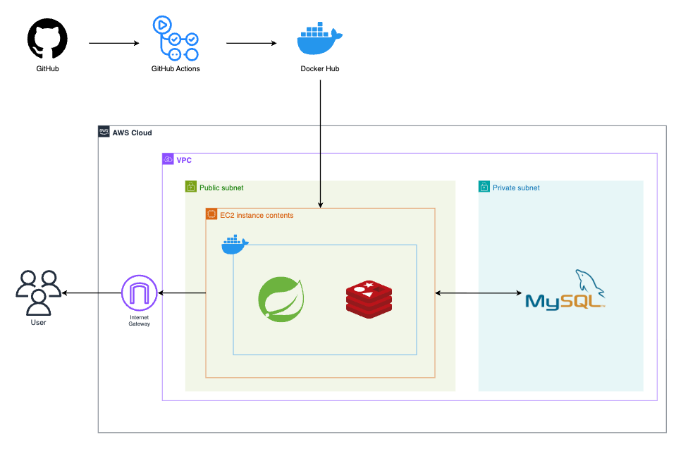
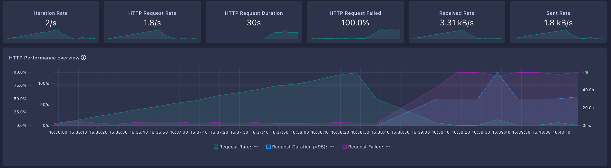
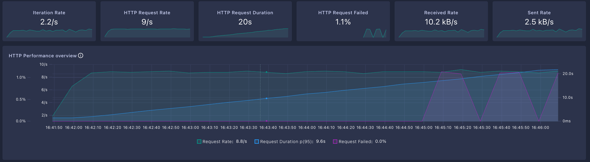
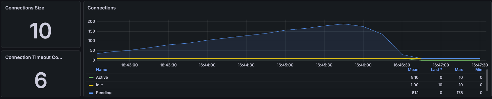
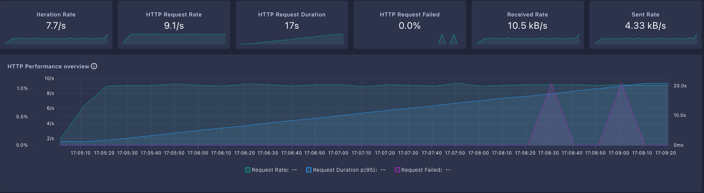
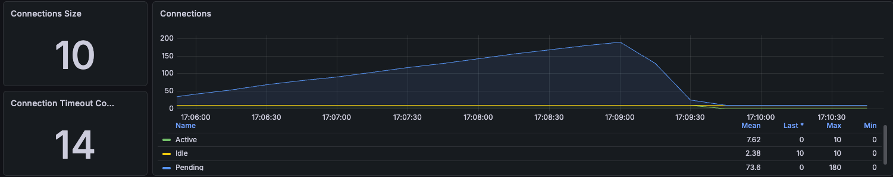
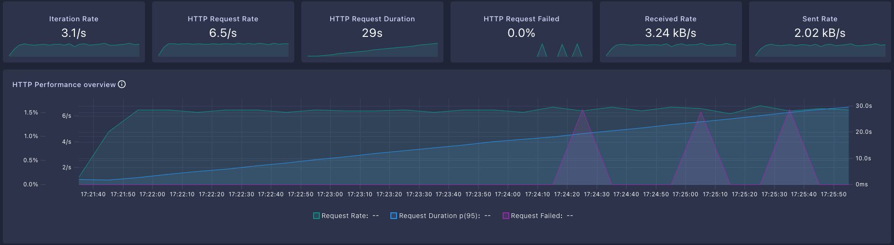
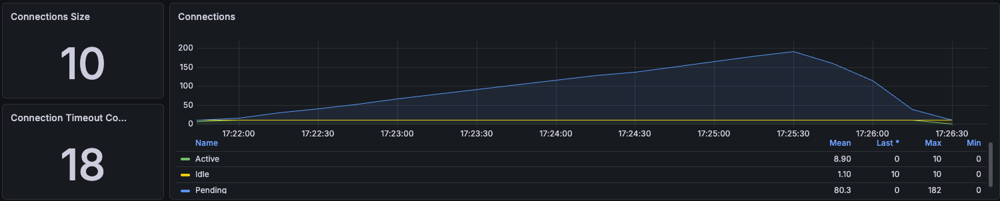

## 아키텍처 구조도



## 부하테스트 결과

### 📌 payment



### 📌 movie





```
 HTTP
    http_req_duration..............: avg=11.36s min=1.05s med=11.53s max=30.05s p(90)=20.01s p(95)=20.82s
      { expected_response:true }...: avg=11.32s min=1.05s med=11.49s max=27.69s p(90)=19.97s p(95)=20.77s
      { group:::1. 영화 차트 조회 }......: avg=10.95s min=1.08s med=10.93s max=22.01s p(90)=19.5s  p(95)=20.39s
      { group:::2. 현재 상영작 조회 }.....: avg=11.49s min=1.08s med=11.56s max=30.05s p(90)=20.09s p(95)=20.89s
      { group:::3. 영화 상세 조회 }......: avg=11.48s min=1.05s med=11.67s max=30.01s p(90)=20.1s  p(95)=20.88s
      { group:::4. 영화 출연진 조회 }.....: avg=11.62s min=1.25s med=11.86s max=21.79s p(90)=20.11s p(95)=21.04s
    http_req_failed................: 0.21%  5 out of 2311
    http_reqs......................: 2311   8.522719/s
```

### 📌 theater





```
    HTTP
    http_req_duration..............: avg=10.81s min=1.07s med=10.98s max=30.01s p(90)=19s    p(95)=20.01s
      { expected_response:true }...: avg=10.8s  min=1.07s med=10.97s max=25.75s p(90)=18.98s p(95)=19.99s
      { group:::1. 극장 목록 조회 }......: avg=10.56s min=1.07s med=10.65s max=21.05s p(90)=18.83s p(95)=19.98s
      { group:::2. 극장 상세 조회 }......: avg=11.07s min=1.07s med=11.43s max=30.01s p(90)=19.18s p(95)=20.06s
    http_req_failed................: 0.08%  2 out of 2377
    http_reqs......................: 2377   8.766126/s
```

### 📌 screening





```
    HTTP
    http_req_duration................: avg=15.26s min=1.13s med=15.24s max=30.14s p(90)=27.06s p(95)=28.45s
      { expected_response:true }.....: avg=15.23s min=1.13s med=15.22s max=30.14s p(90)=27.04s p(95)=28.4s 
      { group:::1. 극장별 상영 스케줄 조회 }...: avg=15.11s min=1.42s med=15.16s max=30.01s p(90)=26.96s p(95)=28.3s 
      { group:::2. 영화별 상영 스케줄 조회 }...: avg=15.44s min=1.61s med=15.51s max=30.14s p(90)=27.27s p(95)=28.55s
    http_req_failed..................: 0.17%  3 out of 1688
    http_reqs........................: 1688   6.225172/s
```

## 📢 정리

위의 movie, theater, screening의 부하테스트 결과를 보면 `Request Failed`는 모두 1% 내외로 설정한 값인 5% 안으로 들어와 비교적 낮은 것처럼 보인다.   
다만, 여기서 주목해야 할 점은 3개의 테스트 모두 `request Duartion p(95)`가 지속적으로 증가해 20s가 넘는 구간이 존재한다는 것이다.    
즉, 사용자가 한 번의 요청에 20초 이상 응답을 기다려야 한다는 의미이다.

이 병목의 원인은 각 테스트의 Grafana 차트를 보면 알 수 있다.  
세 테스트 모두 HikariCP의 Active Connection이 최대치인 **10개에 지속적으로 도달해 풀이 완전히 포화 상태**임을 확인할 수 있고, 동시에 커넥션을 기다리며 대기 중인 Pending 요청이
평균 60~80개, 최대 **180개 정도까지 쌓여 있다.**  
이로 인해 일부 요청은 정해진 시간 안에 커넥션을 받지 못하고 **Connection Timeout이 발생하며, 결국 응답 지연과 일부 요청 실패로 이어지고 있다.**

현재 시스템에서 응답 시간이 늘어나는 직접적인 원인은 DB 자체의 성능이나 특정 API의 로직 문제가 아니라, **애플리케이션이 보유한 DB 커넥션 풀(HikariCP, 기본값 10)이 부하 대비 부족한
것**이다.  
사용 가능한 커넥션 수보다 많은 요청이 동시에 들어오면서 대다수의 요청이 큐에서 대기하게 되고, 이 대기 시간이 누적되어 응답 시간이 20초 수준까지 늘어난 것으로 분석된다.

## ✅ 해결 방법

- **DB Connection 풀 크기 증가**
    - HikariCP `maximum-pool-size`: 10 → 30
- **캐싱 적용**
    - Redis 캐시 적용 (영화/극장 목록 등)
- **쿼리 최적화**
    - N+1 쿼리 점검
- **읽기 전용 replica 추가**