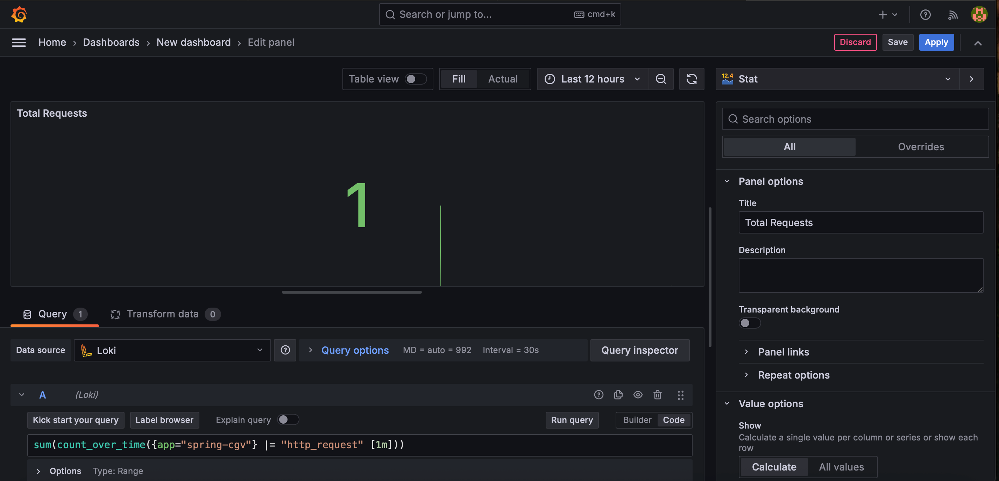
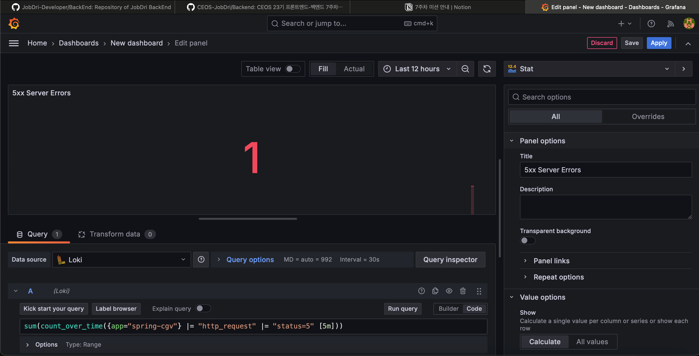
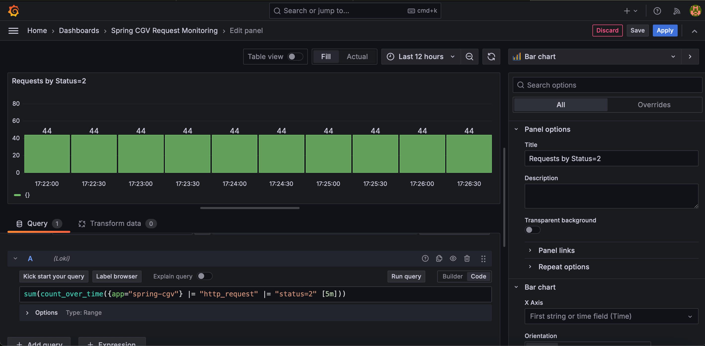
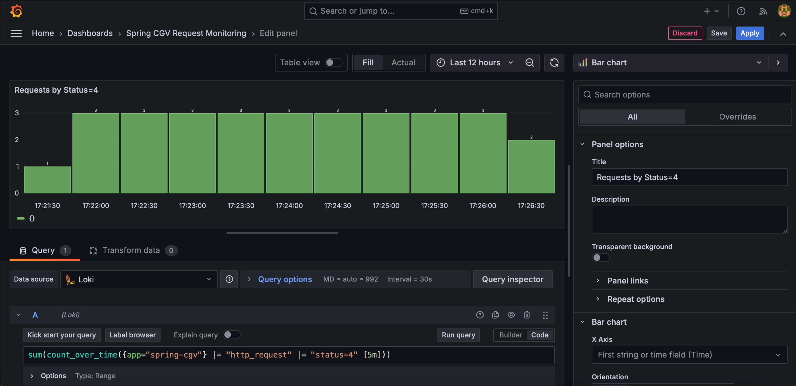
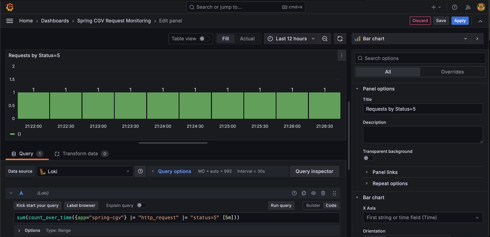
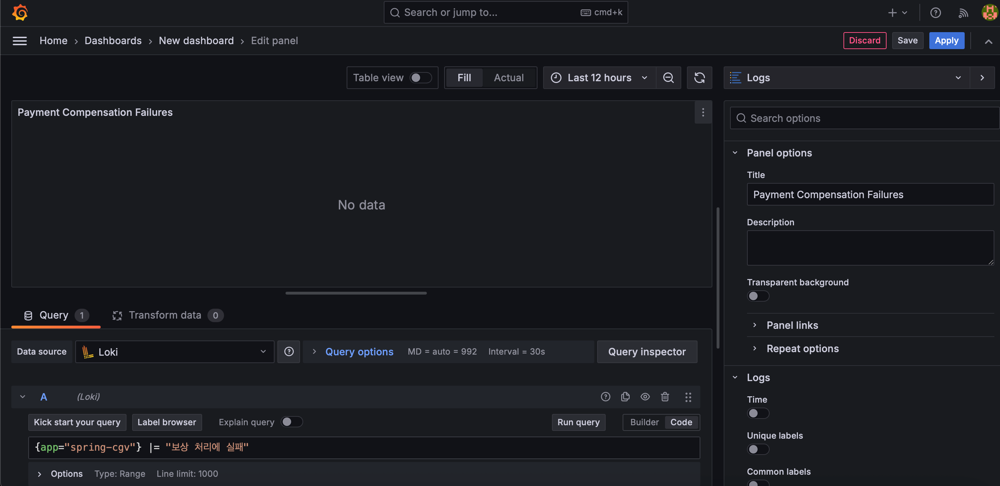
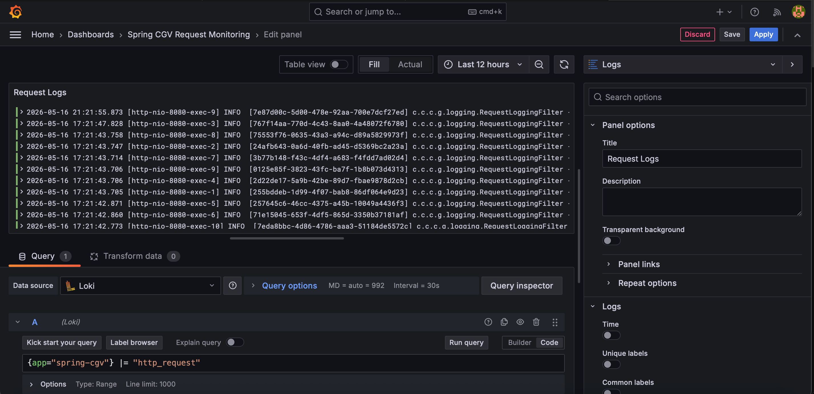
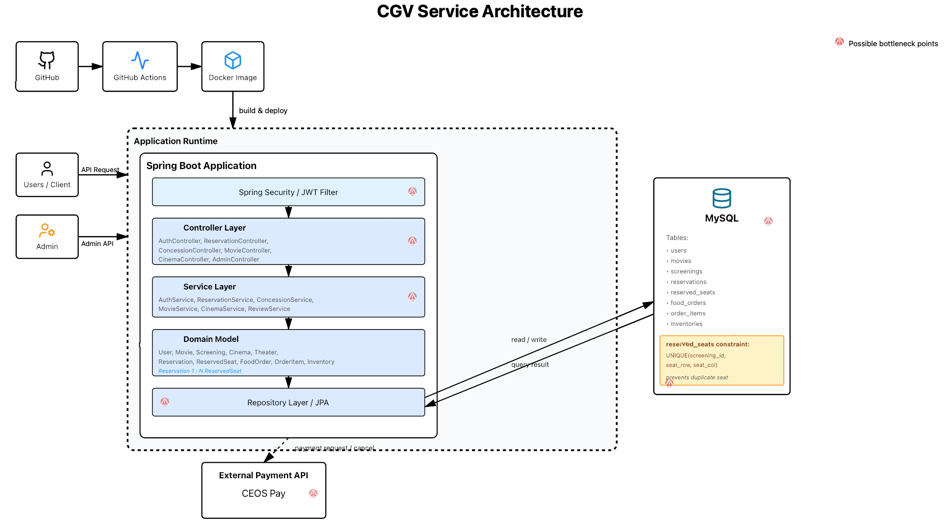

# spring-cgv-23rd
CEOS 23기 백엔드 스터디 - CGV 클론 코딩 프로젝트

<details>
<summary>7주차 캐싱 & 로깅 미션 정리</summary>

## 1. 캐시 도입

### 캐시 적용 대상

| 기준 | 질문 | 예시 |
| --- | --- | --- |
| **Read-heavy** | 읽기가 쓰기보다 압도적으로 많은가? | 게시글 상세 조회 |
| **Slow I/O** | DB 조회나 계산 비용이 비싼가? | 복잡한 통계 쿼리, 외부 API |
| **Low Volatility** | 데이터가 자주 바뀌지 않는가? | 공지사항, 상품 카테고리 |
| **Repeatability** | 동일한 요청이 반복적으로 오는가? | 인기 게시글, 메인 피드 |
| **Staleness 허용** | 1~2초 오래된 데이터여도 괜찮은가? | 조회수, 좋아요 수 |

위 표를 참고해 조회 빈도가 높고 데이터 변경 빈도가 상대적으로 낮은 API를 우선 캐시 대상으로 선택했다.

- 영화 목록 조회: `/api/v1/movies`
- 영화 상세 조회: `/api/v1/movies/{movieId}`
- 영화관 목록/상세 조회
- 매점 상품 목록 조회: `/api/concessions/products`
- 이벤트 목록/영화별 이벤트 조회

예매 생성, 좌석 조회, 매점 주문, 재고 차감처럼 실시간 상태가 중요한 흐름에는 캐시를 적용하지 않았다. 특히 좌석과 재고는 동시성 제어와 데이터 정합성이 중요하므로 DB의 최신 상태를 기준으로 판단해야 한다.

### 선택한 캐시 방식

- 적용 방식: Spring Cache + Caffeine 로컬 캐시
- 만료 전략: write 후 10분 만료
- 크기 제한: 최대 500개 엔트리
- 무효화 전략: 관리자 생성/삭제 API가 호출되면 관련 캐시 전체 삭제

Redis 같은 분산 캐시는 멀티 서버 환경에서 캐시 일관성을 맞추기 좋지만, 현재 프로젝트는 Render 기반 단일 애플리케이션 인스턴스 실습 환경에 가깝다. 따라서 별도 인프라를 추가하지 않고도 효과를 확인할 수 있는 Caffeine 로컬 캐시를 먼저 적용했다.

강의록에 소개된 방식 중에는 Look-Aside (=Lazy Loading)에 가깝다.

흐름은
1. 조회 요청이 들어온다.
2. Spring Cache가 먼저 Caffeine 캐시에 값이 있는지 확인한다.
3. 캐시에 있으면 DB를 조회하지 않고 캐시 값을 반환한다.
4. 캐시에 없으면 Service 메서드가 실행되어 DB를 조회한다.
5. 조회 결과를 캐시에 저장한다.
6. 이후 같은 요청은 캐시에서 반환된다.

쓰기 쪽은 Write Around에 가까운 방식이다. 관리자 API로 영화, 영화관, 상품, 이벤트 등을 생성하거나 삭제할 때:
DB에 먼저 반영 후 관련 캐시 무효화, 다음 조회 떄 DB에서 다시 읽고 캐시 재적재 과정을 거친다.

### 캐시 적용 이유

- 영화, 영화관, 매점 상품, 이벤트는 사용자가 반복적으로 조회할 가능성이 높다.
- 해당 데이터는 관리자 API를 통해 드물게 변경된다.
- DB 조회를 줄여 단순 조회 API의 응답 시간을 안정화할 수 있다.
- 캐시 무효화 지점이 명확해 과도한 복잡도 없이 적용할 수 있다.

### 적용한 코드

- `CacheConfig`: Caffeine 기반 `CacheManager` 구성
- `CacheNames`: 캐시 이름 상수화
- `MovieService`: 영화 목록/상세 조회 캐싱, 영화 생성/삭제 시 캐시 무효화
- `CinemaService`: 영화관 목록/상세 조회 캐싱, 영화관 생성 시 캐시 무효화
- `ConcessionService`: 매점 상품 목록 캐싱, 상품 생성 시 캐시 무효화
- `EventService`: 이벤트 목록/영화별 이벤트 캐싱, 이벤트 생성/연결 시 캐시 무효화

## 2. 로그 리팩토링

### 개선 방향

기존 로그는 예외 처리나 결제 보상 실패처럼 일부 지점에만 남아 있었다. 이번에는 요청 단위 흐름을 추적할 수 있도록 공통 요청 로그를 추가했다.

### 적용 방식

- `RequestLoggingFilter`를 추가해 모든 HTTP 요청 종료 시 로그를 남긴다.
- 요청마다 `requestId`를 생성하거나, 클라이언트가 보낸 `X-Request-Id`를 재사용한다.
- 응답 헤더에도 `X-Request-Id`를 내려주어 클라이언트와 서버 로그를 연결할 수 있게 했다.
- MDC에 `requestId`를 넣고 `logback-spring.xml` 패턴에 출력하도록 했다.
- 로그 파일은 `logs/application.log`에 저장하고, 날짜/크기 기준으로 롤링한다.

### 로그 형식

```text
http_request method=GET uri=/api/v1/movies status=200 durationMs=12 requestId=...
```

### 유용한 관찰 지표

Grafana/Loki로 로그를 수집한다면 다음 지표를 대시보드에 둘 수 있다.

- 요청 수: `http_request` 로그 발생량
- 에러 응답 수: `status=4xx`, `status=5xx` 필터링
- 느린 요청: `durationMs`가 큰 요청 확인
- 결제 보상 실패: `외부 결제 취소 보상 처리에 실패` 로그 확인
- 특정 요청 추적: `requestId`로 요청 흐름 검색

### Grafana/Loki 연결 방법

처음 Grafana Explore에서 `No logs found`가 나온 이유는 Spring Boot가 `logs/application.log`에는 로그를 쓰고 있었지만, 해당 파일을 Loki로 보내는 수집기가 없었기 때문이다. 이를 해결하기 위해 `monitoring` 디렉터리에 Loki, Alloy, Grafana 구성을 추가했다.

```text
Spring Boot -> logs/application.log -> Alloy -> Loki -> Grafana
```

실행 방법:

```bash
cd monitoring
docker compose up -d
```

상태 확인:

```bash
curl http://localhost:3101/ready
docker compose ps
```

Grafana 접속:

```text
http://localhost:3001
admin / admin
```

### Grafana 대시보드 구성 결과

로컬 Spring Boot 로그를 Loki로 수집하고 Grafana에서 다음 패널을 구성했다.

- Total Requests:
   - 전체 HTTP 요청 수를 확인한다.
   - Query: `sum(count_over_time({app="spring-cgv"} |= "http_request" [1m]))`



- 5xx Server Errors:
   - 서버 내부 오류 발생 여부를 확인한다.
   - Query: `sum(count_over_time({app="spring-cgv"} |= "http_request" |= "status=5" [5m]))`



- Requests by Status:
   - 2xx, 4xx, 5xx 요청 흐름을 구분해 확인한다.
   - 상태 코드는 로그 본문에 포함되므로 LogQL에서는 상태별 문자열 필터를 사용했다.





- Payment Compensation Failures:
   - 외부 결제 성공 후 내부 처리 실패 시 보상 취소 실패 로그를 추적한다.
   - Query: `{app="spring-cgv"} |= "보상 처리에 실패"`



- Request Logs:
   - 실제 요청 로그를 직접 확인한다.
   - Query: `{app="spring-cgv"} |= "http_request"`



이번 모니터링에서는 `http_request` 로그가 Loki에 정상 수집되는 것을 확인했고, Grafana에서 요청 수와 5xx 오류를 시각화했다. 보상 처리 실패 패널은 현재 해당 오류가 발생하지 않아 `No data`로 표시되며, 이는 정상 상태로 판단했다.


## 3. Redis / Memcached / 로컬 캐시 비교

### Redis

- 장점: 분산 환경에서 여러 서버가 같은 캐시를 공유할 수 있고, TTL, 자료구조, pub/sub 등을 지원한다.
- 단점: 별도 서버 운영이 필요하고 네트워크 왕복 비용이 있다.
- 적합한 상황: 멀티 서버, 세션 공유, 랭킹, 분산 락, 캐시 일관성이 중요한 서비스

### Memcached

- 장점: 단순 key-value 캐시에 빠르고 가볍다.
- 단점: Redis보다 자료구조와 기능이 제한적이다.
- 적합한 상황: 단순 조회 결과를 빠르게 저장하고 꺼내는 대규모 캐시

### Caffeine

- 장점: 애플리케이션 내부 메모리를 사용해 빠르고, 별도 인프라가 필요 없다.
- 단점: 서버가 여러 대면 인스턴스마다 캐시가 분리되어 일관성 관리가 어렵다.
- 적합한 상황: 단일 서버, 실습 환경, 변경 빈도가 낮은 기준 데이터 캐싱

## 4. 한계와 보완점

- 현재 캐시는 로컬 메모리 기반이므로 서버가 여러 대로 늘어나면 인스턴스별 캐시 불일치가 생길 수 있다.
- 조회 결과를 Entity 형태로 캐시하고 있어, 규모가 커지면 DTO 캐싱 또는 전용 조회 모델 캐싱을 검토할 수 있다.
- 운영 환경에서는 Actuator/Micrometer와 연동해 캐시 hit/miss, 요청 latency, 에러율을 함께 관찰하는 것이 좋다.
- 감사 로그가 필요한 결제/주문/예매 취소 이벤트는 별도 audit log 저장소로 분리할 수 있다.

## 5. 검증 내용

- 실행 명령: `./gradlew test --no-daemon`
- 결과: `BUILD SUCCESSFUL`
- 캐시 설정, 요청 로그 필터, 기존 서비스 테스트가 함께 컴파일되고 테스트를 통과하는 것을 확인했다.

### 캐시 성능 측정

`CachePerformanceTest`에서 H2 테스트 DB에 영화 30건을 저장한 뒤 `MovieService.getAllMovies()`를 반복 호출해 측정했다.

- 측정 명령: `./gradlew test --tests com.ceos23.cgv.global.cache.CachePerformanceTest --no-daemon --info`
- Cold 조회 평균: `7.870ms`
- Warm 캐시 조회 평균: `0.017ms`
- 응답 시간 개선율: 약 `99.78%`
- Cache hit count: `100`
- Cache miss count: `2`
- Cache hit rate: `98.04%`

측정값은 로컬 H2 기반 서비스 계층 반복 호출 결과이므로 운영 DB와 실제 HTTP 네트워크 비용을 포함한 수치는 아니다. 다만 동일 조회가 반복될 때 DB 접근을 캐시 접근으로 대체해 응답 시간이 크게 줄어드는 효과와 캐시 적중 동작은 확인할 수 있었다.

</details>

<details>
<summary>5주차 배포 미션 정리</summary>

## 1. 프로젝트 마무리 및 리팩토링

### 진행 내용

- 예약 생성과 좌석 저장을 하나의 예매 흐름으로 통합했다.
- 같은 상영 회차의 같은 좌석 중복 예매를 막기 위해 `Screening` 비관적 락과 `ReservedSeat` 유니크 제약을 함께 사용했다.
- 예매 결제에는 티켓팅 케이스를 적용해 좌석을 먼저 선점하고, 결제 실패 또는 취소 시 좌석을 복구하도록 했다.
- 매점 결제에는 커머스 케이스를 적용해 결제 성공 후 재고를 차감하도록 했다.
- 운영성 API는 `/api/admin/**` 컨트롤러로 분리해 관리자 권한 규칙을 타도록 정리했다.
- JWT 보안 리뷰를 반영해 인증/인가 실패 응답, refresh token HttpOnly Cookie, JWT secret 환경변수화를 적용했다.

### 리팩토링 기준

- Service는 유스케이스 흐름 조율에 집중한다.
- 도메인 규칙은 도메인 객체 또는 정책 객체로 이동한다.
- DTO 변환은 응답 DTO의 `from` 메서드와 Controller 계층에서 처리한다.
- 예외는 `CustomException`과 `ErrorCode` 기반으로 통일한다.
- 과도한 구조 변경보다 현재 프로젝트 규모에 맞는 점진적 개선을 우선한다.

### 리팩토링 결과

- `Reservation`, `FoodOrder`, `Inventory`에 상태 변경과 검증 메서드를 모아 Service의 조건문을 줄였다.
- `CouponDiscountPolicy`, `ReservationPricePolicy`로 가격/할인 정책을 분리했다.
- `ReservationService`와 `ConcessionService`의 결제 흐름은 DB 트랜잭션과 외부 API 호출을 분리해 락 점유 시간과 상태 불일치 위험을 줄였다.
- `PaymentService`와 `PaymentClient`로 외부 결제 API 호출 책임을 분리했다.
- `GlobalExceptionHandler`, `CustomAuthenticationEntryPoint`, `CustomAccessDeniedHandler`로 API 에러 응답 형식을 맞췄다.
- 매점 주문 총액 계산을 `FoodOrder`와 `OrderItem` 도메인 메서드로 이동해 Service가 계산식을 직접 알지 않도록 했다.
- 매점 재고 차감 시 `productId` 기준으로 정렬한 뒤 비관적 락을 획득해 상품 주문 순서 차이로 발생할 수 있는 데드락 위험을 줄였다.
- 쿠폰 할인 규칙을 `Coupon` enum으로 분리해 쿠폰 코드별 할인 정책을 한 곳에서 관리하도록 했다.

## 2. Docker 기반 배포

### Dockerfile 구성

- Build stage: `gradle:8.14-jdk21`
- Runtime stage: `eclipse-temurin:21-jre`
- 빌드 단계에서 `gradle clean bootJar --no-daemon`으로 jar를 생성한다.
- 실행 단계에서는 생성된 jar를 `java -jar app.jar`로 실행한다.

## 3. 수동 배포

### 배포 환경

- Platform: Render
- Database: Aiven MySQL
- Runtime: Docker
- 배포 URL: https://spring-cgv-23rd.onrender.com

### AWS EC2 대신 Render를 사용한 이유

기존에는 AWS EC2를 활용한 배포를 고려했지만, 프리티어 사용량이 만료되어 추가 비용이 발생하는 상황이었다.

또한, 이전에 AWS EC2를 활용해 여러번 배포를 해보았기 때문에 다른 플랫폼 경험도 쌓을겸 해서 여러 방안을 찾아보았다.

무료 플랜을 제공하는 PaaS 기반 배포 플랫폼을 대안으로 검토하였고, Render, Railway, Fly.io, Oracle Cloud Free Tier 등을 비교하였다. 그중 Render를 선택한 이유는 다음과 같다.

- 무료 플랜으로도 서비스 배포 실습이 가능하다.
- GitHub 연동 및 CI/CD 구성이 단순하다.
- Docker 기반 배포를 지원해 환경 일관성을 유지할 수 있다.
- 별도의 인프라 설정 없이 빠르게 배포할 수 있다.

이번 과제의 목적은 배포 경험, CI/CD 구성 등에 있으므로 반드시 AWS를 사용해야 하는 것은 아니라고 판단했다. 최종적으로 Render를 사용하되, 배포 구조는 Docker 이미지 기반으로 구성하여 향후 AWS EC2 환경에서도 동일하게 실행할 수 있도록 했다.

### 배포 과정

1. Dockerfile 작성
2. Render Web Service 생성
3. GitHub Repository 연결
4. Aiven MySQL 생성
5. Render Environment Variables 등록
6. 수동 배포 실행
7. 서버 정상 실행 확인

### 환경변수 관리

Render에는 다음 환경변수를 등록했다. 실제 값은 Git과 README에 기록하지 않는다.

- `PORT`
- `DB_HOST`
- `DB_PORT`
- `DB_NAME`
- `DB_USERNAME`
- `DB_PASSWORD`
- `JWT_SECRET`
- `PAYMENT_API_SECRET_KEY`

## 1. CGV 서비스 아키텍처 구조

이번 부하테스트는 영화 예매 API 중에서도 같은 상영 회차의 같은 좌석을 동시에 예매하려는 상황을 중심으로 진행했다. Spring MVC는 일반적으로 요청마다 별도 스레드가 처리하는 구조이므로, 여러 사용자가 동시에 같은 좌석을 예매하면 DB의 `reserved_seats` 테이블에 같은 `(screening_id, seat_row, seat_col)` 조합을 저장하려는 경쟁이 발생할 수 있다.



### 병목 또는 충돌 가능 지점

- 인증: 각 요청마다 JWT 인증 필터를 통과한다.
- 애플리케이션 스레드: VU가 증가하면 동시에 처리해야 하는 HTTP 요청 수가 늘어난다.
- DB 커넥션: 예매 생성은 트랜잭션 안에서 예약과 좌석을 저장하므로 커넥션을 사용한다.
- 좌석 중복 저장: 같은 좌석을 동시에 저장하면 DB 유니크 제약 조건에서 충돌한다.

## 2. K6 부하테스트 구성

부하테스트 도구는 k6를 사용했다. 스크립트를 JavaScript로 작성할 수 있어 요청 흐름을 빠르게 구성할 수 있고, VU 증가, 응답 시간, 실패율, 커스텀 지표를 한 번에 확인하기 쉽기 때문이다.

원래는 5주차에 Render로 배포한 서버를 대상으로 부하테스트를 진행하려고 했다. 하지만 Render 무료 플랜 환경에서 테스트 중 서버가 불안정해지거나 요청을 안정적으로 처리하지 못하는 문제가 발생했다. 배포 서버의 자원 한계 때문에 예매 동시성 로직 자체를 확인하기 어려워졌으므로, 이번 부하테스트는 로컬에서 Spring Boot 애플리케이션과 MySQL을 실행한 상태로 진행했다.

따라서 이번 결과는 Render 운영 환경의 최대 처리량을 측정한 값이라기보다, 로컬 환경에서 예매 API의 동시 요청 처리와 좌석 중복 방어가 정상 동작하는지 확인한 결과로 해석했다.

테스트 스크립트:

```text
cgv-reservation-load-test.js
```

테스트 대상 API:

```http
POST /api/reservations
```

현재 예매 요청 형식:

```json
{
  "screeningId": 1,
  "payment": "KAKAO_PAY",
  "couponCode": null,
  "seatNumbers": ["A1"]
}
```

### 시나리오

- `setup()`에서 로그인 API를 호출해 Access Token을 발급받는다.
- 각 VU는 발급받은 토큰으로 예매 생성 API를 반복 호출한다.
- `SEAT_MODE=unique`는 요청마다 다른 좌석을 선택해 일반 처리량을 확인한다.
- `SEAT_MODE=contention`은 같은 좌석 또는 작은 좌석 풀에 요청을 집중시켜 중복 예매 방어를 확인한다.

실행 예시:

```bash
k6 run \
  -e BASE_URL=http://localhost:8080 \
  -e EMAIL=테스트계정이메일 \
  -e PASSWORD=테스트계정비밀번호 \
  -e SCREENING_ID=1 \
  -e SEAT_MODE=contention \
  -e SEAT_POOL_SIZE=1 \
  cgv-reservation-load-test.js
```

## 3. 테스트 중 발견한 문제와 수정

### 요청 형식 불일치

초기 k6 스크립트는 예전 API 형식인 `peopleCount`, `seats[{row, col}]`를 보내고 있었다. 현재 API는 `seatNumbers` 문자열 목록을 사용하므로 모든 요청이 `400 C001`로 실패했다.

API 테스트와 같이 스크립트도 형식을 잘 지켜 작성해야겠다는 걸 느꼈다.

수정 내용:

- `peopleCount` 제거
- `seats` 제거
- `seatNumbers: ["A1"]` 형식으로 변경

### 중복 좌석 예외가 500으로 응답되는 문제

좌석 중복 저장은 DB 유니크 제약 조건에서 막히지만, 예외가 트랜잭션 flush/commit 시점에 발생하면 전역 예외 처리에서 일반 서버 에러 `500 C003`으로 내려갈 수 있었다.

수정 내용:

- `ReservationService`에서 `saveAndFlush()`를 사용해 저장 시점에 DB 제약 위반을 즉시 확인했다.
- `DataIntegrityViolationException`을 `SEAT_ALREADY_RESERVED(R002)`로 변환했다.
- `GlobalExceptionHandler`에도 DB 제약 위반 예외 처리를 추가했다.

### 반복 실행 시 같은 좌석을 다시 사용하는 문제

`unique` 테스트에서도 매 실행마다 좌석 번호가 `A1`부터 시작하면 이전 실행에서 저장된 좌석과 충돌할 수 있다.

수정 내용:

- k6 스크립트에 `SEAT_OFFSET`을 추가해 실행마다 다른 좌석 번호 범위를 사용하도록 했다.

## 4. 부하테스트 결과 분석

같은 상영 회차의 같은 좌석 하나에 요청을 집중시키는 `contention` 모드로 테스트했다.

주요 결과:

```text
iterations: 8041
reservation_created: 1 / 8041
seat_conflict: 8040 / 8041
http_req_duration p95: 12.1ms
status: 409
code: R002
```

분석:

- 같은 좌석에 8041번의 예매 요청이 들어갔고, 1건만 성공했다.
- 나머지 8040건은 `409 R002`로 응답했다.
- 중복 예매가 발생하지 않았으므로 좌석 중복 방어는 정상 동작했다.
- `500 C003`이 아니라 비즈니스 예외인 `R002`로 분류되도록 개선했다.
- p95 응답 시간이 12.1ms로 낮게 나온 것은 대부분의 요청이 DB 유니크 제약 충돌 후 빠르게 실패했기 때문이다.

주의할 점:

- `contention` 모드는 의도적으로 실패를 많이 발생시키는 테스트다.
- 따라서 `reservation_created > 0.70`, `http_req_failed < 0.20` 같은 성공률 중심 threshold는 이 시나리오와 맞지 않는다.
- 중복 방어 테스트에서는 `성공 1건`, `나머지 R002`, `500 없음`을 성공 기준으로 보는 것이 적절하다.

## 5. 병목 지점 판단

이번 테스트의 핵심은 CPU나 DB 커넥션 고갈보다 좌석이라는 공유 자원에 대한 동시 접근 제어였다.

- 애플리케이션 서버는 요청을 빠르게 처리했다.
- 응답 시간 p95가 낮았으므로 긴 대기열이나 심각한 latency 병목은 확인되지 않았다.
- 같은 좌석 요청은 DB 유니크 제약 조건에서 대부분 거절되었다.
- 현재 병목 또는 제한 지점은 `동일 좌석에 대한 쓰기 충돌`로 보는 것이 맞다.

개선 방향:

- 같은 좌석 중복 방어는 DB 유니크 제약으로 유지한다.
- 사용자 경험을 고려하면 이미 선점된 좌석은 화면에서 빠르게 비활성화해야 한다.
- 운영 환경에서는 좌석 선점 만료, Redis 기반 seat hold, 결제 실패 시 보정 작업 등을 추가로 고려할 수 있다.

</div>
</details>

## ❓EntityManager는 누가 생성하고, DB와의 연결은 어떻게 이루어질까요?

### EntityManager는 누가 생성할까?

직접 `new EntityManager()`로 만드는 게 아니라, **JPA 구현체(예: Hibernate)** 가 생성한다.
조금 더 정확히 말하면, **EntityManagerFactory**가 EntityManager를 생성한다.

```java
EntityManagerFactory emf = Persistence.createEntityManagerFactory("unitName");
EntityManager em = emf.createEntityManager();
```

### 스프링에서는 누가 관리할까?

Spring 환경에서는**Spring Framework** 가 대신 해준다.

- `@PersistenceContext`
- 또는 `@Autowired`

```java
@PersistenceContext
private EntityManager em;
```

내부적으로는

- Spring이 **EntityManagerFactory를 생성**
- 요청마다 적절한 **EntityManager를 주입**
- 트랜잭션 범위에 맞게 관리

### DB 연결은 어떻게 이루어질까?

👇 전체 흐름

1. 애플리케이션 시작
2. Spring → DataSource 생성
3. DataSource 기반으로 EntityManagerFactory 생성
4. 요청 시 EntityManager 생성
5. 트랜잭션 시작 시 DB 커넥션 획득

이 때, EntityManager가 항상 DB와 연결되어 있는 건 아님.

실제 DB 연결은 **트랜잭션 시작 시점**에 이루어짐

```java
@Transactional
public void save() {
    em.persist(entity); // 이 시점에 커넥션 사용
}
```

### 정리

- EntityManager 생성 → **EntityManagerFactory**
- 관리 → **Spring**
- DB 연결 → **DataSource + 트랜잭션 시점**

## ❓flush의 발생하는 시점은 언제일까요?

### 트랜잭션 commit 시

- 트랜잭션이 커밋되기 직전에 자동으로 flush 발생
- 거의 모든 경우 기본 동작

```java
@Transactional
public void save() {
    em.persist(member);
} // commit 시 flush 발생
```

### `em.flush()`  직접 호출

- 개발자가 강제로 DB에 반영

```java
em.persist(member);
em.flush(); // 즉시 SQL 실행
```

#### 특징

- commit 안 해도 SQL 실행됨
- 하지만 rollback 되면 결국 반영 안 됨

### JPQL 쿼리 실행 직전

- 기본 flush 모드는 **AUTO**
- JPQL 실행 전에 flush 발생

```java
em.persist(member);

em.createQuery("select m from Member m")
  .getResultList(); // 여기서 flush 발생
```

#### 이유

- JPQL은 DB 기준으로 조회하기 때문에
- 영속성 컨텍스트와 DB 결과를 맞추기 위해 flush

### 중요한 추가 포인트

#### flush ≠ commit

- flush → SQL 실행
- commit → 실제 DB 반영 확정

#### flush는 영속성 컨텍스트를 비우지 않는다

- 1차 캐시는 그대로 유지됨
- 단지 DB에 반영만 하는 것

#### flush 모드도 존재

- AUTO (기본)
- COMMIT

```java
em.setFlushMode(FlushModeType.COMMIT);
```

COMMIT 모드 특징

- JPQL 실행 시 flush 안 함
- 오직 commit 시에만 flush

### 정리

flush는

**"DB와 영속성 컨텍스트의 동기화를 맞추기 위해 필요한 시점에 발생"**

- commit 직전
- 직접 호출
- JPQL 실행 직전 (AUTO 모드)

## **JOIN을 사용할 때 SQL과 JPQL이 어떤 기준으로 조인을 수행하는지** 비교해보면 차이를 더 쉽게 이해할 수 있어요

### SQL JOIN 기준

테이블과 컬럼(FK)을 기준으로 조인

```java
SELECT *
FROM member m
JOIN team t ON m.team_id = t.id;
```

특징

- 개발자가 직접 `ON` 조건 작성
- **외래키(FK) 컬럼 기반으로 조인**
- DB 구조(테이블, 컬럼)에 의존

### JPQL JOIN 기준

엔티티와 연관관계를 기준으로 조인

```java
SELECT m FROM Member m JOIN m.team t
```

특징

- `ON` 조건을 직접 쓰지 않음 (기본적으로)
- **객체의 연관관계 필드 기준 (`m.team`)**
- 내부적으로 Hibernate 가 SQL로 변환

| 구분 | 기준 |
| --- | --- |
| SQL | 테이블 + 외래키 컬럼 |
| JPQL | 엔티티 + 연관관계 필드 |

👆사고방식 자체가 다르다

- SQL → **데이터 중심 (테이블)**
- JPQL → **객체 중심 (엔티티 그래프)**

### 정리

SQL은 외래키 컬럼 기준으로 조인하고,

JPQL은 엔티티 간 연관관계 필드를 기준으로 조인한다.

## ❓fetch join을 사용하면서 페이징을 적용할 때 발생하는 문제에 대해 알아보아요!

### 상황: fetch join + 페이징

```java
SELECT m FROM Member m
JOIN FETCH m.orders
```

여기서 페이징을 적용하면:

```java
query.setFirstResult(0);
query.setMaxResults(10);
```

### 문제 발생 원인

핵심은 **1:N 관계에서의 fetch join** 이다.

```java
Member A - Order 1, 2, 3
Member B - Order 4, 5
```

fetch join 결과:

```java
A, Order1
A, Order2
A, Order3
B, Order4
B, Order5
```

row가 뻥튀기됨 (중복 발생)

### 페이징이 깨지는 이유

DB는 이렇게 생각함

→ "row 기준으로 10개 잘라야지”

하지만 우리는

→ "Member 10명"을 기대

### 실제 문제

- DB 페이징 → row 기준
- JPA 결과 → 중복 제거 후 엔티티 기준

결과적으로:

- 데이터 누락 발생
- 페이지 크기 깨짐
- 심하면 메모리 페이징 발생

### 특히 위험한 경우

컬렉션 fetch join (`@OneToMany`)

- JPA 구현체(예: Hibernate)는

  → 경고 로그 발생


```java
firstResult/maxResults specified with collection fetch; applying in memory!
```

의미:

- DB에서 페이징 안 함
- 전부 가져온 뒤 메모리에서 자름 (🔥 성능 최악)

### 해결 방법

#### 1. 컬렉션 fetch join + 페이징 ❌

→ 가장 중요한 원칙

#### 2. ToOne 관계만 fetch join + 페이징 ✅

```java
SELECT m FROM Member m
JOIN FETCH m.team
```

이유

- row 증가 없음

#### 3. 컬렉션은 별도 조회 (지연로딩 활용)

```java
SELECT m FROM Member m
```

이후

```java
m.getOrders() // 필요할 때 조회
```

#### 4. DTO 조회 방식 (실무에서 많이 사용)

```java
SELECT new com.example.dto.MemberDto(m.id, o.name)
FROM Member m
JOIN m.orders o
```

#### 5. 배치 사이즈 활용

```java
@BatchSize(size = 100)
```

→ N+1 문제 완화

### 정리

컬렉션 fetch join을 사용하면 row가 증가하기 때문에

DB 페이징이 깨지고, 경우에 따라 메모리 페이징이 발생한다.

## data jpa를 찾다보면 SimpleJpaRepository에서  entity manager를 생성자 주입을 통해서 주입 받는다. 근데 싱글톤 객체는 한번만 할당을  받는데, 한번 연결 때 마다 생성이 되는 entity manager를 생성자 주입을 통해서 받는 것은 수상하지 않는가? 어떻게 되는 것일까? 한번 알아보자

### SimpleJpaRepository는 싱글톤인데 EntityManager는 왜 괜찮을까?

**주입되는 건 진짜 EntityManager가 아니라 프록시(EntityManager Proxy)이다.**

Spring Data JPA의 `SimpleJpaRepository`는 싱글톤이다.

```java
public class SimpleJpaRepository<T, ID> {
    private final EntityManager em;
}
```

여기서 주입되는 `em`은 실제 객체가 아니라

**→ Spring Framework 가 만든 프록시**

### 핵심 동작 방식

- 주입 시점 → 프록시 객체 1개 (싱글톤처럼 보임)
- 실제 사용 시 → 트랜잭션마다 진짜 EntityManager 할당

### 내부 흐름

```java
클라이언트 요청
 → 트랜잭션 시작
 → 실제 EntityManager 생성
 → 프록시가 실제 EM을 찾아 위임
```

### 정리

싱글톤에 주입되는 건 프록시이고,

실제 EntityManager는 트랜잭션마다 따로 생성된다.

## fetch join 할 때 distinct를 안하면 생길 수 있는 문제

### 문제 상황

```java
SELECT m FROM Member m
JOIN FETCH m.orders
```

결과:

```java
Member A
Member A
Member A
Member B
```

### 문제

- 동일 엔티티 중복 반환
- 컬렉션 크기 이상하게 보임
- 로직 오류 발생 가능

### 해결

```java
SELECT DISTINCT m FROM Member m
JOIN FETCH m.orders
```

### 디테일

JPQL의 DISTINCT는 2가지 역할

1. SQL에 DISTINCT 추가
2. **JPA가 엔티티 중복 제거 (핵심)**

### 정리

fetch join 시 DISTINCT를 사용하지 않으면

중복 엔티티가 반환된다.

## fetch join 을 할 때 생기는 에러가 생기는 3가지 에러 메시지의 원인과 해결 방안

### `HHH000104: firstResult/maxResults specified with collection fetch; applying in memory!`

#### 원인

- 컬렉션 fetch join + 페이징

#### 결과

- DB 페이징 불가
- 메모리 페이징 발생 (성능 최악)

#### 해결

- 컬렉션 fetch join 제거
- ToOne만 fetch join
- 또는 DTO 조회

### `query specified join fetching, but the owner of the fetched association was not present in the select list`

#### 원인

```java
SELECT o FROM Order o
JOIN FETCH o.member m
```

여기서 m을 fetch 했는데 select에 없음 → 문제 발생

#### 해결

반드시 fetch 대상의 owner 포함

```java
SELECT o FROM Order o
JOIN FETCH o.member
```

또는

```java
SELECT m FROM Member m
JOIN FETCH m.orders
```

### `org.hibernate.loader.MultipleBagFetchException: cannot simultaneously fetch multiple bags`

#### 원인

```java
JOIN FETCH m.orders
JOIN FETCH m.coupons
```

둘 다 List (bag)일 때 발생

#### 왜?

DB 결과가 카테시안 곱으로 폭발

```java
orders 3개 * coupons 4개 = 12 rows
```

Hibernate가 감당 못함 (Hibernate 정책적으로 막음)

#### 해결 방법

방법 1: Set으로 변경

```java
Set<Order> orders;
```

방법 2: 하나만 fetch join

방법 3: 나머지는 지연로딩 + BatchSize

### 정리

| 문제 | 원인 | 해결 |
| --- | --- | --- |
| 페이징 에러 | 컬렉션 fetch join | fetch join 제거 |
| owner 없음 | select 대상 누락 | owner 포함 |
| multiple bag | List 2개 fetch | Set / 분리 조회 |

## 1️⃣ DB를 모델링해봐요!

### CGV 서비스 개요

CGV는 영화 관람을 중심으로 다양한 기능을 제공하는 복합 플랫폼입니다.

핵심 기능은 다음과 같이 크게 5가지 도메인으로 나눌 수 있습니다.

- **영화 도메인**: 영화 정보 조회, 배우 정보, 리뷰
- **상영 도메인**: 영화 상영 스케줄 및 상영관 관리
- **예매 도메인**: 좌석 선택 및 영화 예매
- **커머스 도메인**: 매점 상품 주문 및 재고 관리
- **커뮤니티 도메인**: 리뷰, 시네톡, 좋아요 기능

이러한 기능들을 기반으로 실제 서비스 흐름을 분석한 뒤, 데이터 간 관계를 중심으로 ERD를 설계하였습니다.

### ERD 설계 핵심 방향

본 ERD는 단순 데이터 저장이 아니라 **실제 서비스 동작 방식**을 반영하는 것을 목표로 설계되었습니다.

핵심 설계 기준은 다음과 같습니다:

- 다대다 관계는 반드시 중간 테이블로 분리
- 조회 성능과 확장성을 고려한 테이블 분리
- 실제 사용자 행동 흐름(예매, 주문 등)을 기준으로 모델링
- 불필요한 데이터 생성 최소화 (ex. 좌석 테이블 제거)

### 모델링 설명

1. 좌석 테이블을 만들지 않기
    - “통로가 없고 빈 곳이 없는 직사각형”, “동일한 타입이면 좌석 형태가 같다”
    - 즉, 일반관(10x10), 특별관(15x15) 처럼 규격이 고정되어 있으므로, 굳이 DB에 모든 좌석 데이터를 100개, 200개씩 미리 만들어둘 필요가 없다.
    - 예매 된 좌석만 DB에 저장하고, 화면에 보여줄 때는 전체 좌석 화면에서 예매 된 좌석만 색깔을 칠하는 방식이 효율적.
2. 매점 상품과 지점별 재고를 분리 (다대다 관계 해결)
    - 메뉴는 전국 공통이므로 하나만 만든다.
    - 각 지점의 재고는 ‘영화관’과 ‘상품’ 사이의 중간 테이블로 만들어 관리한다.
3. 중복 예매 방지를 위해 예매된 좌석 상세 테이블 만들기
    - 상영관 ID, 좌석 행, 좌석 열 3개를 묶어서 유니크 키 제약조건 설정하기
4. 매점 구매 시 환불 X
    - 매점 구매 내역 테이블에서 상태 컬럼 생략 또는 무조건 ‘COMPLETED’
5. 영화 - 배우 관계를 다대다로 분리
    - 한 배우는 여러 영화에 출연할 수 있고, 하나의 영화에도 여러 배우가 출연한다.
    - 또한 단순 출연이 아니라 **역할(주연, 조연, 감독 등)** 이 존재한다.

   따라서 `movies` ↔ `persons` 를 직접 연결하지 않고 중간 테이블 `work_participations`로 분리한다.

    - `movie_id`, `actor_id`를 FK로 가지며
    - `role` 컬럼으로 역할 정보까지 함께 관리
6. 영화 좋아요 / 영화관 좋아요 분리
    - `movie_likes`, `cinema_likes` 테이블을 별도로 둔다.

   이유:

    - 좋아요 대상이 서로 다름 (영화 vs 영화관)
    - 확장성 고려 (추후 리뷰 좋아요 등 추가 가능)
7. 상영 정보와 영화 분리
    - 영화 자체 정보(`movies`)와

      실제 상영 정보(`screenings`)는 완전히 다른 개념


    `movies`
    
    → 영화 메타데이터 (제목, 러닝타임 등)
    
    `screenings`
    
    → 실제 상영 스케줄 (시간, 상영관)

8. 상영관(theater)과 영화관(cinema) 구조 분리
    - 하나의 영화관(`cinemas`)에는 여러 상영관(`theaters`)이 존재

   `cinemas (1) : theaters (N)`

    - 좌석 크기, 타입(일반관, 특별관)은 상영관 기준으로 관리

   → 이 구조 덕분에

   같은 영화관인데 IMAX관, 일반관 다르게 운영 가능

9. 예매(reservations)와 좌석(reserved_seats) 분리
    - 하나의 예매에는 여러 좌석이 포함될 수 있음

   `reservations (1) : reserved_seats (N)`

    - 좌석은 따로 테이블을 만들지 않고

      **예매된 좌석만 저장**


    추가 핵심:
    
    - `(screening_id, seat_row, seat_col)` → UNIQUE
    
    이걸로 **중복 좌석 예매 방지**

10. 주문(food_orders) - 주문상품(order_items) 구조
    - 하나의 주문에는 여러 상품이 포함될 수 있음

    `food_orders (1) : order_items (N)`

    - `order_items`에서 수량(`quantity`) 관리

    장점:

    - 같은 상품 여러 개 주문 가능
    - 주문 단위와 상품 단위 책임 분리
11. 유저 활동 데이터 분리 (user_statics)
    - 유저의 활동 통계는 별도 테이블로 분리

    이유:

    - 조회 성능 최적화 (count 쿼리 최소화)
    - 랭킹 / 프로필 빠른 조회 가능

    예:

    - cinetalk_count
    - follower_count

    → 실시간 계산이 아니라 **집계 데이터 캐싱 개념**

12. 리뷰 / 시네톡 분리
    - `reviews`: 영화에 대한 평가 중심 콘텐츠
    - `cinetalks`: 커뮤니티 성격 (영화 + 영화관 기반)

    둘 다 user, movie를 참조하지만 목적이 다름

    → 하나로 합치지 않고 분리한 이유:

    - 기능 확장 시 충돌 방지
    - 정책 다르게 적용 가능 (ex. 신고, 노출 방식)
13. 이벤트와 영화 연결 (movie_events)
    - 하나의 이벤트는 여러 영화에 적용될 수 있음
    - 하나의 영화도 여러 이벤트에 포함될 수 있음

    `events ↔ movies` = N:M 관계

    → `movie_events`로 분리

14. 사진(photo) 테이블의 유연한 구조
    - `actor_id`, `movie_id` 둘 다 nullable

    하나의 테이블로:

    - 배우 사진
    - 영화 스틸컷

    을 모두 관리

    → 테이블 분리 대신 **유연한 단일 테이블 전략**

15. ENUM 적극 활용

    여러 테이블에서 ENUM 사용:

    - 영화 장르 (`genre`)
    - 관 타입 (`type`)
    - 결제 방식 (`payment`)
    - 리뷰 타입 (`type`) 등

    👉 장점:

    - 데이터 정합성 보장
    - 잘못된 값 입력 방지

    👉 단점:

    - 확장 시 마이그레이션 필요 (트레이드오프)


https://www.erdcloud.com/d/PhXPysc9AfrTJbSYq

<details>
<summary><h2>1️⃣ JWT 인증(Authentication) 방법에 대해서 알아보기</h2></summary>
<div markdown="1">

<br>

<details>
<summary><b>JWT를 이용한 인증 방식(액세스토큰, 리프레쉬 토큰)에 대해서 조사해보아요</b></summary>
<div markdown="1">

- **개념**: 사용자를 인증하고 식별하기 위한 정보를 암호화시킨 토큰입니다. 별도의 세션 저장소 없이 토큰 자체로 검증이 가능하여 Stateless한 현대 웹에서 널리 쓰입니다.
- **구조**: `Header`(타입 및 알고리즘) + `Payload`(클레임 정보, 유저 ID, 만료일시 등) + `Signature`(위변조 검증용 서명)


- **토큰의 종류**:
    - **Access Token**: 실제 서버 자원을 요청할 때 헤더에 실어 보내는 수명이 짧은 토큰입니다.
    - **Refresh Token**: Access Token이 만료되었을 때, 새 Access Token을 발급받기 위한 수명이 긴 토큰입니다. (보안을 위해 주로 DB에 저장)

**🔄 JWT 인증 흐름**
1. **로그인**: 사용자가 로그인을 요청하면 서버가 회원 DB를 대조하여 확인합니다.
2. **토큰 발급**: 유효기간이 짧은 `Access Token`과 긴 `Refresh Token`을 함께 생성하여 응답합니다.
3. **API 요청**: 클라이언트는 매 API 요청 시 헤더에 `Access Token`을 담아 보냅니다.
4. **만료 및 재발급**: `Access Token`이 만료되어 401(Unauthorized) 에러를 받으면, 보관해둔 `Refresh Token`을 서버로 보내 유효성 검증 후 새로운 `Access Token`을 발급받아 통신을 재개합니다.


**✅ 장단점**
- **장점**: 세션 저장소가 필요 없어 서버 자원을 절약하고 확장에 유리합니다. 짧은 수명의 Access Token과 긴 수명의 Refresh Token을 조합해 보안과 사용자 편의성(자동 로그인 유지)을 모두 챙길 수 있습니다.
- **단점**: 한 번 발급된 토큰은 임의로 강제 만료시키기 어렵고, Payload 자체는 누구나 디코딩할 수 있어 민감한 정보를 담을 수 없습니다.

</div>
</details>

<br>

<details>
<summary><b>추가로 세션, 쿠키, OAuth 등 다른 방식도 조사해보아요</b></summary>
<div markdown="1">

**🍪 쿠키(Cookie) 인증**
- **특징**: 브라우저에 저장되는 Key-Value 형태의 문자열입니다. 한 번 설정되면 이후 매 요청마다 브라우저가 자동으로 헤더에 담아 보냅니다.
- **한계**: 용량이 4KB로 제한적이며, 네트워크 상에 값이 그대로 노출되어 보안에 매우 취약합니다.

**🗄️ 세션(Session) 인증**
- **특징**: 비밀번호 같은 민감한 정보는 서버(메모리/DB)에 저장하고, 클라이언트에게는 출입증 역할의 무의미한 고유 식별자(`Session ID`)만 쿠키에 담아 발급합니다.
- **장/단점**: 쿠키 자체에 유의미한 개인정보가 없어 훨씬 안전하지만, 동시 접속자가 많아질수록 서버의 저장 공간과 메모리 부하가 심해집니다. 또한 '세션 하이재킹' 공격의 위험이 있습니다.

**🔐 OAuth 2.0 인증**
- **특징**: 사용자가 비밀번호를 우리 서비스에 직접 제공하지 않고, 구글/카카오 같은 외부의 신뢰할 수 있는 서비스의 인증 및 권한을 위임받아 사용하는 범용 프로토콜입니다.
- **장점**: 사용자는 일일이 회원가입을 할 필요 없이 안전하게 서비스를 이용할 수 있으며, 서비스 개발자는 복잡한 보안 처리를 거대 플랫폼에 위임할 수 있어 더욱 안전합니다.

</div>
</details>

</div>
</details>

<details>
<summary><h2>2️⃣ 액세스 토큰 발급 및 검증 로직 구현하기</h2></summary>
<div markdown="1">

<br>

- **`TokenProvider` 구현**: `io.jsonwebtoken` 라이브러리를 활용하여 Access 및 Refresh Token 생성, 서명(Signature) 검증 로직을 구현했습니다.
- **DB 조회 최소화 (최적화)**: `getAuthentication` 호출 시 매번 DB를 찌르지 않고, **토큰의 Payload에 담긴 유저 식별자(ID)와 권한 정보(Role)만을 이용해 Authentication 객체를 생성**하도록 최적화하여 Stateless한 JWT의 장점을 극대화했습니다.
- **`JwtAuthenticationFilter` 적용**: 헤더(`Authorization`)에서 토큰을 추출해 유효성을 검증한 뒤, 정상 토큰인 경우 `SecurityContextHolder`에 인증 정보를 저장하는 커스텀 필터를 구현했습니다.

</div>
</details>

<details>
<summary><h2>3️⃣ 회원가입 및 로그인 API 구현하고 테스트하기</h2></summary>
<div markdown="1">

<br>

- **비밀번호 암호화**: 회원가입 API 호출 시 `BCryptPasswordEncoder`를 통해 평문 비밀번호를 단방향 암호화하여 DB에 안전하게 저장합니다.
- **로그인 및 토큰 발급**: 로그인 시 `AuthenticationManager`를 통해 계정을 검증하고, 성공 시 `TokenProvider`를 거쳐 Access Token과 Refresh Token을 동시 발급합니다.
  

</div>
</details>

<details>
<summary><h2>4️⃣ 토큰이 필요한 API 1개 이상 구현하고 테스트하기</h2></summary>
<div markdown="1">

<br>

- **URL 접근 권한 제어**: 관리자(ADMIN)와 일반 사용자(USER)의 권한(`Role`)을 Enum으로 분리하고, `SecurityConfig`를 통해 `/api/admin/**` 등 경로별 접근 권한을 제어했습니다.
  
- **API 보안 개선**: 기존에 Request 파라미터나 바디로 직접 유저 ID를 입력받던 취약한 구조를 개선했습니다. `ReservationController`(예매, 예매 취소) 등에서 `@AuthenticationPrincipal`을 사용해 **검증된 JWT 토큰에서 안전하게 유저 식별자를 추출**해 비즈니스 로직을 처리하도록 리팩토링했습니다.
  

</div>
</details>

<details>
<summary><h2>5️⃣(도전 미션~!) 리프레쉬 토큰 발급 로직 구현하고 테스트하기</h2></summary>
<div markdown="1">

<br>

보안과 사용자 편의성을 모두 잡기 위해 Refresh Token 시스템을 도입했습니다.
- **DB 저장**: 로그인 시 발급된 긴 수명의 Refresh Token을 DB(`User` 엔티티)에 저장합니다.
- **재발급(Reissue) API 구현**: 토큰이 만료되었을 때 클라이언트가 Refresh Token을 보내면, DB에 저장된 토큰과 대조하여 일치할 경우에만 새로운 토큰을 발급합니다.
- **RTR (Refresh Token Rotation) 기법 적용**: 토큰 재발급 시 Access Token뿐만 아니라 **Refresh Token도 함께 새로 발급하고 DB를 갱신**합니다. 이를 통해 Refresh Token이 탈취되더라도 한 번 사용되면 폐기되도록 보안을 한층 강화했습니다.
  

</div>
</details>
