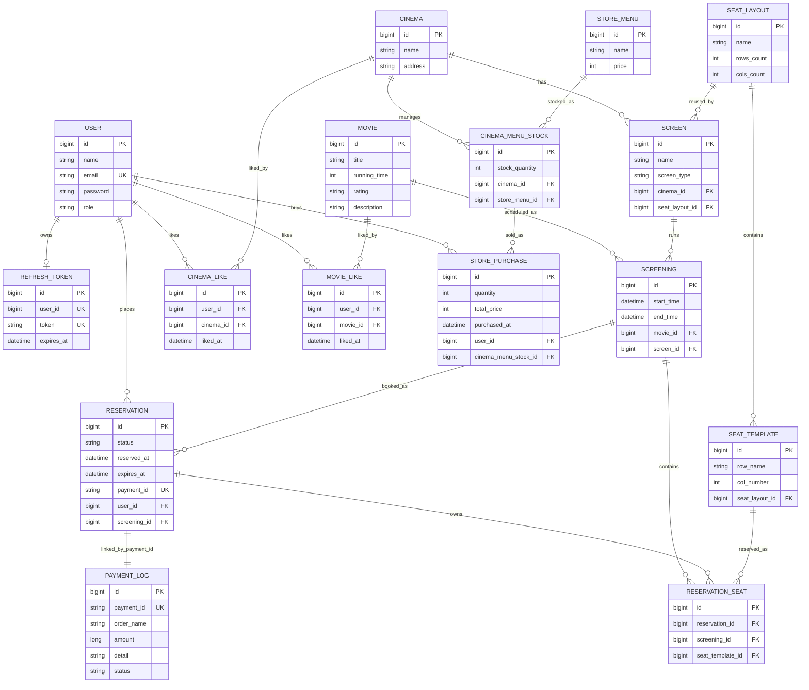
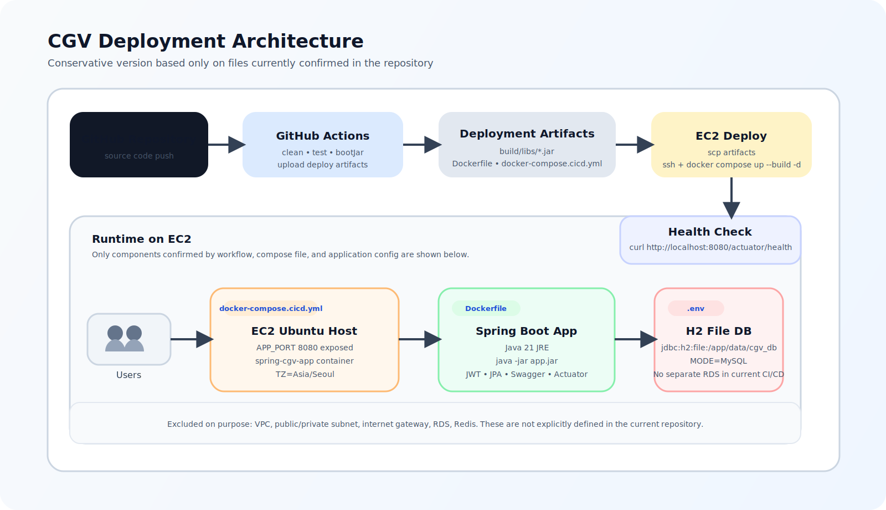
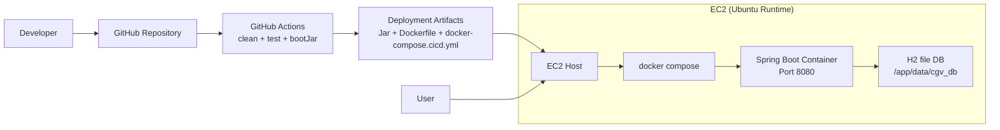
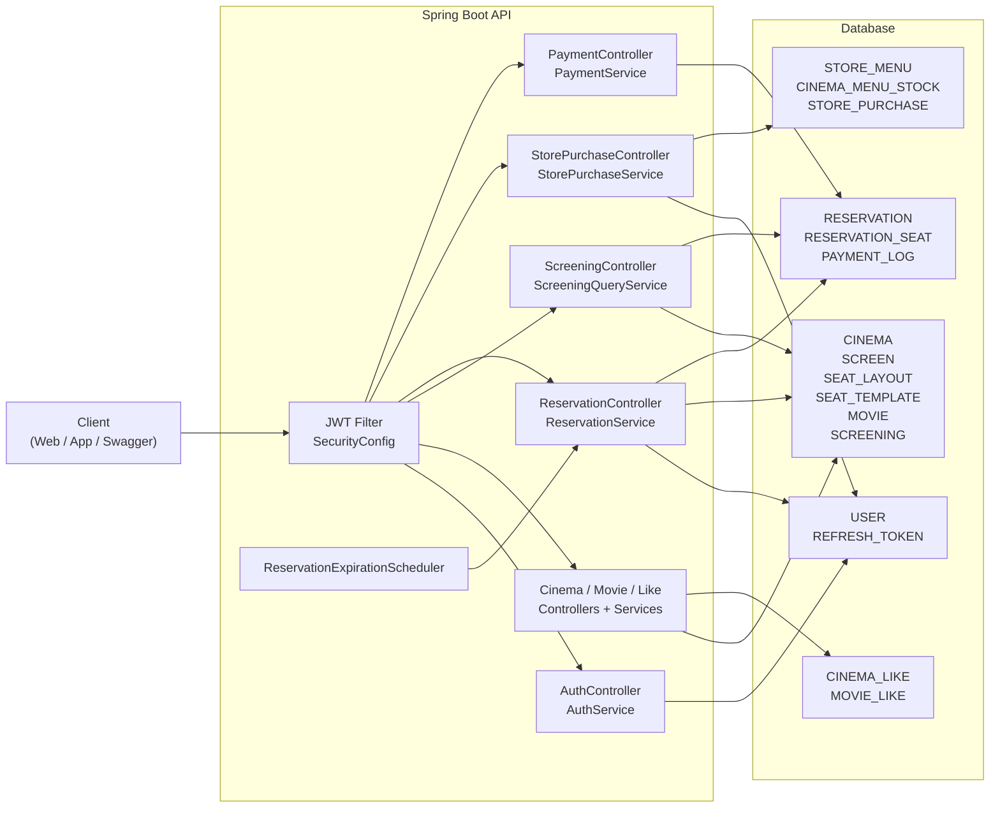

# CGV ERD, 배포 아키텍처, 서비스 아키텍처

## 문서 범위

- 현재 저장소 코드 기준으로 정리했음.
- 실제 CGV 전체 플랫폼이 아니라, 지금 구현된 프로젝트 모델 기준으로 봤음.
- ERD, 배포 아키텍처, 서비스 아키텍처를 서로 다른 레이어로 나눠서 정리했음.
- 매점은 별도 `Store` 테이블 없이 영화관별 재고 모델로 표현했음.
- 결제는 외부 PG 연동이 아니라 현재 프로젝트 내부 `PaymentLog` 흐름 기준으로 봤음.

## 모델링 가정

- 모든 영화관에는 `GENERAL`, `SPECIAL` 상영관이 있다고 가정했음.
- 좌석 규칙이 같으면 여러 상영관이 같은 `SeatLayout`을 재사용할 수 있게 잡았음.
- 좌석은 통로 없이 직사각형 그리드로 둠.
- 모든 영화관은 같은 매점 메뉴 마스터 데이터를 공유한다고 봤음.
- 재고는 영화관과 메뉴 조합마다 따로 관리함.

## 현재 구현 기준 ERD

## 중요한 제약 조건

- `seat_template (seat_layout_id, row_name, col_number)` 조합은 unique.
- `cinema_like (user_id, cinema_id)` 조합은 unique.
- `movie_like (user_id, movie_id)` 조합은 unique.
- `cinema_menu_stock (cinema_id, store_menu_id)` 조합은 unique.
- `reservation_seat (screening_id, seat_template_id)` 조합은 unique.
- `reservation.payment_id`, `payment_log.payment_id`는 각각 unique.
- `refresh_token.user_id`가 unique 라서 사용자당 활성 refresh token row는 하나만 둠.

## 왜 이 모델이 현재 프로젝트와 맞는가

- `SeatLayout`과 `SeatTemplate`를 분리해서 정적인 좌석 배치와 실제 상영 스케줄을 나눴음. 그래서 하나의 좌석 배치를 여러 상영관이 재사용할 수 있음.
- `ReservationSeat`는 한 예약이 여러 좌석을 가질 수 있게 하면서도, 한 상영 안에서는 같은 좌석이 중복 예약되지 않게 막아줌.
- `StoreMenu`는 공통 메뉴 마스터, `CinemaMenuStock`는 영화관별 재고 레이어로 뒀음. "메뉴는 같고 재고만 다름"이라는 조건에 맞춘 구조임.
- `PaymentLog`는 `payment_id`로 느슨하게 연결했음. 현재 프로젝트에서 결제를 내부 워크플로우 레코드처럼 다루기 때문임.

## 현재 배포 아키텍처

과제 예시처럼 GitHub, CI/CD, EC2, DB 경로를 보여주는 그림은 `서비스 구조도`보다 `배포 아키텍처`에 가까움.  
현재 활성 배포 경로는 `README`의 수동 배포 설명보다, 실제 [.github/workflows/cicd.yml](../.github/workflows/cicd.yml) 기준 흐름에 더 가까웠음.

아래 그림은 `저장소 안에서 직접 확인되는 요소만` 남긴 보수적인 버전임.

기존에 만든 조금 더 연출된 버전도 참고용으로 남겨둠.

- [기존 SVG 보기](images/architecture-diagram.svg)

Mermaid 원본 보기

## 배포 아키텍처 해설

- 개발자가 GitHub에 push 하면 GitHub Actions가 테스트와 `bootJar` 빌드를 수행함.
- Actions는 jar, `Dockerfile`, `docker-compose.cicd.yml`을 EC2로 넘긴 뒤 EC2 내부에서 Docker 이미지를 다시 build 함.
- 사용자는 EC2 public IP와 `8080` 포트로 접속함.
- 현재 자동 배포 기준 DB는 별도 RDS가 아니라 `H2 file DB`임.
- 그래서 지금 구조는 예시 이미지처럼 `Public EC2 + Private MySQL + Redis`가 분리된 구조가 아니라, 더 단순한 `단일 EC2 중심 구조`로 보는 게 맞음.
- 반대로 `VPC`, `Public Subnet`, `Internet Gateway` 같은 네트워크 레이어는 저장소 안에서 직접 확인되지 않아서 이번 보수적 다이어그램에서는 뺐음.

## 왜 이전 문서가 과제 의도와 어긋나 보였는가

- 이전 문서는 `컨트롤러/서비스/DB 테이블 관계`를 보여주는 논리 구조도였음.
- 그런데 과제에서 기대한 건 `사용자 -> 인터넷 -> EC2 -> 애플리케이션 -> DB` 흐름, 그리고 `GitHub -> CI/CD -> 배포` 흐름이 보이는 인프라 구조도였음.
- 즉 그림이 틀렸다기보다, `그림의 레이어가 달랐다`고 보는 쪽이 더 정확했음.

## 서비스 아키텍처

## 병목 후보 지점

| 구간 | 왜 병목이 될 수 있는가 | 현재 상태 | 다음 개선 방향 |
| --- | --- | --- | --- |
| JWT 인증 경로 | 인증이 필요한 모든 요청이 JWT 필터를 지나면서 사용자 정보를 다시 DB에서 읽음. | 정확성은 괜찮은 편이지만 찜, 예매, 매점, 결제 조회 요청이 많아지면 DB read 부하가 커짐. | 사용자 정보 캐시나 토큰 claim 활용 범위를 넓혀 DB hit를 줄이는 방향이 가능함. |
| 인기 상영 예매 | `ReservationService.createReservation()`가 하나의 `screening` row에 `PESSIMISTIC_WRITE`를 잡아서 같은 상영 요청은 직렬화됨. | 정합성은 강하지만 인기 상영에서는 lock queue가 생길 수 있음. | 락 범위 축소, 분산 락, 대기열 같은 트래픽 제어 전략을 검토할 수 있음. |
| 좌석 배치 조회 | `getSeatAvailability()`는 좌석 템플릿 전체와 예약 좌석 상태를 매번 다시 읽음. | 지금 규모에서는 버티지만 좌석 새로고침이 많아지면 읽기 부하가 커짐. | 정적인 좌석 배치 캐시와 동적인 점유 상태 조회를 분리하는 쪽이 나아 보임. |
| 예약 만료 스케줄러 | 만료 스케줄러가 1분마다 만료 대상 예약을 스캔함. pending 예약이 많아질수록 스캔 비용이 커짐. | 현재 규모에서는 동작하지만 테이블이 커질수록 비싸짐. | `(status, expires_at)` 인덱스와 이벤트 기반 만료 처리까지 고려할 수 있음. |
| 인기 매점 메뉴 구매 | 같은 영화관의 같은 메뉴 재고 row를 잠그기 때문에 인기 메뉴는 구매가 한 줄로 처리됨. | 최근 비관적 락 보강으로 정합성은 안전해졌음. | 원자적 재고 차감 쿼리나 짧은 재고 예약 모델로 확장 가능함. |
| 상영 목록 조회 | `GET /api/screenings`는 현재 pagination 없이 상영 목록과 연관 정보를 같이 내려줌. | 지금은 괜찮지만 데이터가 커지면 읽기 비용이 커짐. | 페이지네이션, 기간 필터, 영화관 우선 조회 경로를 추가하는 쪽이 좋음. |

## 가장 먼저 볼 병목 후보

가장 먼저 병목이 날 가능성이 큰 구간은 인기 상영 예매 경로였음.

- write-heavy 흐름임.
- 한 트랜잭션 안에서 여러 테이블을 함께 건드림.
- 이미 비관적 락을 사용 중임.
- 실제 사용자는 같은 상영, 같은 좌석 배치 화면으로 동시에 몰릴 가능성이 큼.

그래서 운영할 때 가장 먼저 볼 지표는 아래 두 가지였음.

- 특정 상영 기준 예약 요청 latency
- `createReservation()` 주변 lock wait / transaction time

## ERD 발표 때 같이 말하면 좋은 한 문장

2주차 ERD 설명 때는 아래처럼 말하면 됨.

- 현재 코드는 별도 `Store` 엔티티를 두지 않았고
- 대신 영화관별 매점은 `CinemaMenuStock`으로 표현했으며
- 메뉴 마스터는 공통이고 영화관마다 달라지는 건 재고뿐이라서 이 구조로도 충분했음.

이렇게 설명하면 ERD가 빠진 게 아니라, 의도적으로 단순화한 모델처럼 보임.
